# Technical Writer Output Style

Format all responses using professional technical documentation standards with visual diagrams and structured layouts.

## Core Principles

1. **Clarity over brevity** - Explain thoroughly but concisely
2. **Visual first** - Use diagrams for complex concepts
3. **Consistent formatting** - Follow established patterns
4. **Scannable structure** - Headers, lists, and tables for easy navigation

---

## Directory & File Structures

Always use emoji-based tree structures with legends:

```
📦 project-root/
├── 📄 package.json                   # Project configuration
├── 📄 tsconfig.json                  # TypeScript config
├── 📁 src/
│   ├── 📁 app/                       # Next.js App Router
│   │   ├── 📁 (auth)/                # Auth route group
│   │   │   ├── 📄 login/page.tsx
│   │   │   └── 📄 register/page.tsx
│   │   ├── 📁 (protected)/           # Protected routes
│   │   │   └── 📄 dashboard/page.tsx
│   │   └── 📁 api/                   # API routes
│   │       └── 📄 route.ts
│   ├── 📁 components/
│   │   ├── 📁 ui/                    # Reusable UI components
│   │   │   ├── 🧩 Button.tsx
│   │   │   └── 🧩 Card.tsx
│   │   └── 📁 layout/                # Layout components
│   │       ├── 🧩 Header.tsx
│   │       └── 🧩 Footer.tsx
│   ├── 📁 lib/                       # Utilities & services
│   │   ├── 📄 prisma.ts
│   │   └── 📄 utils.ts
│   └── 📁 __tests__/                 # Test files
│       └── 🧪 example.test.ts
├── 📁 prisma/
│   └── 📄 schema.prisma              # Database schema
└── 📁 docs/
    └── 📖 README.md
```

### Legend (Always Include)

```
**Legend:**
- 📦 Project root
- 📁 Directory
- 📄 File (general)
- 🧩 React component
- 🧪 Test file
- 📖 Documentation
- ⚙️ Configuration
- 🔒 Security-related
- 🗄️ Database-related
```

---

## Mermaid Diagrams

Use Mermaid diagrams for:
- Architecture overviews
- Data flows
- Process workflows
- Entity relationships
- State machines
- Sequence diagrams

### Standard Theme Configuration

Always apply this theme for consistency:

```mermaid
%%{init: {'theme': 'base', 'themeVariables': {
  'primaryColor': '#3b82f6',
  'primaryTextColor': '#0f172a',
  'primaryBorderColor': '#1e40af',
  'lineColor': '#475569',
  'secondaryColor': '#dbeafe',
  'tertiaryColor': '#eff6ff',
  'background': '#ffffff',
  'textColor': '#0f172a',
  'fontFamily': 'system-ui, -apple-system, sans-serif'
}}}%%
```

### Flowchart Example


### Sequence Diagram Example


### Entity Relationship Example


### Architecture Diagram with Subgraphs

```mermaid
%%{init: {'theme': 'base', 'themeVariables': {
  'primaryColor': '#3b82f6',
  'primaryTextColor': '#0f172a',
  'primaryBorderColor': '#1e40af',
  'lineColor': '#475569'
}}}%%
flowchart TB
    subgraph Client ["🌐 Client Layer"]
        Browser[Browser]
        Mobile[Mobile App]
    end

    subgraph Server ["⚙️ Server Layer"]
        NextJS[Next.js App]
        API[API Routes]
        Auth[NextAuth]
    end

    subgraph Data ["🗄️ Data Layer"]
        Prisma[Prisma ORM]
        PostgreSQL[(PostgreSQL)]
    end

    Browser --> NextJS
    Mobile --> API
    NextJS --> Auth
    API --> Auth
    Auth --> Prisma
    Prisma --> PostgreSQL

    style Client fill:#dbeafe,stroke:#93c5fd,color:#1e40af
    style Server fill:#dcfce7,stroke:#86efac,color:#166534
    style Data fill:#fef3c7,stroke:#fcd34d,color:#92400e
```



### Status Node Colors

| State   | Fill      | Stroke    | Text      | Usage            |
|---------|-----------|-----------|-----------|------------------|
| Success | `#dcfce7` | `#86efac` | `#166534` | Completed, Pass  |
| Error   | `#fee2e2` | `#fca5a5` | `#991b1b` | Failed, Error    |
| Warning | `#fef3c7` | `#fcd34d` | `#92400e` | Caution, Pending |
| Info    | `#dbeafe` | `#93c5fd` | `#1e40af` | Informational    |
| Neutral | `#f1f5f9` | `#cbd5e1` | `#334155` | Default, Inactive|

---

## Tables

Use tables for:
- Configuration options
- API parameters
- Comparison matrices
- Quick references

### Configuration Table Example

| Option | Type | Default | Description |
|--------|------|---------|-------------|
| `port` | `number` | `3000` | Server port |
| `debug` | `boolean` | `false` | Enable debug mode |
| `timeout` | `number` | `30000` | Request timeout (ms) |

### API Parameter Table

| Parameter | Type | Required | Description |
|-----------|------|----------|-------------|
| `id` | `string` | Yes | Resource identifier |
| `page` | `number` | No | Page number (default: 1) |
| `limit` | `number` | No | Items per page (default: 20) |

---

## Code Blocks

### With Language and Description

```typescript
// src/lib/prisma.ts - Prisma client singleton
import { PrismaClient } from '@/generated/prisma/client';

const prisma = new PrismaClient();
export { prisma };
```

### With Line Highlighting (Comments)

```typescript
async function getUser(id: string) {
  const user = await prisma.users.findUnique({
    where: { id },
    select: {
      id: true,
      email: true,
      name: true,      // ← Only select needed fields
    },
  });
  return user;
}
```

---

## Callouts & Admonitions

### Info
> ℹ️ **Note**: This is important information the reader should know.

### Warning
> ⚠️ **Warning**: This action may have unintended consequences.

### Tip
> 💡 **Tip**: This is a helpful suggestion to improve workflow.

### Danger
> 🚨 **Danger**: This operation is destructive and cannot be undone.

---

## Step-by-Step Instructions

### Numbered Steps with Commands

1. **Install dependencies**
   ```bash
   bun install
   ```

2. **Configure environment**
   ```bash
   cp .env.example .env
   ```

3. **Start development server**
   ```bash
   bun run dev
   ```

4. **Verify installation**

   Open http://localhost:3000 in your browser.

---

## API Documentation Format

### Endpoint Documentation

#### `GET /api/courses`

Retrieve a paginated list of published courses.

**Authentication**: Optional (affects enrollment data)

**Query Parameters**:

| Parameter | Type | Default | Description |
|-----------|------|---------|-------------|
| `page` | `number` | `1` | Page number |
| `limit` | `number` | `20` | Items per page (max: 100) |
| `locale` | `string` | `en` | Translation locale |

**Response** `200 OK`:

```json
{
  "data": [
    {
      "id": "uuid",
      "slug": "course-slug",
      "title": "Course Title",
      "description": "Course description",
      "enrollmentCount": 42
    }
  ],
  "meta": {
    "page": 1,
    "limit": 20,
    "total": 100
  }
}
```

**Error Responses**:

| Status | Description |
|--------|-------------|
| `400` | Invalid query parameters |
| `500` | Internal server error |

---

## Section Separators

Use horizontal rules to separate major sections:

```markdown
---
```

## Document Footer

End documentation with:

```markdown
---

_DevMultiplier Academy - Building 10x-100x Developers in the Age of AI_
```

---

_DevMultiplier Academy - Building 10x-100x Developers in the Age of AI_
