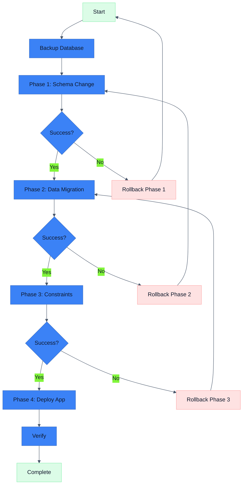

# Migration Planner Skill

Plan safe database migrations with risk assessment and rollback strategies.

## Description

This skill helps plan database schema changes by analyzing impact, identifying risks, and generating migration strategies with proper sequencing and rollback plans.

## Triggers

Activate this skill when:
- User asks to "plan migration"
- User asks about "schema changes"
- User wants to "add/remove/modify" database columns/tables
- User mentions "database refactoring"

## Instructions

### Step 1: Analyze Current Schema

```bash
# View current schema
cat prisma/schema.prisma

# Check for existing migrations
ls -la prisma/migrations/

# Get current migration status
bunx prisma migrate status
```

### Step 2: Identify Changes Required

Document each change:

```markdown
### Proposed Changes

| Change | Type | Model | Field | Risk |
|--------|------|-------|-------|------|
| Add field | ADD | users | phoneNumber | 🟢 Low |
| Add required field | ADD | courses | publishedAt | 🔴 High |
| Remove field | DROP | users | legacyId | 🔴 High |
| Rename field | RENAME | users | name → displayName | 🟠 Medium |
| Add table | CREATE | notifications | - | 🟢 Low |
| Add index | INDEX | enrollments | [userId, status] | 🟢 Low |
```

### Step 3: Risk Assessment

#### Risk Levels

| Risk | Criteria | Action Required |
|------|----------|-----------------|
| 🟢 Low | No data impact, backwards compatible | Direct migration |
| 🟠 Medium | Data transformation needed, minor downtime | Staged migration |
| 🔴 High | Data loss possible, breaking change | Multi-step migration with backup |

#### Risk Analysis Template

```markdown
### Risk: Add Required Field to Existing Table

**Change**: Add `publishedAt DateTime` to `Course` (required)

**Risk Level**: 🔴 High

**Why Risky**:
- Table has existing rows
- Required field with no default will fail
- Application code must be updated

**Mitigation**:
1. Add as nullable first
2. Backfill existing records
3. Add NOT NULL constraint
4. Update application code

**Rollback**:
1. Remove NOT NULL constraint
2. Application code handles null
```

### Step 4: Generate Migration Plan

#### Single-Step Migration (Low Risk)

```markdown
### Migration: Add Optional Field

**Change**: Add `phoneNumber` to `users` (optional)

**Schema Change**:
```prisma
model users {
  // existing fields...
  phoneNumber String?  // NEW
}
```

**Steps**:
1. Update schema.prisma
2. Run `bunx prisma migrate dev --name add_user_phone_number`
3. Deploy

**Rollback**:
```bash
# Remove the field from schema
# Run new migration to drop column
bunx prisma migrate dev --name remove_user_phone_number
```

**Estimated Downtime**: None
```

#### Multi-Step Migration (High Risk)

```markdown
### Migration: Add Required Field with Default

**Change**: Add `status` to `courses` (required, default 'draft')

**Phase 1: Add Nullable Field**
```prisma
model Course {
  // existing...
  status String?
}
```
```bash
bunx prisma migrate dev --name add_course_status_nullable
```

**Phase 2: Backfill Data**
```sql
UPDATE "Course" SET status = 'published' WHERE status IS NULL;
```

**Phase 3: Add Constraint**
```prisma
model Course {
  status String @default("draft")
}
```
```bash
bunx prisma migrate dev --name add_course_status_required
```

**Phase 4: Update Application**
- Add status to create operations
- Add status to queries
- Update UI

**Rollback Plan**:
1. Deploy previous application version
2. Run: `ALTER TABLE "Course" ALTER COLUMN status DROP NOT NULL`
3. Mark migration as rolled back

**Estimated Downtime**: None (if done correctly)
```

#### Data Migration

```markdown
### Migration: Rename Column

**Change**: Rename `users.name` to `users.displayName`

**Why Multi-Step**: Prisma doesn't detect renames automatically

**Phase 1: Add New Column**
```prisma
model users {
  name        String?  // Keep temporarily
  displayName String?  // New
}
```

**Phase 2: Copy Data**
```sql
UPDATE users SET "displayName" = name WHERE "displayName" IS NULL;
```

**Phase 3: Update Application**
- Change all reads to use displayName
- Change all writes to use displayName
- Deploy

**Phase 4: Drop Old Column**
```prisma
model users {
  displayName String?
  // name removed
}
```

**Phase 5: Make Required (if needed)**
```prisma
model users {
  displayName String @default("")
}
```

**Rollback at Each Phase**:
- Phase 1-2: Drop displayName column
- Phase 3: Revert application, keep both columns
- Phase 4-5: Cannot easily rollback, restore from backup
```

### Step 5: Generate Migration Sequence



## Output Format

```markdown
## Migration Plan: [Description]

### Summary

| Metric | Value |
|--------|-------|
| Total Changes | 3 |
| Risk Level | 🟠 Medium |
| Estimated Duration | 30 minutes |
| Requires Downtime | No |
| Backup Required | Yes |

### Changes

1. Add `phoneNumber` to `users` (🟢 Low)
2. Add `status` to `courses` with default (🟠 Medium)
3. Add index on `enrollments` (🟢 Low)

### Execution Plan

#### Pre-Migration
- [ ] Notify team of migration
- [ ] Create database backup
- [ ] Verify backup is restorable

#### Phase 1: Low-Risk Changes
```bash
bunx prisma migrate dev --name add_user_phone_number
bunx prisma migrate dev --name add_enrollments_index
```

#### Phase 2: Medium-Risk Changes
```bash
# Step 1: Add nullable
bunx prisma migrate dev --name add_course_status_nullable

# Step 2: Backfill
psql -c "UPDATE \"Course\" SET status = 'draft' WHERE status IS NULL"

# Step 3: Add constraint
bunx prisma migrate dev --name add_course_status_required
```

#### Phase 3: Deploy Application
- [ ] Deploy updated application
- [ ] Verify functionality
- [ ] Monitor for errors

### Rollback Procedures

<details>
<summary>Phase 1 Rollback</summary>

```bash
# Revert schema and create drop migration
bunx prisma migrate dev --name rollback_phone_number
```

</details>

<details>
<summary>Phase 2 Rollback</summary>

```sql
-- Remove NOT NULL constraint
ALTER TABLE "Course" ALTER COLUMN status DROP NOT NULL;
-- Or restore from backup
```

</details>

### Verification Checklist

- [ ] All migrations applied
- [ ] Application starts correctly
- [ ] Key features working
- [ ] No errors in logs
- [ ] Performance acceptable

### Post-Migration

- [ ] Update documentation
- [ ] Notify team of completion
- [ ] Schedule backup retention review
```

## Tools Available

- `Read` - View schema and migrations
- `Write` - Create migration plans
- `Bash` - Run Prisma commands
- `Grep` - Find schema usage in code
