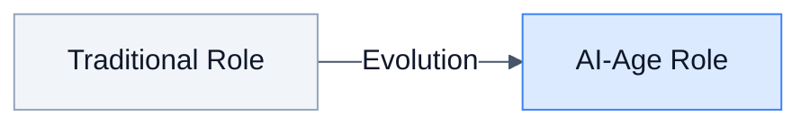

# The GenAI Landscape for Software Development

**Duration:** 25 minutes **Learning Objectives:**

- Understand the current state of AI-assisted software development
- Recognize key players and tools in the AI coding ecosystem
- Learn how AI agents are transforming development workflows
- Prepare for AI-assisted DDD and CQRS implementation

---

## Introduction

Before diving into Domain-Driven Design and CQRS patterns, it's essential to understand the revolutionary landscape of
Generative AI (GenAI) in software development. This course is designed for the AI age—where developers work alongside
intelligent agents to build complex systems faster and with higher quality.

The statistics are staggering: **82% of developers now use AI coding tools weekly**, and AI-generated code accounts for
**46% of all code** in repositories using tools like GitHub Copilot. This isn't the future—it's the present.

---

## The Current State of AI-Assisted Development (2026)

### Market Overview

The AI coding assistant market has exploded, reaching **$12.8 billion in 2026** with projections suggesting **$45.7
billion by 2030**. This growth reflects a fundamental shift in how software is created.


### Key Players and Adoption

| Tool                        | Users/Reach    | Key Metric                | Primary Strength                     |
| --------------------------- | -------------- | ------------------------- | ------------------------------------ |
| **GitHub Copilot**          | 20M+ users     | 46% code contribution     | IDE integration, code completion     |
| **Claude Code**             | 41% dev usage  | 81% retention rate        | Agentic workflows, complex reasoning |
| **Claude Desktop + Cowork** | Max plan users | Multi-agent orchestration | File access, parallel workstreams    |
| **Cursor**                  | Rapid growth   | Deep IDE integration      | AI-native editor experience          |

### Anthropic's Claude: Leading the Agentic Revolution

Anthropic's Claude models have become the go-to choice for complex software development tasks:

| Model               | Best For                             | Key Capabilities                                           |
| ------------------- | ------------------------------------ | ---------------------------------------------------------- |
| **Claude Opus 4.5** | Complex architecture, deep reasoning | Sustained performance on long tasks, nuanced understanding |
| **Claude Sonnet 4** | Fast iteration, code generation      | Excellent speed/quality balance, ideal for daily coding    |
| **Claude Haiku**    | Quick completions, simple tasks      | Ultra-fast responses, cost-efficient                       |

**Why Claude excels at DDD/CQRS:**

- **Deep reasoning** - Understands business domains and translates to code
- **Long context** - Can analyze entire bounded contexts at once
- **Agentic capabilities** - Plans and executes multi-step refactorings autonomously

### Enterprise Adoption

The enterprise shift has been remarkable:

- **90% of Fortune 100** companies now use GitHub Copilot
- **97% of developers** have used AI coding tools in some capacity
- **55% faster task completion** reported with AI assistance
- **30-50% productivity gains** in routine coding tasks


---

## The Evolution of AI Coding Assistants

### Generation 1: Code Completion (2021-2022)

The first wave focused on autocomplete—suggesting the next few lines of code based on context.

```typescript
// Example: Traditional code completion
// Developer types: "function calculateTotal("
// AI suggests: "items: CartItem[]): number {"

function calculateTotal(items: CartItem[]): number {
  return items.reduce((sum, item) => sum + item.price * item.quantity, 0);
}
```

**Limitations:** Context-limited, couldn't understand broader architecture or business requirements.

### Generation 2: Conversational AI (2023-2024)

ChatGPT and Claude brought conversational interfaces to coding, enabling developers to describe problems in natural
language.

```typescript
// Example: Conversational AI interaction
// Developer: "Create a value object for Money that prevents negative amounts"
// AI generates complete implementation with validation

class Money {
  private constructor(
    private readonly amount: number,
    private readonly currency: Currency
  ) {}

  static create(amount: number, currency: Currency): Money {
    if (amount < 0) {
      throw new DomainError('Money amount cannot be negative');
    }
    return new Money(amount, currency);
  }

  add(other: Money): Money {
    this.ensureSameCurrency(other);
    return Money.create(this.amount + other.amount, this.currency);
  }
}
```

**Advancement:** Better understanding of intent, but still operated in isolation from the codebase.

### Generation 3: AI Agents (2025-2026)

The current generation introduces **agentic AI**—autonomous systems that can explore codebases, make decisions, and
execute multi-step workflows.


**Key Capabilities:**

- **Codebase awareness** - Understands project structure and patterns
- **Multi-step reasoning** - Plans and executes complex refactorings
- **Self-correction** - Runs tests and fixes issues autonomously
- **Tool integration** - Uses terminal, file system, and external APIs

### Claude's Agentic Tools

Anthropic offers two powerful agentic interfaces for developers:

**Claude Code (CLI)** The command-line tool that powers professional development workflows:

```bash
# Claude Code can explore, plan, and implement autonomously
claude "Refactor the Order aggregate to use event sourcing"
```

- Runs in your terminal with full codebase access
- Powered by Claude Opus 4.5 or Sonnet 4 for different use cases
- Executes multi-file refactorings with test validation

**Cowork (Claude Desktop)** A research preview feature that extends agentic capabilities to Claude Desktop:

| Component | Description |
|-----------|-------------|
| **📁 Local Files** | Reads/writes files directly without uploads |
| **📊 Excel/PPT** | Creates spreadsheets with formulas, presentations |
| **📄 Documents** | Generates formatted documents |


**Cowork capabilities:**

- **Direct file access** - Reads/writes local files without manual uploads
- **Multi-agent coordination** - Breaks projects into subtasks with parallel execution
- **Extended execution** - Complex tasks run without conversation timeouts
- **Professional outputs** - Generates Excel with formulas, PowerPoint, formatted docs

> 💡 **Tip**: Use Claude Code for coding tasks in your terminal, and Cowork for documentation, research synthesis, and
> file organization tasks.

---

## "Vibe Coding" and the New Development Paradigm

### What is Vibe Coding?

"Vibe coding" (coined by Andrej Karpathy) describes a new development style where developers express high-level intent
and let AI handle implementation details.

```typescript
// Traditional approach: Write every line manually
// Vibe coding approach: Describe the "vibe"

// Developer: "I need an aggregate for Order that:
// - Enforces business rules about minimum order amounts
// - Publishes domain events when state changes
// - Uses the ubiquitous language from our domain model"

// AI Agent generates complete implementation following DDD patterns
```

### The Developer's Evolving Role

| Traditional Role | AI-Age Role             |
| ---------------- | ----------------------- |
| Write Code       | Define Requirements     |
| Debug Issues     | Review AI Output        |
| Write Tests      | Architectural Decisions |
| Documentation    | Domain Expertise        |



**Key shifts:**

- From **writing code** to **directing AI and reviewing output**
- From **syntax knowledge** to **architectural thinking**
- From **implementation** to **domain expertise**
- From **solo coding** to **human-AI collaboration**

---

## AI in Domain-Driven Design

### Why AI + DDD is Powerful

DDD's emphasis on **ubiquitous language** makes it particularly well-suited for AI assistance:

1. **Natural language alignment** - DDD uses business terminology that AI can understand
2. **Pattern recognition** - AI excels at identifying and applying DDD patterns
3. **Consistency enforcement** - AI can maintain ubiquitous language across the codebase
4. **Refactoring at scale** - AI can restructure entire bounded contexts

### AI-Assisted DDD Workflow

```typescript
// Example: AI-assisted aggregate design

// 1. Developer provides domain context
/*
  Business Rule: Orders can only be cancelled within 24 hours
  of placement, unless they haven't been shipped yet.
  The customer should be notified when cancellation succeeds or fails.
*/

// 2. AI generates DDD-compliant implementation
class Order extends AggregateRoot {
  private status: OrderStatus;
  private placedAt: Date;
  private shippedAt?: Date;

  cancel(): void {
    this.ensureCanBeCancelled();

    this.status = OrderStatus.Cancelled;

    this.addDomainEvent(
      new OrderCancelledEvent({
        orderId: this.id,
        cancelledAt: new Date(),
        reason: 'Customer requested',
      })
    );
  }

  private ensureCanBeCancelled(): void {
    if (this.status === OrderStatus.Delivered) {
      throw new DomainError('Delivered orders cannot be cancelled');
    }

    const hoursSincePlacement = this.getHoursSincePlacement();
    const canCancelByTime = hoursSincePlacement <= 24;
    const notYetShipped = !this.shippedAt;

    if (!canCancelByTime && !notYetShipped) {
      throw new DomainError('Orders can only be cancelled within 24 hours or before shipping');
    }
  }
}
```

---

## Future Predictions

### Near-Term (2026-2027)

| Prediction                  | Impact on Development                          |
| --------------------------- | ---------------------------------------------- |
| **AI writes 70%+ of code**  | Developers become reviewers and architects     |
| **Multi-agent systems**     | Specialized agents for testing, security, docs |
| **Real-time collaboration** | AI pair programming becomes standard           |
| **Context windows expand**  | Entire codebases understood at once            |

### Medium-Term (2028-2030)

| Year | Milestone                                                    |
| :--- | :----------------------------------------------------------- |
| 2028 | Autonomous debugging, Natural language programming           |
| 2029 | AI architects systems, Human oversight minimal for routine   |
| 2030 | Full-stack AI development, Human-AI collaborative teams      |

### What This Means for You

This course teaches DDD and CQRS **with AI as your partner**. You'll learn to:

1. **Express domain concepts** that AI can implement accurately
2. **Review AI-generated code** for DDD compliance
3. **Direct AI agents** to refactor toward CQRS patterns
4. **Leverage AI** for event storming and domain modeling

---

## Hands-On: Your First AI-Assisted Domain Model

### Exercise: Create a Value Object with AI

Try this with your AI coding assistant:

```
Prompt: "Create a DDD value object for EmailAddress in TypeScript that:
- Validates email format
- Is immutable
- Provides equality comparison
- Follows DDD patterns from Eric Evans' book"
```

**Expected AI Output:**

```typescript
class EmailAddress {
  private constructor(private readonly value: string) {}

  static create(email: string): EmailAddress {
    if (!EmailAddress.isValid(email)) {
      throw new DomainError(`Invalid email format: ${email}`);
    }
    return new EmailAddress(email.toLowerCase());
  }

  private static isValid(email: string): boolean {
    const emailRegex = /^[^\s@]+@[^\s@]+\.[^\s@]+$/;
    return emailRegex.test(email);
  }

  equals(other: EmailAddress): boolean {
    return this.value === other.value;
  }

  toString(): string {
    return this.value;
  }
}
```

### Reflection Questions

1. How did the AI interpret "DDD patterns from Eric Evans' book"?
2. What domain rules did it enforce?
3. What improvements would you suggest?

---

## Summary

The GenAI revolution isn't replacing developers—it's **amplifying** them. By combining:

- **Domain expertise** (your understanding of business problems)
- **Architectural knowledge** (DDD, CQRS patterns you'll learn)
- **AI capabilities** (code generation, refactoring, testing)

You'll build systems that would have taken teams months in a fraction of the time.

### Key Takeaways

1. **82% of developers** now use AI tools weekly—you should too
2. **Claude Opus 4.5 and Sonnet 4** excel at complex domain modeling and DDD patterns
3. **AI agents** (Claude Code, Cowork) can understand and implement architecture autonomously
4. **"Vibe coding"** shifts focus from syntax to architecture
5. **This course** teaches you to leverage AI for complex domain modeling

---

## Next Steps

In the next lesson, we'll dive into **What is Domain-Driven Design?**, where you'll learn the foundational concepts that
make AI-assisted DDD so powerful.

---

## Navigation

| Previous | Up | Next |
|----------|-----|------|
| — | [Course Overview](../00-course-overview.md) | [Lesson 1: What is DDD?](lesson-1-what-is-ddd.md) |

---

## Additional Resources

### Claude & Anthropic

- [Claude Code Guide](https://docs.anthropic.com/en/docs/claude-code) - CLI for agentic coding
- [Getting Started with Cowork](https://support.claude.com/en/articles/13345190-getting-started-with-cowork) -
  Multi-agent desktop workflows
- [Claude Opus 4.5 & Sonnet 4 Overview](https://www.anthropic.com/claude) - Model capabilities

### Other Tools & Research

- [GitHub Copilot Documentation](https://docs.github.com/en/copilot)
- [Andrej Karpathy on "Vibe Coding"](https://twitter.com/karpathy)
- [State of AI Report 2026](https://www.stateof.ai)

---

_Charts and statistics in this lesson are based on industry reports from GitHub, Anthropic, Stack Overflow Developer
Survey 2026, and IDC market research. Data compiled January 2026._

_© 2026 DevMultiplier Academy. Charts may be used for educational purposes with attribution._
