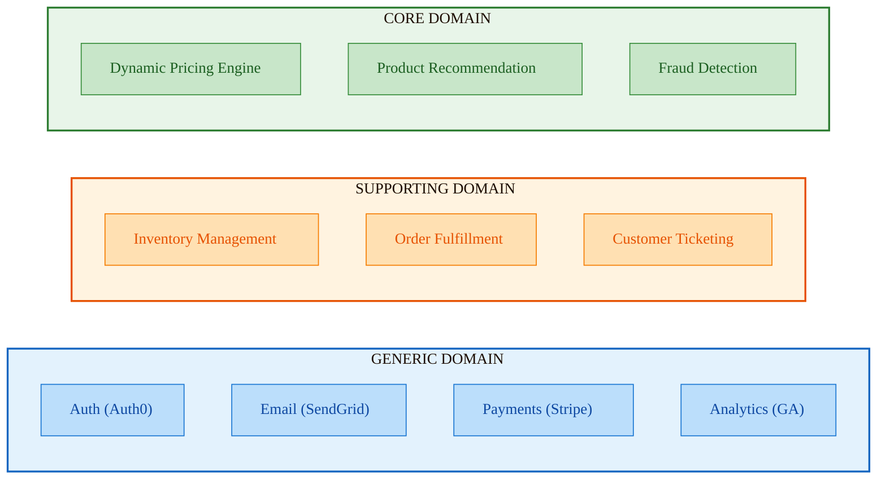

# Identifying Your Core Domain

**Duration:** 22 minutes **Learning Objectives:**

- Distinguish between core, supporting, and generic subdomains
- Apply investment strategies based on domain classification
- Make strategic decisions about build vs buy

---

## Introduction

Not all code is created equal. Some parts of your system are your competitive advantage—the unique value proposition
that sets your business apart. Other parts are necessary but generic. DDD helps you make strategic decisions about where
to invest your time, talent, and architectural sophistication.

## The Three Types of Subdomains

### Core Domain

**Definition:** The area that provides competitive advantage and differentiates your business.

**Characteristics:**

- Unique to your business
- Complex business logic
- Frequently changing
- High business value
- Cannot be bought off-the-shelf

**Investment Strategy:**

- Apply full DDD rigor
- Assign best developers
- Deep domain expert collaboration
- Sophisticated patterns (aggregates, domain events)
- Extensive testing

**Example - E-Commerce Platform:**

```typescript
// Core Domain: Dynamic Pricing Engine
class PricingEngine {
  // Complex, proprietary pricing logic
  calculatePrice(context: PricingContext): Price {
    const basePrice = this.getBasePrice(context.product);
    const customerTier = this.getTierDiscount(context.customer);
    const volumeDiscount = this.getVolumeDiscount(context.quantity);
    const dynamicPrice = this.getMarketAdjustment(context.market);
    const competitorPrice = this.getCompetitorAdjustment(context.competitors);

    return this.strategy.apply(basePrice, [customerTier, volumeDiscount, dynamicPrice, competitorPrice]);
  }

  private getMarketAdjustment(market: MarketConditions): PriceAdjustment {
    // Proprietary algorithm based on:
    // - Supply/demand
    // - Seasonal trends
    // - Inventory levels
    // - Competitor pricing
    // This is your competitive advantage
  }
}

// Rich domain model with sophisticated patterns
class PricingStrategy {
  constructor(
    private readonly rules: PricingRule[],
    private readonly constraints: PricingConstraint[]
  ) {}

  apply(basePrice: Money, adjustments: PriceAdjustment[]): Price {
    let finalPrice = basePrice;

    for (const adjustment of this.prioritize(adjustments)) {
      finalPrice = adjustment.apply(finalPrice);
      this.validateConstraints(finalPrice);
    }

    return new Price(finalPrice, this.calculateMargin(finalPrice));
  }
}
```

### Supporting Domain

**Definition:** Necessary for the business but not a differentiator. Supports the core domain.

**Characteristics:**

- Specific to your business
- Moderate complexity
- Less frequently changing
- Important but not unique

**Investment Strategy:**

- Apply DDD patterns selectively
- Good developers, not necessarily your best
- Some domain expert involvement
- Simpler patterns
- Standard testing practices

**Example - E-Commerce Platform:**

```typescript
// Supporting Domain: Inventory Management
class InventoryTracker {
  private reservations = new Map<ProductId, Reservation[]>();

  async reserveStock(productId: ProductId, quantity: number, orderId: OrderId): Promise<StockReservation> {
    const available = await this.getAvailableStock(productId);

    if (available < quantity) {
      throw new InsufficientStockError(productId, quantity, available);
    }

    const reservation = new StockReservation(
      ReservationId.generate(),
      productId,
      quantity,
      orderId,
      this.getExpirationTime()
    );

    this.reservations.set(productId, [...(this.reservations.get(productId) || []), reservation]);

    return reservation;
  }

  async releaseReservation(reservationId: ReservationId): Promise<void> {
    // Straightforward logic, important but not complex
  }
}

// Simpler model than core domain
interface StockReservation {
  id: ReservationId;
  productId: ProductId;
  quantity: number;
  orderId: OrderId;
  expiresAt: Date;
}
```

### Generic Domain

**Definition:** Solved problems that every business needs. No competitive advantage.

**Characteristics:**

- Common to many businesses
- Well-understood solutions exist
- Rarely changes
- Low differentiation value

**Investment Strategy:**

- Buy or use open-source
- Minimal custom code
- Standard implementations
- Focus on integration, not innovation

**Example - E-Commerce Platform:**

```typescript
// Generic Domain: Authentication
// DON'T build this yourself - use NextAuth, Auth0, Clerk, etc.

import NextAuth from 'next-auth';
import GithubProvider from 'next-auth/providers/github';

export const { handlers, auth } = NextAuth({
  providers: [
    GithubProvider({
      clientId: process.env.GITHUB_ID!,
      clientSecret: process.env.GITHUB_SECRET!,
    }),
  ],
});

// Generic Domain: Email Notifications
// Use Resend, SendGrid, AWS SES, etc.

import { Resend } from 'resend';

const resend = new Resend(process.env.RESEND_API_KEY);

async function sendOrderConfirmation(order: Order) {
  await resend.emails.send({
    from: 'orders@example.com',
    to: order.customerEmail,
    subject: 'Order Confirmation',
    html: await renderTemplate('order-confirmation', order),
  });
}
```

## Real-World Classification Examples

### Example 1: Online Learning Platform

```typescript
// CORE DOMAIN: Adaptive Learning Algorithm
class AdaptiveLearningEngine {
  // Proprietary logic that personalizes content
  recommendNextLesson(student: Student, progress: LearningProgress, performance: PerformanceMetrics): Lesson {
    // Complex algorithm based on:
    // - Learning style preferences
    // - Historical performance patterns
    // - Knowledge graph dependencies
    // - Optimal difficulty curve
    // - Time-of-day effectiveness
    // THIS IS YOUR COMPETITIVE ADVANTAGE
  }
}

// SUPPORTING DOMAIN: Progress Tracking
class ProgressTracker {
  recordCompletion(studentId: StudentId, lessonId: LessonId): void {
    // Important but straightforward
    this.db.progress.create({
      studentId: studentId.value,
      lessonId: lessonId.value,
      completedAt: new Date(),
    });
  }

  getProgress(studentId: StudentId, courseId: CourseId): Progress {
    // Query and aggregate - not complex
  }
}

// GENERIC DOMAIN: Video Hosting
// Use Vimeo, YouTube, Mux, or Cloudflare Stream
import { Mux } from '@mux/mux-node';

class VideoService {
  async uploadVideo(file: File): Promise<VideoId> {
    const mux = new Mux();
    const upload = await mux.video.uploads.create({
      new_asset_settings: { playback_policy: 'public' },
    });
    // Delegate to specialized service
  }
}
```

### Example 2: Healthcare Scheduling

```typescript
// CORE DOMAIN: Appointment Scheduling with Complex Rules
class AppointmentScheduler {
  scheduleAppointment(
    patient: Patient,
    provider: Provider,
    appointmentType: AppointmentType,
    preferredTime: TimeSlot
  ): Result<Appointment, SchedulingError> {
    // Complex business rules:
    // - Provider specialization vs patient needs
    // - Insurance coverage verification
    // - Room/equipment availability
    // - Travel time between appointments
    // - Emergency slot preservation
    // - Provider preference patterns
    // - Patient history considerations
  }
}

// SUPPORTING DOMAIN: Provider Availability
class AvailabilityManager {
  getAvailableSlots(provider: Provider, date: Date, duration: Duration): TimeSlot[] {
    // Moderate complexity - important but not unique
    const schedule = provider.getSchedule(date);
    const existing = this.getExistingAppointments(provider, date);
    return schedule.findOpenSlots(duration, existing);
  }
}

// GENERIC DOMAIN: Appointment Reminders
// Use Twilio, AWS SNS, or similar
import twilio from 'twilio';

class ReminderService {
  async sendAppointmentReminder(appointment: Appointment): Promise<void> {
    const client = twilio(accountSid, authToken);
    await client.messages.create({
      to: appointment.patient.phone,
      from: twilioNumber,
      body: `Reminder: Appointment with ${appointment.provider.name} tomorrow at ${appointment.time}`,
    });
  }
}
```

## Decision Framework

### Step 1: Ask These Questions

For each subdomain, answer:

1. **Uniqueness:** Do competitors solve this differently?
   - Yes → Likely Core
   - No → Supporting or Generic

2. **Complexity:** How intricate are the business rules?
   - Very complex → Core or Supporting
   - Simple → Generic

3. **Change Frequency:** How often do requirements change?
   - Frequently → Core
   - Rarely → Generic

4. **Business Impact:** What's the cost of getting it wrong?
   - High (revenue loss, competitive disadvantage) → Core
   - Moderate → Supporting
   - Low → Generic

5. **Availability:** Can you buy a good solution?
   - No good options → Build (Core or Supporting)
   - Excellent options exist → Buy (Generic)

### Step 2: Create a Domain Map



**Investment breakdown:**

- **Core Domain (60%):** Senior developers + architects, full DDD with event sourcing
- **Supporting Domain (30%):** Mid-level developers, selective DDD patterns
- **Generic Domain (10%):** Any developer, simple integration wrappers

## Strategic Mistakes to Avoid

### Mistake 1: Treating Everything as Core

```typescript
// ❌ Over-engineering a generic domain
class EmailAggregateRoot {
  constructor(
    private readonly id: EmailId,
    private readonly recipient: EmailRecipient,
    private readonly content: EmailContent,
    private readonly metadata: EmailMetadata
  ) {}

  send(): EmailSent {
    // 500 lines of custom SMTP implementation
    // Complex state machine for retries
    // Custom queuing logic
    // Custom bounce handling
  }
}

// ✅ Just use a service
const resend = new Resend(apiKey);
await resend.emails.send({
  from: 'noreply@example.com',
  to: user.email,
  subject: 'Welcome!',
  html: '<p>Welcome!</p>',
});
```

### Mistake 2: Under-investing in Core

```typescript
// ❌ Simplistic core domain (pricing is competitive advantage)
interface Product {
  id: string;
  basePrice: number;
}

function calculatePrice(product: Product, quantity: number): number {
  return product.basePrice * quantity;
}

// ✅ Rich core domain model
class PricingEngine {
  constructor(
    private readonly strategies: PricingStrategy[],
    private readonly rules: PricingRule[],
    private readonly constraints: PricingConstraint[]
  ) {}

  calculatePrice(context: PricingContext): Price {
    // Sophisticated logic
    // Multiple strategies
    // Business rule validation
    // Margin optimization
  }
}
```

### Mistake 3: Building When You Should Buy

```typescript
// ❌ Custom auth system (generic domain)
class CustomAuthenticationSystem {
  // 10,000 lines of authentication code
  // OAuth implementation
  // Password hashing
  // Session management
  // MFA support
  // Security updates required
  // Compliance considerations
}

// ✅ Use proven solution
import { auth } from '@/auth'; // NextAuth
const session = await auth();
```

## Evolution Over Time

Subdomains can migrate between categories:

```typescript
// Year 1: Payment processing is core
// You're a fintech startup, payment IS your product
class PaymentProcessor {
  // 5000 lines of sophisticated payment logic
  // Your competitive advantage
}

// Year 5: Payment is now generic
// You've pivoted to e-commerce, payment is just infrastructure
import { Stripe } from 'stripe';
const stripe = new Stripe(apiKey);
await stripe.charges.create({ ... });

// Now THIS is your core domain:
class PersonalizedShoppingExperience {
  // New competitive advantage
}
```

## AI's Role in Domain Classification

```typescript
// AI Prompt for Domain Analysis:
/*
Analyze this system and classify each subdomain as Core, Supporting, or Generic:

System: Online Course Platform
Features:
1. Course content delivery
2. Progress tracking
3. Adaptive learning recommendations based on student performance
4. Video hosting and streaming
5. Discussion forums
6. Email notifications
7. Payment processing
8. Certificate generation

For each feature, explain:
- Classification (Core/Supporting/Generic)
- Reasoning
- Investment recommendation
*/

// AI can help, but validate with business stakeholders:
// - AI might not know your business strategy
// - Competitive landscape context is crucial
// - Business goals drive core domain definition
```

## Key Takeaways

1. **Not all code deserves equal investment** - Focus rigor on core domain
2. **Buy generic domains** - Don't reinvent authentication, email, payments
3. **Core domain defines competitive advantage** - This is where you differentiate
4. **Classifications can change** - Re-evaluate as business evolves
5. **Supporting domains bridge the gap** - They enable core but aren't unique
6. **Strategic thinking over technical perfection** - Business value drives decisions

## Common Pitfalls

❌ **Over-engineering generic domains** - Building custom auth when Auth0 exists ❌ **Under-investing in core** -
Treating competitive advantage as CRUD ❌ **Misclassifying domains** - Letting technical preferences override business
needs ❌ **Static classification** - Not re-evaluating as business evolves ❌ **Ignoring build vs buy** - Always
building when buying would be faster/better

## Next Steps

In the next lesson, we'll cover **Domain Modeling Techniques**—practical exercises for extracting models from business
conversations.

## Hands-On Exercise

**Domain Classification:**

For your current project (or a system you know well):

1. **List all major features/subsystems** (aim for 8-12)

2. **Classify each** as Core, Supporting, or Generic using the decision framework:

   ```
   Feature: _____________
   Uniqueness: 1-5 (1=everyone does it, 5=only we do it)
   Complexity: 1-5 (1=simple, 5=very complex)
   Change Frequency: 1-5 (1=stable, 5=changes weekly)
   Business Impact: 1-5 (1=low, 5=critical)
   Can Buy?: Yes/No

   Classification: ________
   ```

3. **Calculate current investment:**
   - What % of engineering time goes to each category?
   - Is this aligned with business value?

4. **Make recommendations:**
   - What should you invest more in?
   - What could you outsource?
   - What's over-engineered?

**Example Answer:**

```
System: Project Management SaaS

CORE (60% time recommended, currently 30%):
- AI-powered project risk prediction ← UNDER-INVESTED
- Automated resource allocation

SUPPORTING (30% time recommended, currently 40%):
- Task management
- Time tracking
- Reporting

GENERIC (10% time recommended, currently 30%):
- User authentication ← OVER-INVESTED (custom built)
- Email notifications ← OVER-INVESTED (custom SMTP)
- File storage ← Should use S3

RECOMMENDATION:
- Replace custom auth with Auth0 (save 15% time)
- Replace custom email with SendGrid (save 10% time)
- Invest saved time in AI prediction engine (core domain)
```

---

**Time to complete:** 60 minutes **Difficulty:** Intermediate

Share your classification and recommendations in the course forum!
