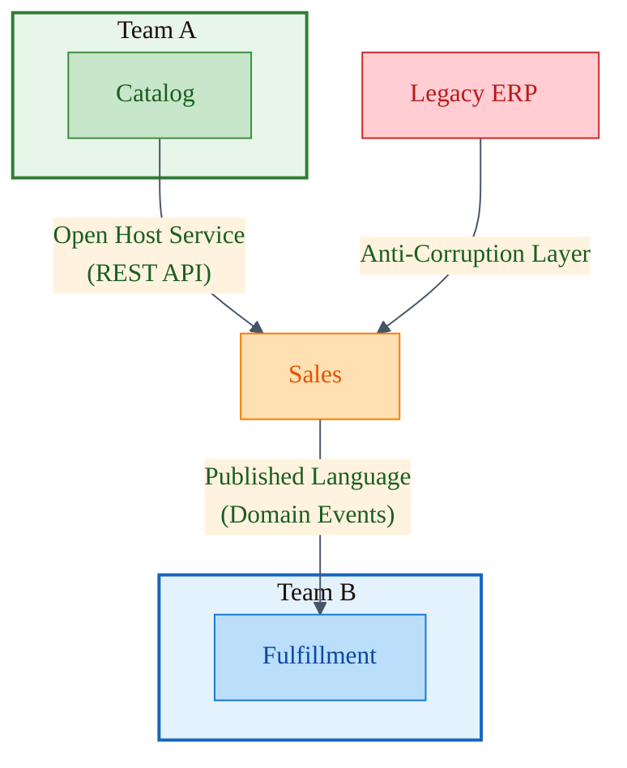

# Context Mapping Patterns

**Duration:** 20 minutes
**Learning Objectives:**
- Understand different relationship patterns between bounded contexts
- Choose appropriate integration patterns for specific scenarios
- Implement context maps in code

---

## Introduction

Bounded contexts don't exist in isolation—they must integrate with each other. Context Mapping provides a vocabulary for describing how contexts relate, who has power in the relationship, and what integration patterns to use. Understanding these patterns helps you make strategic decisions about system architecture.

## The Context Map

A context map is a visual representation showing:
- All bounded contexts in the system
- Relationships between contexts
- Integration patterns used
- Team ownership



## Pattern 1: Shared Kernel

**Definition:** Two contexts share a subset of the domain model and code.

**When to Use:**
- Two teams need to collaborate closely
- Shared concepts are stable and well-understood
- Teams can coordinate on changes

**Risks:**
- Coupling between teams
- Changes require coordination
- Can become a bottleneck

### Implementation

```typescript
// shared-kernel/
//   ├── Money.ts
//   ├── CustomerId.ts
//   └── ProductId.ts

// Shared value objects used by multiple contexts
export class Money {
  private constructor(
    public readonly amount: number,
    public readonly currency: Currency
  ) {
    if (amount < 0) {
      throw new Error('Money cannot be negative');
    }
  }

  static of(amount: number, currency: Currency): Money {
    return new Money(amount, currency);
  }

  add(other: Money): Money {
    this.ensureSameCurrency(other);
    return new Money(this.amount + other.amount, this.currency);
  }

  isGreaterThan(other: Money): boolean {
    this.ensureSameCurrency(other);
    return this.amount > other.amount;
  }

  private ensureSameCurrency(other: Money): void {
    if (this.currency !== other.currency) {
      throw new Error('Cannot operate on different currencies');
    }
  }
}

// Both Sales and Billing use the shared Money class
import { Money } from '@/shared-kernel/Money';

namespace Sales {
  export class Order {
    calculateTotal(): Money {
      return this.items.reduce(
        (sum, item) => sum.add(item.price.multiply(item.quantity)),
        Money.zero(Currency.USD)
      );
    }
  }
}

namespace Billing {
  export class Invoice {
    constructor(
      private readonly amount: Money // Same Money class
    ) {}
  }
}
```

**Governance:**
```typescript
// shared-kernel/OWNERSHIP.md
/*
# Shared Kernel Ownership

## Co-Owned By:
- Sales Team
- Billing Team

## Change Policy:
1. Changes must be approved by both teams
2. Breaking changes require migration path
3. New additions require use case from both contexts

## Protected Classes:
- Money (core value object)
- CustomerId (identity)
- ProductId (identity)

## Review Process:
All changes require PR approval from both teams
*/
```

## Pattern 2: Customer-Supplier

**Definition:** Upstream context (supplier) provides services to downstream context (customer). Downstream depends on upstream.

**Characteristics:**
- Clear power dynamic
- Upstream can make changes independently
- Downstream must adapt to upstream changes
- Often formalized with contracts/SLAs

### Implementation

```typescript
// UPSTREAM: Catalog Context (Supplier)
export namespace Catalog {
  // Public API that downstream contexts depend on
  export interface ProductCatalog {
    getProduct(id: string): Promise<ProductDTO | null>;
    searchProducts(query: string): Promise<ProductDTO[]>;
  }

  export interface ProductDTO {
    id: string;
    name: string;
    description: string;
    price: {
      amount: number;
      currency: string;
    };
    availability: 'in_stock' | 'out_of_stock' | 'pre_order';
  }

  // Implementation
  export class ProductCatalogService implements ProductCatalog {
    async getProduct(id: string): Promise<ProductDTO | null> {
      const product = await this.productRepository.findById(ProductId.from(id));
      if (!product) return null;

      return {
        id: product.id.value,
        name: product.name,
        description: product.description,
        price: {
          amount: product.price.amount,
          currency: product.price.currency,
        },
        availability: product.getAvailability(),
      };
    }

    async searchProducts(query: string): Promise<ProductDTO[]> {
      const products = await this.productRepository.search(query);
      return products.map(p => this.toDTO(p));
    }
  }
}

// DOWNSTREAM: Sales Context (Customer)
namespace Sales {
  // Sales depends on Catalog's interface
  export class OrderService {
    constructor(
      private readonly productCatalog: Catalog.ProductCatalog // Dependency on upstream
    ) {}

    async addItemToCart(
      cartId: CartId,
      productId: string,
      quantity: number
    ): Promise<void> {
      // Must use Catalog's API
      const product = await this.productCatalog.getProduct(productId);

      if (!product) {
        throw new ProductNotFoundError(productId);
      }

      if (product.availability === 'out_of_stock') {
        throw new OutOfStockError(productId);
      }

      const cart = await this.cartRepository.findById(cartId);
      cart.addItem(
        productId,
        product.name,
        Money.of(product.price.amount, product.price.currency),
        quantity
      );

      await this.cartRepository.save(cart);
    }
  }
}

// Contract Testing (Downstream verifies Upstream's promises)
describe('Catalog API Contract', () => {
  it('returns product with required fields', async () => {
    const catalog = new Catalog.ProductCatalogService(productRepo);
    const product = await catalog.getProduct('test-product-id');

    expect(product).toHaveProperty('id');
    expect(product).toHaveProperty('name');
    expect(product).toHaveProperty('price.amount');
    expect(product).toHaveProperty('price.currency');
    expect(product).toHaveProperty('availability');
  });

  it('returns null for non-existent products', async () => {
    const catalog = new Catalog.ProductCatalogService(productRepo);
    const product = await catalog.getProduct('non-existent');

    expect(product).toBeNull();
  });
});
```

**Power Dynamics:**
```typescript
// Upstream (Catalog) can evolve independently
// They might add new fields without breaking downstream

export interface ProductDTO {
  id: string;
  name: string;
  description: string;
  price: PriceDTO;
  availability: Availability;
  // NEW: Added without breaking Sales
  images?: string[];
  rating?: number;
  reviewCount?: number;
}

// Downstream (Sales) must handle upstream changes
// If Catalog removes a field, Sales breaks
// Sales must adapt to Catalog's timeline
```

## Pattern 3: Conformist

**Definition:** Downstream conforms to upstream's model completely. No translation layer.

**When to Use:**
- Upstream provides excellent model
- Cost of translation outweighs benefits
- Upstream is stable and well-designed
- Power imbalance (can't influence upstream)

### Implementation

```typescript
// UPSTREAM: Payment Gateway (External)
// We have no control over their model
interface StripePaymentIntent {
  id: string;
  amount: number;
  currency: string;
  status: 'requires_payment_method' | 'requires_confirmation' | 'succeeded' | 'canceled';
  client_secret: string;
  metadata: Record<string, string>;
}

// DOWNSTREAM: Billing (Conformist)
// We use Stripe's model directly, no translation
namespace Billing {
  export class PaymentService {
    constructor(private readonly stripe: Stripe) {}

    async createPayment(
      orderId: string,
      amount: number
    ): Promise<StripePaymentIntent> {
      // Return Stripe's model directly
      return await this.stripe.paymentIntents.create({
        amount,
        currency: 'usd',
        metadata: { orderId },
      });
    }

    async confirmPayment(
      paymentIntentId: string
    ): Promise<StripePaymentIntent> {
      // Use Stripe's model throughout
      return await this.stripe.paymentIntents.confirm(paymentIntentId);
    }
  }

  // Our domain model conforms to Stripe's concepts
  export class Payment {
    constructor(
      private readonly stripePaymentIntent: StripePaymentIntent // Direct dependency
    ) {}

    isSuccessful(): boolean {
      return this.stripePaymentIntent.status === 'succeeded';
    }

    getAmount(): number {
      return this.stripePaymentIntent.amount;
    }
  }
}
```

**Tradeoff:**
```typescript
// ✅ Pros:
// - No translation code
// - Simpler integration
// - Upstream changes flow through easily

// ❌ Cons:
// - Coupled to upstream's model
// - Upstream terminology leaks into our domain
// - Hard to switch providers later
// - If upstream model is poor, we suffer

// When upstream changes, we must change
// If Stripe renames 'succeeded' to 'completed', we break
```

## Pattern 4: Anti-Corruption Layer (ACL)

**Definition:** Translation layer that protects downstream's domain model from upstream's model.

**When to Use:**
- Upstream model is poor quality
- Protecting your core domain
- Need flexibility to change upstream provider
- Upstream uses different ubiquitous language

*Note: Detailed implementation in Lesson 4*

### Quick Example

```typescript
// UPSTREAM: Legacy ERP (poor model)
interface LegacyCustomerRecord {
  CUST_ID: string;
  CUST_NM: string;
  ADDR_LN1: string;
  ADDR_LN2: string;
  CTY: string;
  ST: string;
  ZIP: string;
  CRDT_LMT: number;
}

// ACL: Translator
class CustomerAdapter {
  toDomain(legacy: LegacyCustomerRecord): Customer {
    return new Customer(
      CustomerId.from(legacy.CUST_ID),
      CustomerName.from(legacy.CUST_NM),
      new Address(
        legacy.ADDR_LN1,
        legacy.ADDR_LN2 || undefined,
        legacy.CTY,
        legacy.ST,
        legacy.ZIP
      ),
      Money.of(legacy.CRDT_LMT, Currency.USD)
    );
  }

  fromDomain(customer: Customer): LegacyCustomerRecord {
    return {
      CUST_ID: customer.id.value,
      CUST_NM: customer.name.value,
      ADDR_LN1: customer.address.street1,
      ADDR_LN2: customer.address.street2 || '',
      CTY: customer.address.city,
      ST: customer.address.state,
      ZIP: customer.address.postalCode,
      CRDT_LMT: customer.creditLimit.amount,
    };
  }
}

// DOWNSTREAM: Our clean domain model (protected)
namespace Sales {
  export class Customer {
    constructor(
      public readonly id: CustomerId,
      public readonly name: CustomerName,
      public readonly address: Address,
      public readonly creditLimit: Money
    ) {}
  }

  // Repository uses ACL
  export class CustomerRepository {
    constructor(
      private readonly legacyClient: LegacyERPClient,
      private readonly adapter: CustomerAdapter
    ) {}

    async findById(id: CustomerId): Promise<Customer | null> {
      const legacy = await this.legacyClient.getCustomer(id.value);
      if (!legacy) return null;

      return this.adapter.toDomain(legacy); // ACL protects us
    }
  }
}
```

## Pattern 5: Open Host Service

**Definition:** Upstream defines a protocol (usually API) that gives access to its services. Open to all downstream consumers.

### Implementation

```typescript
// UPSTREAM: Catalog (Open Host)
// Provides public REST API for all contexts

// API Layer (Open Host)
export class CatalogAPI {
  @Get('/api/catalog/products')
  async listProducts(
    @Query('search') search?: string,
    @Query('category') category?: string,
    @Query('page') page = 1,
    @Query('limit') limit = 20
  ): Promise<ProductListResponse> {
    const products = await this.catalogService.searchProducts({
      search,
      category,
      pagination: { page, limit },
    });

    return {
      data: products.map(p => this.toDTO(p)),
      meta: {
        page,
        limit,
        total: products.length,
      },
    };
  }

  @Get('/api/catalog/products/:id')
  async getProduct(@Param('id') id: string): Promise<ProductDTO> {
    const product = await this.catalogService.getProductById(id);
    if (!product) {
      throw new NotFoundException('Product not found');
    }
    return this.toDTO(product);
  }

  @Post('/api/catalog/products/:id/availability')
  async checkAvailability(
    @Param('id') id: string,
    @Body() body: AvailabilityRequest
  ): Promise<AvailabilityResponse> {
    const available = await this.catalogService.checkAvailability(
      id,
      body.quantity
    );

    return { available, quantity: body.quantity };
  }

  private toDTO(product: Product): ProductDTO {
    return {
      id: product.id.value,
      name: product.name,
      description: product.description,
      price: {
        amount: product.price.amount,
        currency: product.price.currency,
      },
    };
  }
}

// Multiple downstream contexts can consume
namespace Sales {
  class OrderService {
    constructor(
      private readonly catalogAPI: CatalogAPIClient // HTTP client
    ) {}

    async validateProduct(productId: string): Promise<void> {
      const product = await this.catalogAPI.getProduct(productId);
      // Use product data
    }
  }
}

namespace Recommendations {
  class RecommendationEngine {
    constructor(
      private readonly catalogAPI: CatalogAPIClient // Same API
    ) {}

    async getRelatedProducts(productId: string): Promise<string[]> {
      const product = await this.catalogAPI.getProduct(productId);
      // Use product data for recommendations
    }
  }
}
```

## Pattern 6: Published Language

**Definition:** Use a well-established, shared language for integration. Often domain events with standard schema.

### Implementation

```typescript
// Published Language: Domain Events in standard format

// Event Schema (Published Language)
export interface DomainEventV1 {
  eventId: string;
  eventType: string;
  aggregateId: string;
  aggregateType: string;
  occurredAt: string; // ISO 8601
  version: number;
  payload: unknown;
}

// Sales Context publishes events
namespace Sales {
  export class OrderPlaced implements DomainEventV1 {
    readonly eventType = 'order.placed';
    readonly aggregateType = 'Order';
    readonly version = 1;

    constructor(
      public readonly eventId: string,
      public readonly aggregateId: string,
      public readonly occurredAt: string,
      public readonly payload: {
        customerId: string;
        items: Array<{
          productId: string;
          quantity: number;
          priceSnapshot: {
            amount: number;
            currency: string;
          };
        }>;
        total: {
          amount: number;
          currency: string;
        };
      }
    ) {}
  }

  export class Order {
    place(): void {
      // Business logic
      this.status = OrderStatus.Placed;

      // Publish event in standard format
      const event = new OrderPlaced(
        generateEventId(),
        this.id.value,
        new Date().toISOString(),
        {
          customerId: this.customerId.value,
          items: this.items.map(item => ({
            productId: item.productId,
            quantity: item.quantity,
            priceSnapshot: {
              amount: item.price.amount,
              currency: item.price.currency,
            },
          })),
          total: {
            amount: this.total.amount,
            currency: this.total.currency,
          },
        }
      );

      this.addDomainEvent(event);
    }
  }
}

// Multiple contexts subscribe to published events
namespace Fulfillment {
  @Subscribe('order.placed')
  async handleOrderPlaced(event: Sales.OrderPlaced): Promise<void> {
    // Create shipment from order
    const shipment = Shipment.createFromOrder(
      event.aggregateId,
      event.payload.items
    );
    await this.shipmentRepository.save(shipment);
  }
}

namespace Analytics {
  @Subscribe('order.placed')
  async handleOrderPlaced(event: Sales.OrderPlaced): Promise<void> {
    // Track order for analytics
    await this.analyticsService.recordOrder({
      orderId: event.aggregateId,
      customerId: event.payload.customerId,
      total: event.payload.total.amount,
      itemCount: event.payload.items.length,
    });
  }
}
```

## Choosing the Right Pattern

### Decision Matrix

```typescript
/*
┌────────────────────────┬────────────────┬──────────────┬─────────────┐
│ Pattern                │ Coupling Level │ Coordination │ Use When    │
├────────────────────────┼────────────────┼──────────────┼─────────────┤
│ Shared Kernel          │ High           │ High         │ Close teams │
│ Customer-Supplier      │ Medium         │ Medium       │ Clear power │
│ Conformist             │ High           │ Low          │ Good model  │
│ Anti-Corruption Layer  │ Low            │ Low          │ Bad model   │
│ Open Host Service      │ Low            │ Low          │ Many consumers │
│ Published Language     │ Low            │ Low          │ Events      │
└────────────────────────┴────────────────┴──────────────┴─────────────┘
*/

// Example decision tree
function choosePattern(scenario: IntegrationScenario): Pattern {
  // Same team, stable shared concepts?
  if (scenario.sameTeam && scenario.stableConcepts) {
    return Pattern.SharedKernel;
  }

  // External system with poor model?
  if (scenario.external && scenario.poorModel) {
    return Pattern.AntiCorruptionLayer;
  }

  // Many downstream consumers?
  if (scenario.manyConsumers) {
    return Pattern.OpenHostService;
  }

  // Upstream has good model and power?
  if (scenario.goodModel && scenario.upstreamHasPower) {
    return Pattern.Conformist;
  }

  // Clear supplier-customer relationship?
  if (scenario.clearPowerDynamic) {
    return Pattern.CustomerSupplier;
  }

  // Asynchronous integration preferred?
  if (scenario.asyncPreferred) {
    return Pattern.PublishedLanguage;
  }

  return Pattern.CustomerSupplier; // Default
}
```

## Key Takeaways

1. **Different patterns for different relationships** - Choose based on power dynamics and coupling tolerance
2. **Shared Kernel is high-risk** - Use sparingly for stable, well-understood concepts
3. **ACL protects your core domain** - Worth the cost when upstream model is poor
4. **Open Host Service enables scalability** - One API, many consumers
5. **Published Language for async** - Events with standard schema
6. **Document your choices** - Context maps make integration explicit

## Common Mistakes

❌ **Using Shared Kernel everywhere** - Too much coupling
❌ **Conformist with poor upstream model** - Pollutes your domain
❌ **No ACL with legacy systems** - Legacy model leaks everywhere
❌ **Customer-Supplier without clear contract** - Integration breaks
❌ **Forgetting to document relationships** - Integration becomes mysterious

## Next Steps

In the next lesson, we'll dive deeper into **Integration Strategies**—the technical mechanisms for connecting bounded contexts.

## Hands-On Exercise

**Create a Context Map:**

For your system (or a system you know well):

1. **Identify all bounded contexts** (4-6 contexts)

2. **Map relationships:**
   ```
   [Context A] ──pattern──> [Context B]

   Example:
   [Catalog] ──Open Host──> [Sales]
   [Sales] ──Published Language──> [Fulfillment]
   [Billing] ──ACL──> [Legacy ERP]
   ```

3. **For one relationship, implement the pattern:**
   ```typescript
   // If using Customer-Supplier:
   export interface UpstreamService {
     // Define contract
   }

   class DownstreamConsumer {
     constructor(private upstream: UpstreamService) {}
   }
   ```

4. **Document tradeoffs:**
   - Why did you choose this pattern?
   - What are the risks?
   - How will you handle upstream changes?

---

**Time to complete:** 60 minutes
**Difficulty:** Advanced

Share your context map in the course forum!
