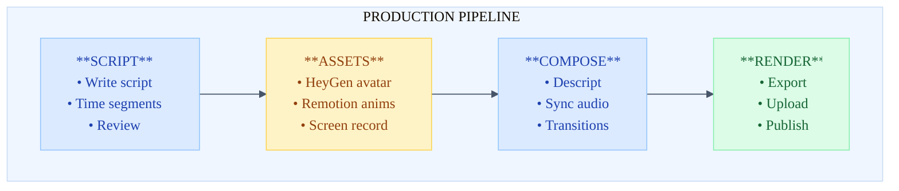
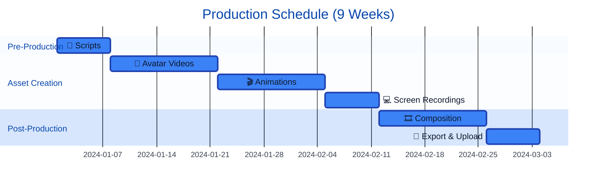

# Video Production Workflow: DevMultiplier Academy

## Overview

This document outlines the complete workflow for producing course videos with AI virtual presenters, animated diagrams,
and code demonstrations.

**Related Documents:**
- [Video Priorities](video-priorities.md) - Which lessons need videos, phased production plan, and subscriber-based update schedule

---

## Video Production Phases (Quick Reference)

| Phase | Videos | Duration | Coverage | Trigger |
|-------|--------|----------|----------|---------|
| **Phase 1: Must Have** | 9 | ~50 min | 33% | Launch |
| **Phase 2: Beneficial** | 7 | ~45 min | 54% | 50+ subscribers |
| **Phase 3: Nice to Have** | 15 | ~70 min | 100% | 200+ subscribers |

**Phase 1 Priority Videos:**
1. Course Introduction
2. M1-L1: What is DDD?
3. M1-L2: Ubiquitous Language
4. M1-L4: Domain Modeling Techniques (Event Storming)
5. M2-L1: Bounded Contexts
6. M4-L1: The Problem CQRS Solves
7. M4-L2: Separating Reads and Writes
8. M5-L1: Event Sourcing Concepts

See [video-priorities.md](video-priorities.md) for complete breakdown and rationale.

---

## Recommended Tool Stack

| Component        | Tool                       | Purpose                     | Cost        |
| ---------------- | -------------------------- | --------------------------- | ----------- |
| AI Avatar        | **HeyGen**                 | Generate presenter videos   | $24-72/mo   |
| Voice (backup)   | **ElevenLabs**             | High-quality TTS            | $5-22/mo    |
| Video Editing    | **Descript**               | Edit, compose, transcribe   | $12-24/mo   |
| Screen Recording | **Descript** / OBS         | Code demos                  | Free-$24/mo |
| Animations       | **Remotion**               | React-based motion graphics | Free (OSS)  |
| Diagrams         | **Mermaid** → **Remotion** | Animated flowcharts         | Free        |
| Final Render     | **DaVinci Resolve**        | Color grading, export       | Free        |

**Estimated Monthly Cost:** $41-118/month

---

## Production Pipeline



---

## Phase 1: Pre-Production

### 1.1 Script Preparation

**Input:** Lesson content markdown **Output:** Timed presenter script

```
📦 course-content/
└── 📁 ddd-to-cqrs/
    └── 📁 module-1/
        ├── 📄 lesson-4-domain-modeling-techniques.md  ← Source
        └── 📁 scripts/
            └── 📄 lesson-4-presenter-script.md        ← Script
```

**Script Format Requirements:**

```markdown
## SEGMENT X: Title (Duration)

### Visual

- Description of what's on screen

### Script

> Presenter dialogue in blockquotes With **emphasis** markers for inflection

### Notes

- Production notes, b-roll suggestions
```

### 1.2 Asset List Generation

For each segment, create an asset checklist:

| Segment | Asset Type | Description              | Status |
| ------- | ---------- | ------------------------ | ------ |
| 1       | Avatar     | Intro presenter shot     | ⬜     |
| 2       | Animation  | Sticky notes appearing   | ⬜     |
| 3       | Animation  | Full Event Storm diagram | ⬜     |
| 4       | Screen     | Code editor walkthrough  | ⬜     |
| ...     | ...        | ...                      | ...    |

---

## Phase 2: Asset Creation

### 2.1 HeyGen Avatar Videos

**Setup (One-time):**

1. Create HeyGen account at https://heygen.com
2. Choose or create avatar:
   - **Option A:** Select from 230+ stock avatars
   - **Option B:** Create custom avatar from video (recommended for brand consistency)
3. Select voice or clone your own

**Per-Video Process:**

```
1. Go to HeyGen → Create Video → AI Avatar
2. Select your avatar
3. Paste script segment (presenter dialogue only)
4. Choose background: Transparent (for compositing)
5. Generate video
6. Download MP4
```

**File Naming Convention:**

```
lesson-{lesson}-segment-{segment}-avatar.mp4

Example:
lesson-4-segment-1-avatar.mp4
lesson-4-segment-2-avatar.mp4
```

**HeyGen Settings:**

- Resolution: 1920x1080
- Background: Transparent or Green screen
- Voice speed: 1.0x (adjust in post if needed)
- Gestures: Auto (or manual if available)

**HeyGen Project Folder Structure:**

Organize your HeyGen projects for easy navigation and consistent production:

```
📁 DevMultiplier Academy
├── 📁 DDD to CQRS
│   ├── 📁 Module 1 - Introduction to DDD (5 lessons)
│   ├── 📁 Module 2 - Bounded Contexts & Strategic Design (5 lessons)
│   ├── 📁 Module 3 - Aggregates & Tactical Patterns (5 lessons)
│   ├── 📁 Module 4 - Introduction to CQRS (4 lessons)
│   ├── 📁 Module 5 - Event Sourcing Fundamentals (3 lessons)
│   └── 📁 Module 6 - AI-Assisted Implementation (3 lessons)
│
├── 📁 Marketing
│   ├── 📁 Course Promos
│   │   ├── 📁 DDD to CQRS Trailer
│   │   └── 📁 Platform Overview
│   ├── 📁 Social Media
│   │   ├── 📁 YouTube Shorts
│   │   └── 📁 LinkedIn Videos
│   └── 📁 Testimonials
│
├── 📁 Platform Videos
│   ├── 📁 Welcome & Onboarding
│   ├── 📁 How-To Guides
│   └── 📁 Feature Announcements
│
└── 📁 Templates & Tests
    ├── 📁 Avatar Tests
    ├── 📁 Voice Tests
    └── 📁 Style Experiments
```

**Folder Naming Tips:**

- Use numbered prefixes for modules/lessons (e.g., "01 - Introduction") for correct sorting
- Keep names concise but descriptive
- Create a "Templates & Tests" folder for experimentation without cluttering course folders

### 2.2 Remotion Animations

**Setup (One-time):**

```bash
# Install Remotion
bunx create-video@latest devmultiplier-animations
cd devmultiplier-animations
bun install
```

**Project Structure:**

```
📦 remotion/
├── 📁 src/
│   ├── 📁 components/
│   │   ├── 🧩 Arrow.tsx
│   │   ├── 🧩 BoundedContext.tsx
│   │   └── 🧩 StickyNote.tsx
│   ├── 📁 compositions/
│   │   └── 🧩 EventStormDemo.tsx
│   ├── 📄 index.tsx
│   └── 📄 Root.tsx
├── 📄 bun.lock
├── 📄 package.json
├── 📄 README.md
└── 📄 tsconfig.json
```

**Render Animation:**

```bash
# Preview
bun run start

# Render to MP4
bun run render:all
```

### 2.3 Screen Recordings (Code Demos)

**Using Descript:**

1. Open Descript → New Project
2. Click Record → Screen Recording
3. Open VS Code with prepared code file
4. Record while narrating (or add narration later)
5. Export individual segments

**Using OBS (Free alternative):**

```
Settings:
- Resolution: 1920x1080
- FPS: 30
- Format: MP4
- Encoder: x264 (or hardware if available)
```

**Code Demo Preparation:**

1. Create clean code file with final state
2. Use VS Code extension "Code Highlighter" for visual emphasis
3. Increase font size: `"editor.fontSize": 18`
4. Use theme: "GitHub Light" (matches course branding)

---

## Phase 3: Composition in Descript

### 3.1 Project Setup

```
📦 Descript Project Structure:
└── 📁 Lesson 4 - Domain Modeling/
    ├── 📁 Media/
    │   ├── 📁 Avatar/
    │   │   ├── 🎬 segment-1-avatar.mp4
    │   │   └── ...
    │   ├── 📁 Animations/
    │   │   ├── 🎬 segment-3-animation.mp4
    │   │   └── ...
    │   └── 📁 Screen/
    │       └── 🎬 segment-4-code.mp4
    ├── 📁 Sequences/
    │   ├── 📄 01-Introduction.dscript
    │   ├── 📄 02-EventStorming.dscript
    │   └── ...
    └── 📁 Final/
        └── 📄 Lesson-4-Complete.dscript
```

### 3.2 Composition Templates

| Template | Layout | Use For |
|----------|--------|---------|
| **A** | 👤 Presenter Full Screen | Intro, Outro, Key Takeaways |
| **B** | 👤 30% + 🎬 70% Split | Diagram explanations |
| **C** | 🎬 Full Animation + 👤 PIP | Complex diagram walkthroughs |
| **D** | 💻 Code Editor + 👤 PIP | Code walkthroughs |

**Template A: Presenter Full Screen**

```
┌─────────────────────────────────────┐
│                                     │
│         👤 AI PRESENTER             │
│           (100% Width)              │
│                                     │
│  ┌─────────────────────┐            │
│  │ Lower Third: Topic  │            │
│  └─────────────────────┘            │
└─────────────────────────────────────┘
```

**Template B: Presenter + Content (Split)**

```
┌─────────────────────────────────────┐
│ ┌─────────┐  ┌───────────────────┐  │
│ │         │  │                   │  │
│ │   👤    │  │    🎬 ANIMATION   │  │
│ │  PRES   │  │                   │  │
│ │  (30%)  │  │      (70%)        │  │
│ │         │  │                   │  │
│ └─────────┘  └───────────────────┘  │
└─────────────────────────────────────┘
```

**Template C: Full Animation + Voice**

```
┌─────────────────────────────────────┐
│                                     │
│        🎬 FULL ANIMATION            │
│         (Voice-over only)           │
│                                     │
│  ┌──────┐                           │
│  │👤 PIP│                           │
│  └──────┘                           │
└─────────────────────────────────────┘
```

**Template D: Code Demo**

```
┌─────────────────────────────────────┐
│  ┌───────────────────────────────┐  │
│  │                               │  │
│  │      💻 CODE EDITOR           │  │
│  │                               │  │
│  └───────────────────────────────┘  │
│  ┌──────┐                           │
│  │👤 PIP│  (Presenter corner)       │
│  └──────┘                           │
└─────────────────────────────────────┘
```

### 3.3 Descript Workflow

```
1. Import all assets (avatar, animations, screen recordings)
2. Create new Composition
3. Arrange on timeline:
   - Drag avatar video as base layer
   - Add animation/screen as overlay
   - Adjust sizes using templates above
4. Sync audio (Descript auto-transcribes)
5. Add transitions (0.5s crossfade between segments)
6. Add lower thirds and text overlays
7. Review and adjust timing
8. Export
```

### 3.4 Branding Elements

**Lower Third (Segment Title):**

```
┌─────────────────────────────────┐
│  ▌ Domain Modeling Techniques   │
│  ▌ Event Storming               │
└─────────────────────────────────┘

Font: System UI, 32px
Colors:
- Bar: #3b82f6 (brand blue)
- Text: #0f172a (dark navy)
```

**Course Bug (Corner Logo):**

```
Position: Top-right, 10% from edges
Size: 120x40px
Asset: /public/logo.svg (transparent)
```

---

## Phase 4: Final Render & Export

### 4.1 Export Settings

**YouTube/Course Platform:**

```
Format: MP4 (H.264)
Resolution: 1920x1080
Frame Rate: 30fps
Bitrate: 10-15 Mbps
Audio: AAC, 48kHz, 320kbps
```

**Backup/Archive:**

```
Format: ProRes 422 or DNxHD
Resolution: 1920x1080
```

### 4.2 Quality Checklist

Before publishing each video:

- [ ] Audio levels consistent (-14 to -12 LUFS)
- [ ] No audio clipping
- [ ] Avatar lip-sync matches dialogue
- [ ] All animations render correctly
- [ ] Code is readable (check on mobile)
- [ ] Lower thirds display long enough (3+ seconds)
- [ ] Transitions are smooth
- [ ] Course branding visible
- [ ] End card displays correctly

### 4.3 File Delivery

```
Final Deliverables per Lesson:
├── lesson-4-domain-modeling.mp4      (YouTube upload)
├── lesson-4-domain-modeling-srt.srt  (Subtitles)
├── lesson-4-thumbnail.png            (1280x720)
└── lesson-4-description.txt          (Video description)
```

---

## Phase 5: Batch Production Process

### 5.1 Efficient Production Order

For a 24-lesson course, batch similar work:

| Week | Phase | Tasks | Status |
|------|-------|-------|--------|
| 1 | 📝 Scripts | Write/review all 24 scripts, Create asset lists | ⬜ |
| 2-3 | 👤 Avatar | Generate all HeyGen segments (batch upload), Download and organize | ⬜ |
| 4-5 | 🎬 Animations | Build reusable Remotion components, Create all animated sequences, Render to MP4 | ⬜ |
| 6 | 💻 Screen | Record all code demos, Basic editing | ⬜ |
| 7-8 | 🎞️ Composition | Assemble all videos in Descript, Add branding/transitions, Quality review | ⬜ |
| 9 | 🚀 Export | Export all videos, Generate subtitles, Upload to platform | ⬜ |



### 5.2 Automation Opportunities

**Script to HeyGen (API):**

```typescript
// scripts/generate-avatar-videos.ts
import { HeyGenAPI } from '@heygen/sdk';

const heygen = new HeyGenAPI({ apiKey: process.env.HEYGEN_API_KEY });

async function generateAvatarVideo(script: string, outputPath: string) {
  const video = await heygen.createVideo({
    avatar_id: 'your-avatar-id',
    voice_id: 'your-voice-id',
    script: script,
    background: { type: 'transparent' },
  });

  // Poll for completion
  await heygen.waitForVideo(video.id);

  // Download
  await heygen.downloadVideo(video.id, outputPath);
}
```

**Batch Remotion Render:**

```bash
#!/bin/bash
# scripts/render-all-animations.sh

compositions=(
  "Lesson4Segment2"
  "Lesson4Segment3"
  "Lesson4Segment7"
)

for comp in "${compositions[@]}"; do
  bunx remotion render src/index.tsx "$comp" "out/${comp}.mp4"
done
```

---

## Cost Estimation

### Per-Video Costs

| Item                | Cost            | Notes                      |
| ------------------- | --------------- | -------------------------- |
| HeyGen              | ~$0.50-1.00/min | Based on $72/mo for 60 min |
| ElevenLabs (backup) | ~$0.30/min      | If needed                  |
| Descript            | ~$0.40/video    | Based on $24/mo            |
| Remotion            | Free            | Open source                |
| DaVinci Resolve     | Free            | For final touch            |

**For 24 lessons × 28 min average:**

- Total runtime: ~672 minutes
- Avatar cost: ~$336-672
- Total production: ~$500-800

### Monthly Subscription Model

| Service            | Monthly  | Annual (save 20%) |
| ------------------ | -------- | ----------------- |
| HeyGen Creator     | $72      | $58               |
| Descript Pro       | $24      | $19               |
| ElevenLabs Starter | $5       | $5                |
| **Total**          | **$101** | **$82**           |

---

## Appendix: File Templates

### A. Segment Tracking Spreadsheet

```csv
Lesson,Segment,Duration,Avatar,Animation,Screen,Status
1-4,1,2:00,✅,❌,❌,Complete
1-4,2,3:30,✅,✅,❌,In Progress
1-4,3,5:00,⬜,⬜,❌,Not Started
```

### B. Asset Naming Convention

```
{lesson}-{segment}-{type}-{version}.{ext}

Examples:
lesson-4-seg-1-avatar-v1.mp4
lesson-4-seg-3-animation-v2.mp4
lesson-4-seg-4-code-final.mp4
```

### C. Folder Structure Template

```
📦 production/
├── 📁 scripts/
│   └── 📄 lesson-4-presenter-script.md
├── 📁 assets/
│   ├── 📁 avatar/
│   ├── 📁 animations/
│   ├── 📁 screen/
│   └── 📁 branding/
├── 📁 compositions/
│   └── 📁 lesson-4/
├── 📁 exports/
│   ├── 📁 youtube/
│   └── 📁 archive/
└── 📁 tracking/
    └── 📄 production-status.csv
```

---

## Quick Start Checklist

To produce your first video (Module 1, Lesson 4):

- [ ] 1. Sign up for HeyGen (free trial available)
- [ ] 2. Sign up for Descript (free tier works for testing)
- [ ] 3. Install Remotion: `bunx create-video@latest`
- [ ] 4. Generate Segment 1 avatar video in HeyGen
- [ ] 5. Create Segment 3 animation in Remotion
- [ ] 6. Compose in Descript
- [ ] 7. Export and review
- [ ] 8. Iterate based on feedback

**Estimated time for first video:** 4-6 hours (including learning curve) **Subsequent videos:** 2-3 hours each
