# Domain Modeling Techniques

**Duration:** 28 minutes **Learning Objectives:**

- Apply Event Storming to discover domain models
- Extract entities, aggregates, and bounded contexts from business conversations
- Use Domain Storytelling to validate models with stakeholders
- Leverage AI to accelerate modeling while maintaining quality

---

## Introduction

Domain modeling is both an art and a science. It requires translating fuzzy business requirements into crisp, executable
code without losing the richness of the domain. This lesson covers practical techniques you can use tomorrow to extract
better models from your domain experts.

## Technique 1: Event Storming

**What:** A collaborative workshop technique where domain experts and developers map out business processes using sticky
notes.

**When:** Beginning of project, when exploring new features, or when existing model feels wrong.

### The Event Storming Process

#### Step 1: Gather Domain Events

**Domain Event:** Something that happened in the past that domain experts care about.

```
Orange Sticky Notes = Domain Events (past tense)

Examples:
- OrderPlaced
- PaymentReceived
- OrderShipped
- OrderCancelled
- InventoryReplenished
- ProductDiscontinued
```

#### Step 2: Identify Commands

**Command:** An intention to do something, usually triggered by a user action.

```
Blue Sticky Notes = Commands (imperative)

Examples:
- PlaceOrder
- ProcessPayment
- ShipOrder
- CancelOrder
- ReplenishInventory
- DiscontinueProduct
```

#### Step 3: Find Aggregates

**Aggregate:** A cluster of related objects that should be treated as a single unit.

```
Yellow Sticky Notes = Aggregates

Examples:
- Order
- Payment
- Inventory
- Product
```

#### Step 4: Identify Bounded Contexts

**Bounded Context:** A boundary within which a particular model is defined and applicable.

```
Large Paper = Bounded Contexts

Examples:
- Sales Context (Order, Customer, Cart)
- Fulfillment Context (Shipment, Inventory, Warehouse)
- Catalog Context (Product, Category, Price)
```

### Event Storming Example: E-Commerce Checkout

```mermaid
%%{init: {'theme': 'base', 'themeVariables': {
  'primaryColor': '#e8f5e9',
  'primaryTextColor': '#1b5e20',
  'primaryBorderColor': '#2e7d32',
  'lineColor': '#475569',
  'secondaryColor': '#fff3e0',
  'tertiaryColor': '#e3f2fd',
  'background': '#ffffff',
  'textColor': '#1f2328',
  'fontFamily': 'system-ui, -apple-system, sans-serif'
}}}%%
flowchart TB
    subgraph SALES ["SALES CONTEXT"]
        direction LR
        S_Actor["👤 Customer"]
        S_Cmd1["AddItemToCart"]
        S_Event1["ItemAddedToCart"]
        S_Cmd2["PlaceOrder"]
        S_Event2["OrderPlaced"]
        S_Rules["📋 Rules:<br/>• Items in cart<br/>• Valid payment"]
        S_Agg["🔷 Order"]

        S_Actor --> S_Cmd1 --> S_Event1
        S_Actor --> S_Cmd2 --> S_Event2
    end

    subgraph PAYMENT ["PAYMENT CONTEXT"]
        direction LR
        P_Cmd["ProcessPayment"]
        P_Event1["PaymentProcessed"]
        P_Event2["PaymentFailed"]
        P_Agg["🔷 Payment"]
        P_Ext["⚡ Stripe"]

        P_Cmd --> P_Event1
        P_Cmd -.-> P_Event2
    end

    subgraph FULFILLMENT ["FULFILLMENT CONTEXT"]
        direction LR
        F_Cmd1["AllocateInventory"]
        F_Event1["InventoryAllocated"]
        F_Cmd2["ShipOrder"]
        F_Event2["OrderShipped"]
        F_Agg["🔷 Shipment, Inventory"]

        F_Cmd1 --> F_Event1
        F_Event1 --> F_Cmd2 --> F_Event2
    end

    S_Event2 --> P_Cmd
    P_Event1 --> F_Cmd1

    style SALES fill:#e8f5e9,stroke:#2e7d32,stroke-width:2px
    style PAYMENT fill:#fff3e0,stroke:#e65100,stroke-width:2px
    style FULFILLMENT fill:#e3f2fd,stroke:#1565c0,stroke-width:2px
    style S_Actor fill:#c8e6c9,stroke:#388e3c,color:#1b5e20
    style S_Cmd1 fill:#bbdefb,stroke:#1976d2,color:#0d47a1
    style S_Cmd2 fill:#bbdefb,stroke:#1976d2,color:#0d47a1
    style S_Event1 fill:#ffe0b2,stroke:#f57c00,color:#e65100
    style S_Event2 fill:#ffe0b2,stroke:#f57c00,color:#e65100
    style P_Cmd fill:#bbdefb,stroke:#1976d2,color:#0d47a1
    style P_Event1 fill:#ffe0b2,stroke:#f57c00,color:#e65100
    style P_Event2 fill:#ffcdd2,stroke:#c62828,color:#b71c1c
    style F_Cmd1 fill:#bbdefb,stroke:#1976d2,color:#0d47a1
    style F_Cmd2 fill:#bbdefb,stroke:#1976d2,color:#0d47a1
    style F_Event1 fill:#ffe0b2,stroke:#f57c00,color:#e65100
    style F_Event2 fill:#ffe0b2,stroke:#f57c00,color:#e65100
```



### Translating Event Storm to Code

```typescript
// Bounded Context: Sales
export namespace Sales {
  // Domain Events
  export class ItemAddedToCart extends DomainEvent {
    constructor(
      public readonly cartId: CartId,
      public readonly productId: ProductId,
      public readonly quantity: number
    ) {
      super();
    }
  }

  export class OrderPlaced extends DomainEvent {
    constructor(
      public readonly orderId: OrderId,
      public readonly customerId: CustomerId,
      public readonly items: OrderItem[],
      public readonly total: Money
    ) {
      super();
    }
  }

  // Aggregate
  export class Order {
    private constructor(
      private readonly id: OrderId,
      private readonly customerId: CustomerId,
      private items: OrderItem[],
      private status: OrderStatus
    ) {}

    static place(customerId: CustomerId, cart: Cart): Order {
      if (cart.isEmpty()) {
        throw new DomainError('Cannot place order with empty cart');
      }

      const items = cart.items.map((item) => OrderItem.fromCartItem(item));
      const order = new Order(OrderId.generate(), customerId, items, OrderStatus.Placed);

      order.addDomainEvent(new OrderPlaced(order.id, customerId, items, order.calculateTotal()));

      return order;
    }

    private calculateTotal(): Money {
      return this.items.reduce((total, item) => total.add(item.subtotal), Money.zero());
    }
  }

  // Commands
  export interface PlaceOrderCommand {
    customerId: string;
    cartId: string;
  }

  // Command Handler
  export class PlaceOrderHandler {
    constructor(
      private readonly cartRepository: CartRepository,
      private readonly orderRepository: OrderRepository
    ) {}

    async handle(command: PlaceOrderCommand): Promise<OrderId> {
      const cart = await this.cartRepository.findById(CartId.from(command.cartId));
      const order = Order.place(CustomerId.from(command.customerId), cart);

      await this.orderRepository.save(order);
      return order.id;
    }
  }
}

// Bounded Context: Payment
export namespace Payment {
  export class PaymentProcessed extends DomainEvent {
    constructor(
      public readonly paymentId: PaymentId,
      public readonly orderId: OrderId,
      public readonly amount: Money
    ) {
      super();
    }
  }

  export class Payment {
    async process(orderId: OrderId, paymentMethod: PaymentMethod): Promise<Payment> {
      // Payment processing logic
      this.addDomainEvent(new PaymentProcessed(this.id, orderId, this.amount));
      return this;
    }
  }
}
```

## Technique 2: Domain Storytelling

**What:** A pictorial language for visualizing workflows, showing actors, work objects, and activities.

**When:** Validating models with non-technical stakeholders, documenting complex flows.

### Example: Order Processing Story

```
Actors: Customer, System, Warehouse Staff

Story: Customer places an order

1. Customer → [Cart] → adds product
2. Customer → [Cart] → proceeds to checkout
3. Customer → [Payment Form] → enters payment details
4. System → [Payment Gateway] → processes payment
5. System → [Order] → creates order
6. System → [Customer] → sends confirmation email
7. System → [Warehouse] → sends fulfillment request
8. Warehouse Staff → [Inventory] → picks items
9. Warehouse Staff → [Shipment] → creates shipment
10. System → [Customer] → sends tracking information
```

### Code Representation

```typescript
// The "story" becomes a saga/process manager
class OrderProcessingSaga {
  async handle(event: OrderPlaced): Promise<void> {
    // Step 4-5: Process payment and create order
    const payment = await this.paymentService.process(event.orderId, event.paymentMethod);

    if (!payment.isSuccessful()) {
      await this.orderService.markAsFailed(event.orderId);
      return;
    }

    // Step 6: Send confirmation
    await this.emailService.sendOrderConfirmation(event.orderId);

    // Step 7: Request fulfillment
    await this.fulfillmentService.requestFulfillment({
      orderId: event.orderId,
      items: event.items,
      shippingAddress: event.shippingAddress,
    });
  }

  async handle(event: OrderShipped): Promise<void> {
    // Step 10: Send tracking info
    await this.emailService.sendTrackingInfo(event.orderId, event.trackingNumber);
  }
}
```

## Technique 3: Example Mapping

**What:** A structured conversation technique using examples to explore rules and edge cases.

**Format:**

- **Rule (Yellow):** Business rule to explore
- **Example (Green):** Concrete example
- **Question (Red):** Unresolved question
- **Story (Blue):** User story being discussed

### Example Session: Return Policy

```
Story (Blue):
As a customer, I want to return items I'm not satisfied with

Rule (Yellow):
Items can be returned within 30 days if unopened

Example (Green):
✓ Customer bought item on Jan 1, wants to return on Jan 25 → Allowed
✓ Customer bought item on Jan 1, wants to return on Feb 5 → Rejected
✓ Customer opened the item → Rejected

Question (Red):
? What if the item was damaged during shipping?
? What about digital products?
? What if it's a promotional/clearance item?

After discussion:
Rule (Yellow): Damaged items can be returned anytime
Rule (Yellow): Digital products cannot be returned
Rule (Yellow): Promotional items can be returned for store credit only
```

### Code Implementation

```typescript
class OrderItem {
  canBeReturned(today: Date): boolean {
    if (this.isDamaged()) {
      return true; // Can always return damaged items
    }

    if (this.isDigital()) {
      return false; // Digital products cannot be returned
    }

    if (this.isOpened() && !this.isDamaged()) {
      return false; // Cannot return opened items unless damaged
    }

    return this.order.isWithinReturnWindow(today);
  }

  getReturnType(): ReturnType {
    if (!this.canBeReturned(new Date())) {
      throw new DomainError('Item cannot be returned');
    }

    if (this.isPromotional()) {
      return ReturnType.StoreCredit; // Promotional items → store credit
    }

    return ReturnType.Refund; // Normal items → full refund
  }
}

class Order {
  private static readonly RETURN_WINDOW_DAYS = 30;

  isWithinReturnWindow(today: Date): boolean {
    const daysSincePurchase = this.placedAt.daysUntil(today);
    return daysSincePurchase <= Order.RETURN_WINDOW_DAYS;
  }
}

// Tests match examples from Example Mapping
describe('Return Policy', () => {
  it('allows returns within 30 days for unopened items', () => {
    const order = createOrder({ placedAt: new Date('2024-01-01') });
    const item = createOrderItem({ opened: false });

    expect(item.canBeReturned(new Date('2024-01-25'))).toBe(true);
    expect(item.canBeReturned(new Date('2024-02-05'))).toBe(false);
  });

  it('rejects returns for opened items', () => {
    const item = createOrderItem({ opened: true, damaged: false });
    expect(item.canBeReturned(new Date())).toBe(false);
  });

  it('allows returns for damaged items anytime', () => {
    const order = createOrder({ placedAt: new Date('2023-01-01') }); // Over a year ago
    const item = createOrderItem({ damaged: true });
    expect(item.canBeReturned(new Date())).toBe(true);
  });

  it('prevents returns for digital products', () => {
    const item = createOrderItem({ digital: true, opened: false });
    expect(item.canBeReturned(new Date())).toBe(false);
  });

  it('returns store credit for promotional items', () => {
    const item = createOrderItem({ promotional: true });
    expect(item.getReturnType()).toBe(ReturnType.StoreCredit);
  });
});
```

## Technique 4: Context Mapping

**What:** Visualizing relationships between bounded contexts.

**Relationships:**

- **Shared Kernel:** Shared code between contexts (use sparingly)
- **Customer-Supplier:** Upstream context provides API, downstream consumes
- **Conformist:** Downstream conforms to upstream's model
- **Anti-Corruption Layer:** Translate between contexts to protect downstream
- **Open Host Service:** Upstream provides public API for many consumers
- **Published Language:** Standardized schema for integration (JSON, XML)

### Example: E-Commerce Context Map


```typescript
// Anti-Corruption Layer between Sales and Fulfillment
class FulfillmentAdapter {
  // Translates Sales concepts to Fulfillment concepts
  async requestShipment(order: Sales.Order): Promise<void> {
    // Sales "Order" → Fulfillment "ShipmentRequest"
    const request: Fulfillment.ShipmentRequest = {
      shipmentId: this.generateShipmentId(),
      items: order.items.map((item) => ({
        sku: item.product.sku, // Fulfillment uses SKU, not ProductId
        quantity: item.quantity,
      })),
      destination: this.translateAddress(order.shippingAddress),
      priority: this.determinePriority(order),
    };

    await this.fulfillmentService.createShipment(request);
  }

  private translateAddress(salesAddress: Sales.Address): Fulfillment.ShippingDestination {
    // Translate between different address models
    return new Fulfillment.ShippingDestination(
      salesAddress.street,
      salesAddress.city,
      salesAddress.postalCode,
      salesAddress.country
    );
  }
}

// Open Host Service: Catalog exposes REST API
namespace Catalog {
  export class ProductAPI {
    @Get('/api/products/:id')
    async getProduct(@Param('id') id: string): Promise<ProductDTO> {
      const product = await this.productRepository.findById(ProductId.from(id));
      return this.toDTO(product); // Published Language
    }
  }

  // Published Language (DTO)
  export interface ProductDTO {
    id: string;
    name: string;
    description: string;
    price: {
      amount: number;
      currency: string;
    };
    inStock: boolean;
  }
}
```

## AI-Assisted Domain Modeling

### Using AI for Event Storming

```typescript
// AI Prompt for Event Extraction
const prompt = `
Analyze this business process description and extract:
1. Domain Events (past tense, business-significant occurrences)
2. Commands (user intentions)
3. Aggregates (entities that should be consistent)
4. Business Rules (invariants and constraints)

Process:
"When a customer wants to rent a car, they search for available vehicles
in their desired location and date range. Once they select a vehicle,
they provide their driver's license information and insurance details.
The system verifies their license is valid and they meet the age requirements
(25+ for luxury vehicles, 21+ for standard). If approved, they pay a deposit
and the reservation is confirmed. On pickup day, staff verify the customer's
documents and inspect the vehicle condition together with the customer.
When the customer returns the vehicle, staff inspect it for damage and
calculate any additional charges for mileage, fuel, or damage."

Format as:
Events: [list]
Commands: [list]
Aggregates: [list]
Rules: [list]
`;

// AI Output (to be validated with domain expert):
/*
Events:
- VehicleSearched
- VehicleSelected
- LicenseVerified
- AgeRequirementMet
- DepositPaid
- ReservationConfirmed
- VehiclePickedUp
- VehicleInspected
- VehicleReturned
- AdditionalChargesCalculated

Commands:
- SearchVehicles
- SelectVehicle
- VerifyLicense
- PayDeposit
- ConfirmReservation
- PickupVehicle
- InspectVehicle
- ReturnVehicle
- CalculateCharges

Aggregates:
- Reservation
- Vehicle
- Customer
- Inspection
- Payment

Rules:
- Age requirement: 25+ for luxury, 21+ for standard vehicles
- License must be valid at time of rental
- Deposit required before confirmation
- Vehicle must be inspected at pickup and return
- Additional charges for excess mileage, low fuel, or damage
*/
```

### AI for Code Generation

```typescript
// After validating events/aggregates with domain expert, use AI for boilerplate

// Prompt:
/*
Generate a DDD aggregate for CarReservation with:
- Value objects: ReservationId, CustomerId, VehicleId, DateRange
- States: Draft, Confirmed, PickedUp, Completed, Cancelled
- Methods: confirm(), pickup(), complete(), cancel()
- Business rules:
  * Cannot confirm without valid license and payment
  * Cannot pickup before start date
  * Cannot complete before end date
  * Cannot cancel after pickup
- Domain events for each state transition
*/

// AI generates boilerplate, you review and refine:
class CarReservation {
  private constructor(
    private readonly id: ReservationId,
    private readonly customerId: CustomerId,
    private readonly vehicleId: VehicleId,
    private readonly dateRange: DateRange,
    private status: ReservationStatus,
    private readonly licenseVerified: boolean,
    private readonly depositPaid: boolean
  ) {}

  confirm(): ReservationConfirmed {
    if (this.status !== ReservationStatus.Draft) {
      throw new DomainError('Can only confirm draft reservations');
    }

    if (!this.licenseVerified) {
      throw new DomainError('License must be verified before confirmation');
    }

    if (!this.depositPaid) {
      throw new DomainError('Deposit must be paid before confirmation');
    }

    this.status = ReservationStatus.Confirmed;
    return new ReservationConfirmed(this.id, this.customerId, this.vehicleId);
  }

  // ... AI generated other methods
}
```

## Key Takeaways

1. **Event Storming reveals workflow** - Domain events are the skeleton of your model
2. **Multiple techniques** - Use event storming, domain storytelling, and example mapping together
3. **Validate with domain experts** - Models only work if they match business reality
4. **Context maps show boundaries** - Visualize how contexts interact
5. **AI accelerates but doesn't replace** - Use AI for boilerplate, not business rules
6. **Iterate constantly** - Models evolve as understanding deepens

## Common Pitfalls

❌ **Skipping domain expert validation** - AI-generated models might be technically sound but domain-wrong ❌
**Over-reliance on one technique** - Use multiple approaches for better coverage ❌ **Premature coding** - Model first,
code second ❌ **Perfect modeling paralysis** - Start with good enough, refine as you learn ❌ **Ignoring context
boundaries** - Trying to use one model everywhere

## Next Steps

In the next module, we'll dive deep into **Bounded Contexts and Strategic Design**—how to organize complex systems into
manageable contexts.

## Hands-On Exercise

**Model a Domain:**

Choose a business process you're familiar with (e.g., restaurant ordering, hotel booking, library checkout):

1. **Event Storm:**
   - List 10-15 domain events (past tense)
   - Identify commands that cause those events
   - Group related events into aggregates
   - Identify 2-3 bounded contexts

2. **Example Mapping:**
   - Pick one business rule
   - Create 3-5 concrete examples (including edge cases)
   - Identify at least 2 questions to ask domain expert

3. **Code Structure:**
   - Define domain events as TypeScript classes
   - Create one aggregate with a rich domain method
   - Write tests based on your examples

**Starter Template:**

```typescript
// Domain Events
class OrderPlaced extends DomainEvent {
  constructor(
    public readonly orderId: OrderId,
    public readonly customerId: CustomerId,
    public readonly items: OrderItem[]
  ) {
    super();
  }
}

// Aggregate
class Order {
  private constructor(
    private readonly id: OrderId,
    private status: OrderStatus,
    private items: OrderItem[]
  ) {}

  static create(customerId: CustomerId, items: OrderItem[]): Order {
    // Factory method with business rules
  }

  place(): OrderPlaced {
    // Business logic
  }
}

// Tests
describe('Order', () => {
  it('example from mapping session', () => {
    // Test your concrete examples
  });
});
```

---

**Time to complete:** 90 minutes **Difficulty:** Advanced

Share your event storm diagram and code in the course forum!
