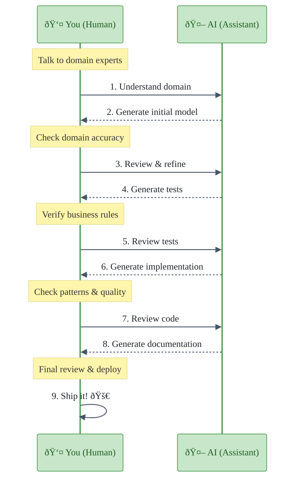

# Production-Ready DDD/CQRS Systems with AI

**Duration:** 30 minutes
**Learning Objectives:**
- Use AI as a pair programmer for DDD/CQRS development
- Master the complete iterative refinement workflow
- Generate comprehensive documentation with AI
- Maintain ubiquitous language across codebase with AI
- Understand AI limitations in domain modeling
- Implement best practices for AI-human collaboration
- Ensure security and quality in AI-generated code
- Build a complete feature from scratch with AI assistance
- Apply production readiness checklist

---

## Introduction

Building production-ready DDD/CQRS systems requires more than just writing code. You need comprehensive tests, documentation, monitoring, security, and maintainability. AI can accelerate every phase of development—from initial domain modeling to deployment—if you know how to collaborate effectively. This lesson teaches you the complete workflow for shipping high-quality systems with AI as your pair programmer.

## AI as Your Pair Programmer

### The AI-Human Collaboration Model

**AI's Strengths:**
- Generating boilerplate and patterns
- Suggesting implementations from descriptions
- Creating comprehensive tests
- Writing documentation
- Spotting common anti-patterns
- Translating between technical and business language

**AI's Limitations:**
- Cannot understand your specific business domain
- Cannot make strategic architectural decisions
- Cannot talk to domain experts
- Cannot understand user needs
- Cannot evaluate business trade-offs
- May generate outdated or incorrect patterns

**The Workflow:**



### Setting Up AI Context

```typescript
// GOOD PRACTICE: Create context document for AI
// File: .ai/context.md

# Project Context

## Domain: E-Commerce Order Management

**Ubiquitous Language:**
- Order: A customer's purchase request with items, shipping, and payment
- Cart: Temporary collection of items before order placement
- Checkout: Process of converting cart to order
- Payment Authorization: Hold on customer's payment method
- Payment Capture: Actual charge to customer
- Fulfillment: Process of picking, packing, and shipping order

**Business Rules:**
- Orders can only be cancelled before shipment
- Refunds require manager approval if > $500
- Free shipping on orders > $50
- Tax calculated based on shipping address
- Inventory reserved when order placed
- Payment captured when order ships

**Bounded Contexts:**
1. Order Management (our context)
2. Inventory (external)
3. Payment (external)
4. Shipping (external)

**Tech Stack:**
- TypeScript
- Prisma ORM with PostgreSQL
- Domain-Driven Design
- CQRS pattern
- Event-driven architecture

When generating code:
- Use TypeScript strict mode
- Follow DDD patterns (aggregates, value objects, domain events)
- Use Zod for validation
- Include comprehensive tests
- Use proper error handling with custom error classes
```

## Complete Feature Development Workflow

### Phase 1: Domain Modeling with AI

**Step 1: Capture Domain Knowledge**

```
YOU: I'm implementing a "Apply Coupon to Order" feature. Here's what I learned from
the business owner:

- Customers can apply one coupon per order
- Coupons have codes, discount type (percentage or fixed), and amount
- Coupons can have expiration dates
- Some coupons require minimum order value
- Some coupons only apply to specific product categories
- Once applied, coupon discount is calculated and stored on order
- Coupons can be removed before order is placed

Model this as DDD value objects and aggregate methods.
```

**AI Response:**

```typescript
// Value Objects
class CouponCode {
  private constructor(private readonly value: string) {}

  static create(code: string): Result<CouponCode, ValidationError> {
    if (!code || code.trim().length === 0) {
      return err(new ValidationError('Coupon code cannot be empty'));
    }

    const normalized = code.trim().toUpperCase();

    if (!/^[A-Z0-9]{4,20}$/.test(normalized)) {
      return err(
        new ValidationError('Coupon code must be 4-20 alphanumeric characters')
      );
    }

    return ok(new CouponCode(normalized));
  }

  getValue(): string {
    return this.value;
  }

  equals(other: CouponCode): boolean {
    return this.value === other.value;
  }
}

type DiscountType = 'Percentage' | 'FixedAmount';

class CouponDiscount {
  private constructor(
    private readonly type: DiscountType,
    private readonly amount: number
  ) {}

  static percentage(percent: number): Result<CouponDiscount, ValidationError> {
    if (percent <= 0 || percent > 100) {
      return err(
        new ValidationError('Percentage discount must be between 0 and 100')
      );
    }

    return ok(new CouponDiscount('Percentage', percent));
  }

  static fixedAmount(amount: number): Result<CouponDiscount, ValidationError> {
    if (amount <= 0) {
      return err(new ValidationError('Fixed discount must be positive'));
    }

    return ok(new CouponDiscount('FixedAmount', amount));
  }

  calculateDiscount(orderTotal: Money): Money {
    if (this.type === 'Percentage') {
      const discountAmount = orderTotal.amount * (this.amount / 100);
      return Money.of(discountAmount, orderTotal.currency);
    }

    return Money.of(this.amount, orderTotal.currency);
  }

  getType(): DiscountType {
    return this.type;
  }

  getAmount(): number {
    return this.amount;
  }
}

class Coupon {
  private constructor(
    private readonly code: CouponCode,
    private readonly discount: CouponDiscount,
    private readonly expiresAt: Date | null,
    private readonly minimumOrderValue: Money | null,
    private readonly applicableCategories: string[] | null
  ) {}

  static create(
    code: CouponCode,
    discount: CouponDiscount,
    expiresAt?: Date,
    minimumOrderValue?: Money,
    applicableCategories?: string[]
  ): Coupon {
    return new Coupon(
      code,
      discount,
      expiresAt || null,
      minimumOrderValue || null,
      applicableCategories || null
    );
  }

  canApplyTo(order: Order): Result<void, DomainError> {
    // Check expiration
    if (this.expiresAt && new Date() > this.expiresAt) {
      return err(new CouponExpiredError(this.code.getValue()));
    }

    // Check minimum order value
    if (
      this.minimumOrderValue &&
      order.getTotal().isLessThan(this.minimumOrderValue)
    ) {
      return err(
        new MinimumOrderValueError(
          this.minimumOrderValue,
          order.getTotal()
        )
      );
    }

    // Check category restrictions
    if (this.applicableCategories && this.applicableCategories.length > 0) {
      const hasApplicableItem = order
        .getItems()
        .some((item) =>
          this.applicableCategories!.includes(item.getCategory())
        );

      if (!hasApplicableItem) {
        return err(
          new CouponNotApplicableError(
            'No items match coupon category restrictions'
          )
        );
      }
    }

    return ok(undefined);
  }

  calculateDiscount(order: Order): Money {
    let applicableTotal = order.getTotal();

    // If category restrictions, only apply to matching items
    if (this.applicableCategories && this.applicableCategories.length > 0) {
      applicableTotal = order
        .getItems()
        .filter((item) =>
          this.applicableCategories!.includes(item.getCategory())
        )
        .reduce(
          (sum, item) => sum.add(item.getSubtotal()),
          Money.zero(order.getTotal().currency)
        );
    }

    return this.discount.calculateDiscount(applicableTotal);
  }

  getCode(): CouponCode {
    return this.code;
  }

  getDiscount(): CouponDiscount {
    return this.discount;
  }
}

// Aggregate methods
class Order {
  private appliedCoupon: Coupon | null = null;
  private couponDiscount: Money = Money.zero('USD');

  // ... other fields and methods

  applyCoupon(coupon: Coupon): Result<void, DomainError> {
    if (this.status !== 'Draft') {
      return err(
        new OrderNotEditableError(
          'Cannot apply coupon to non-draft order'
        )
      );
    }

    // Check if coupon can be applied
    const canApply = coupon.canApplyTo(this);
    if (!canApply.success) {
      return canApply;
    }

    // Calculate discount
    const discount = coupon.calculateDiscount(this);

    // Apply coupon
    this.appliedCoupon = coupon;
    this.couponDiscount = discount;

    // Recalculate total
    this.recalculateTotal();

    // Raise event
    this.addDomainEvent(
      new CouponAppliedEvent(
        this.id.value,
        coupon.getCode().getValue(),
        discount.amount
      )
    );

    return ok(undefined);
  }

  removeCoupon(): Result<void, DomainError> {
    if (this.status !== 'Draft') {
      return err(
        new OrderNotEditableError(
          'Cannot remove coupon from non-draft order'
        )
      );
    }

    if (!this.appliedCoupon) {
      return err(new DomainError('No coupon applied to order'));
    }

    const removedCode = this.appliedCoupon.getCode().getValue();

    this.appliedCoupon = null;
    this.couponDiscount = Money.zero(this.total.currency);
    this.recalculateTotal();

    this.addDomainEvent(
      new CouponRemovedEvent(this.id.value, removedCode)
    );

    return ok(undefined);
  }

  getAppliedCoupon(): Coupon | null {
    return this.appliedCoupon;
  }

  getCouponDiscount(): Money {
    return this.couponDiscount;
  }

  private recalculateTotal(): void {
    const subtotal = this.items.reduce(
      (sum, item) => sum.add(item.getSubtotal()),
      Money.zero(this.total.currency)
    );

    const totalBeforeTax = subtotal.subtract(this.couponDiscount);
    const tax = this.calculateTax(totalBeforeTax);

    this.total = totalBeforeTax.add(tax).add(this.shippingCost);
  }
}
```

**Step 2: Review and Refine**

```
YOU: Good start! But I need to clarify some business rules based on what the
domain expert said:

1. Coupons should be checked against current date/time, not just date
2. Category restrictions should also work with subcategories
3. If a coupon gives more discount than the order total, discount should cap at total
4. We need to track who applied the coupon (customer vs. customer service agent)

Please update the model.
```

**AI provides updated implementation...**

### Phase 2: Test Generation

```
YOU: Generate comprehensive tests for the Coupon value object and Order.applyCoupon()
method. Include:
- Happy path
- All business rule validations
- Edge cases
- Boundary conditions
Use Vitest and AAA pattern.
```

**AI Response:**

```typescript
import { describe, it, expect, beforeEach } from 'vitest';

describe('Coupon Value Object', () => {
  describe('CouponCode', () => {
    describe('create()', () => {
      it('should create valid coupon code', () => {
        // Arrange & Act
        const result = CouponCode.create('SAVE20');

        // Assert
        expect(result.success).toBe(true);
        expect(result.data?.getValue()).toBe('SAVE20');
      });

      it('should normalize code to uppercase', () => {
        // Arrange & Act
        const result = CouponCode.create('save20');

        // Assert
        expect(result.success).toBe(true);
        expect(result.data?.getValue()).toBe('SAVE20');
      });

      it('should trim whitespace', () => {
        // Arrange & Act
        const result = CouponCode.create('  SAVE20  ');

        // Assert
        expect(result.success).toBe(true);
        expect(result.data?.getValue()).toBe('SAVE20');
      });

      it('should reject empty code', () => {
        // Arrange & Act
        const result = CouponCode.create('');

        // Assert
        expect(result.success).toBe(false);
        expect(result.error?.message).toContain('cannot be empty');
      });

      it('should reject code with special characters', () => {
        // Arrange & Act
        const result = CouponCode.create('SAVE-20');

        // Assert
        expect(result.success).toBe(false);
        expect(result.error?.message).toContain('alphanumeric');
      });

      it('should reject code shorter than 4 characters', () => {
        // Arrange & Act
        const result = CouponCode.create('SAV');

        // Assert
        expect(result.success).toBe(false);
      });

      it('should reject code longer than 20 characters', () => {
        // Arrange & Act
        const result = CouponCode.create('VERYLONGCOUPONCODE123');

        // Assert
        expect(result.success).toBe(false);
      });
    });

    describe('equals()', () => {
      it('should return true for identical codes', () => {
        // Arrange
        const code1 = unwrap(CouponCode.create('SAVE20'));
        const code2 = unwrap(CouponCode.create('SAVE20'));

        // Act & Assert
        expect(code1.equals(code2)).toBe(true);
      });

      it('should return false for different codes', () => {
        // Arrange
        const code1 = unwrap(CouponCode.create('SAVE20'));
        const code2 = unwrap(CouponCode.create('SAVE30'));

        // Act & Assert
        expect(code1.equals(code2)).toBe(false);
      });
    });
  });

  describe('CouponDiscount', () => {
    describe('percentage()', () => {
      it('should create percentage discount', () => {
        // Arrange & Act
        const result = CouponDiscount.percentage(20);

        // Assert
        expect(result.success).toBe(true);
        expect(result.data?.getType()).toBe('Percentage');
        expect(result.data?.getAmount()).toBe(20);
      });

      it('should reject percentage <= 0', () => {
        // Arrange & Act
        const result = CouponDiscount.percentage(0);

        // Assert
        expect(result.success).toBe(false);
        expect(result.error?.message).toContain('between 0 and 100');
      });

      it('should reject percentage > 100', () => {
        // Arrange & Act
        const result = CouponDiscount.percentage(101);

        // Assert
        expect(result.success).toBe(false);
      });

      it('should allow maximum 100%', () => {
        // Arrange & Act
        const result = CouponDiscount.percentage(100);

        // Assert
        expect(result.success).toBe(true);
      });
    });

    describe('fixedAmount()', () => {
      it('should create fixed amount discount', () => {
        // Arrange & Act
        const result = CouponDiscount.fixedAmount(10);

        // Assert
        expect(result.success).toBe(true);
        expect(result.data?.getType()).toBe('FixedAmount');
        expect(result.data?.getAmount()).toBe(10);
      });

      it('should reject amount <= 0', () => {
        // Arrange & Act
        const result = CouponDiscount.fixedAmount(0);

        // Assert
        expect(result.success).toBe(false);
      });
    });

    describe('calculateDiscount()', () => {
      it('should calculate percentage discount correctly', () => {
        // Arrange
        const discount = unwrap(CouponDiscount.percentage(20));
        const orderTotal = Money.of(100, 'USD');

        // Act
        const result = discount.calculateDiscount(orderTotal);

        // Assert
        expect(result.amount).toBe(20);
      });

      it('should calculate fixed amount discount', () => {
        // Arrange
        const discount = unwrap(CouponDiscount.fixedAmount(15));
        const orderTotal = Money.of(100, 'USD');

        // Act
        const result = discount.calculateDiscount(orderTotal);

        // Assert
        expect(result.amount).toBe(15);
      });

      it('should handle 100% discount', () => {
        // Arrange
        const discount = unwrap(CouponDiscount.percentage(100));
        const orderTotal = Money.of(50, 'USD');

        // Act
        const result = discount.calculateDiscount(orderTotal);

        // Assert
        expect(result.amount).toBe(50);
      });
    });
  });

  describe('Coupon', () => {
    describe('canApplyTo()', () => {
      it('should allow valid coupon', () => {
        // Arrange
        const code = unwrap(CouponCode.create('SAVE20'));
        const discount = unwrap(CouponDiscount.percentage(20));
        const coupon = Coupon.create(code, discount);
        const order = createTestOrder(100);

        // Act
        const result = coupon.canApplyTo(order);

        // Assert
        expect(result.success).toBe(true);
      });

      it('should reject expired coupon', () => {
        // Arrange
        const code = unwrap(CouponCode.create('EXPIRED'));
        const discount = unwrap(CouponDiscount.percentage(20));
        const yesterday = new Date();
        yesterday.setDate(yesterday.getDate() - 1);
        const coupon = Coupon.create(code, discount, yesterday);
        const order = createTestOrder(100);

        // Act
        const result = coupon.canApplyTo(order);

        // Assert
        expect(result.success).toBe(false);
        expect(result.error).toBeInstanceOf(CouponExpiredError);
      });

      it('should reject if order below minimum', () => {
        // Arrange
        const code = unwrap(CouponCode.create('SAVE20'));
        const discount = unwrap(CouponDiscount.percentage(20));
        const minimum = Money.of(100, 'USD');
        const coupon = Coupon.create(code, discount, undefined, minimum);
        const order = createTestOrder(50); // Below minimum

        // Act
        const result = coupon.canApplyTo(order);

        // Assert
        expect(result.success).toBe(false);
        expect(result.error).toBeInstanceOf(MinimumOrderValueError);
      });

      it('should allow if order meets minimum exactly', () => {
        // Arrange
        const code = unwrap(CouponCode.create('SAVE20'));
        const discount = unwrap(CouponDiscount.percentage(20));
        const minimum = Money.of(100, 'USD');
        const coupon = Coupon.create(code, discount, undefined, minimum);
        const order = createTestOrder(100); // Exactly minimum

        // Act
        const result = coupon.canApplyTo(order);

        // Assert
        expect(result.success).toBe(true);
      });

      it('should reject if no items match category restriction', () => {
        // Arrange
        const code = unwrap(CouponCode.create('ELECTRONICS'));
        const discount = unwrap(CouponDiscount.percentage(20));
        const coupon = Coupon.create(
          code,
          discount,
          undefined,
          undefined,
          ['Electronics']
        );
        const order = createTestOrderWithCategories(['Clothing', 'Books']);

        // Act
        const result = coupon.canApplyTo(order);

        // Assert
        expect(result.success).toBe(false);
        expect(result.error).toBeInstanceOf(CouponNotApplicableError);
      });

      it('should allow if at least one item matches category', () => {
        // Arrange
        const code = unwrap(CouponCode.create('ELECTRONICS'));
        const discount = unwrap(CouponDiscount.percentage(20));
        const coupon = Coupon.create(
          code,
          discount,
          undefined,
          undefined,
          ['Electronics']
        );
        const order = createTestOrderWithCategories([
          'Electronics',
          'Clothing',
        ]);

        // Act
        const result = coupon.canApplyTo(order);

        // Assert
        expect(result.success).toBe(true);
      });
    });

    describe('calculateDiscount()', () => {
      it('should calculate discount on full order when no category restriction', () => {
        // Arrange
        const code = unwrap(CouponCode.create('SAVE20'));
        const discount = unwrap(CouponDiscount.percentage(20));
        const coupon = Coupon.create(code, discount);
        const order = createTestOrder(100);

        // Act
        const result = coupon.calculateDiscount(order);

        // Assert
        expect(result.amount).toBe(20);
      });

      it('should calculate discount only on matching categories', () => {
        // Arrange
        const code = unwrap(CouponCode.create('ELECTRONICS'));
        const discount = unwrap(CouponDiscount.percentage(50));
        const coupon = Coupon.create(
          code,
          discount,
          undefined,
          undefined,
          ['Electronics']
        );
        const order = createMixedCategoryOrder();
        // Order: Electronics $100, Clothing $50

        // Act
        const result = coupon.calculateDiscount(order);

        // Assert
        expect(result.amount).toBe(50); // 50% of $100 Electronics only
      });
    });
  });
});

describe('Order.applyCoupon()', () => {
  let order: Order;

  beforeEach(() => {
    order = createTestOrder(100);
  });

  it('should apply valid coupon successfully', () => {
    // Arrange
    const code = unwrap(CouponCode.create('SAVE20'));
    const discount = unwrap(CouponDiscount.percentage(20));
    const coupon = Coupon.create(code, discount);

    // Act
    const result = order.applyCoupon(coupon);

    // Assert
    expect(result.success).toBe(true);
    expect(order.getAppliedCoupon()).toBe(coupon);
    expect(order.getCouponDiscount().amount).toBe(20);
  });

  it('should recalculate total after applying coupon', () => {
    // Arrange
    const code = unwrap(CouponCode.create('SAVE20'));
    const discount = unwrap(CouponDiscount.percentage(20));
    const coupon = Coupon.create(code, discount);
    const originalTotal = order.getTotal().amount;

    // Act
    order.applyCoupon(coupon);

    // Assert
    const newTotal = order.getTotal().amount;
    expect(newTotal).toBeLessThan(originalTotal);
    expect(newTotal).toBe(originalTotal - 20); // Assuming no tax/shipping
  });

  it('should raise CouponAppliedEvent', () => {
    // Arrange
    const code = unwrap(CouponCode.create('SAVE20'));
    const discount = unwrap(CouponDiscount.percentage(20));
    const coupon = Coupon.create(code, discount);
    order.clearDomainEvents();

    // Act
    order.applyCoupon(coupon);

    // Assert
    const events = order.getDomainEvents();
    expect(events).toHaveLength(1);
    expect(events[0]).toBeInstanceOf(CouponAppliedEvent);
    expect((events[0] as CouponAppliedEvent).couponCode).toBe('SAVE20');
  });

  it('should reject applying coupon to non-draft order', () => {
    // Arrange
    order.place(); // Change status from Draft to Placed
    const code = unwrap(CouponCode.create('SAVE20'));
    const discount = unwrap(CouponDiscount.percentage(20));
    const coupon = Coupon.create(code, discount);

    // Act
    const result = order.applyCoupon(coupon);

    // Assert
    expect(result.success).toBe(false);
    expect(result.error).toBeInstanceOf(OrderNotEditableError);
  });

  it('should reject expired coupon', () => {
    // Arrange
    const code = unwrap(CouponCode.create('EXPIRED'));
    const discount = unwrap(CouponDiscount.percentage(20));
    const yesterday = new Date();
    yesterday.setDate(yesterday.getDate() - 1);
    const coupon = Coupon.create(code, discount, yesterday);

    // Act
    const result = order.applyCoupon(coupon);

    // Assert
    expect(result.success).toBe(false);
    expect(result.error).toBeInstanceOf(CouponExpiredError);
  });

  it('should replace previously applied coupon', () => {
    // Arrange
    const firstCoupon = Coupon.create(
      unwrap(CouponCode.create('FIRST')),
      unwrap(CouponDiscount.percentage(10))
    );
    const secondCoupon = Coupon.create(
      unwrap(CouponCode.create('SECOND')),
      unwrap(CouponDiscount.percentage(20))
    );

    order.applyCoupon(firstCoupon);

    // Act
    const result = order.applyCoupon(secondCoupon);

    // Assert
    expect(result.success).toBe(true);
    expect(order.getAppliedCoupon()?.getCode().getValue()).toBe('SECOND');
    expect(order.getCouponDiscount().amount).toBe(20);
  });
});

describe('Order.removeCoupon()', () => {
  it('should remove applied coupon', () => {
    // Arrange
    const order = createTestOrder(100);
    const coupon = Coupon.create(
      unwrap(CouponCode.create('SAVE20')),
      unwrap(CouponDiscount.percentage(20))
    );
    order.applyCoupon(coupon);

    // Act
    const result = order.removeCoupon();

    // Assert
    expect(result.success).toBe(true);
    expect(order.getAppliedCoupon()).toBeNull();
    expect(order.getCouponDiscount().amount).toBe(0);
  });

  it('should recalculate total after removing coupon', () => {
    // Arrange
    const order = createTestOrder(100);
    const coupon = Coupon.create(
      unwrap(CouponCode.create('SAVE20')),
      unwrap(CouponDiscount.percentage(20))
    );
    const originalTotal = order.getTotal().amount;
    order.applyCoupon(coupon);

    // Act
    order.removeCoupon();

    // Assert
    expect(order.getTotal().amount).toBe(originalTotal);
  });

  it('should raise CouponRemovedEvent', () => {
    // Arrange
    const order = createTestOrder(100);
    const coupon = Coupon.create(
      unwrap(CouponCode.create('SAVE20')),
      unwrap(CouponDiscount.percentage(20))
    );
    order.applyCoupon(coupon);
    order.clearDomainEvents();

    // Act
    order.removeCoupon();

    // Assert
    const events = order.getDomainEvents();
    expect(events).toHaveLength(1);
    expect(events[0]).toBeInstanceOf(CouponRemovedEvent);
  });

  it('should reject removing from non-draft order', () => {
    // Arrange
    const order = createTestOrder(100);
    const coupon = Coupon.create(
      unwrap(CouponCode.create('SAVE20')),
      unwrap(CouponDiscount.percentage(20))
    );
    order.applyCoupon(coupon);
    order.place();

    // Act
    const result = order.removeCoupon();

    // Assert
    expect(result.success).toBe(false);
    expect(result.error).toBeInstanceOf(OrderNotEditableError);
  });

  it('should reject if no coupon applied', () => {
    // Arrange
    const order = createTestOrder(100);

    // Act
    const result = order.removeCoupon();

    // Assert
    expect(result.success).toBe(false);
    expect(result.error?.message).toContain('No coupon applied');
  });
});

// Test helpers
function createTestOrder(total: number): Order {
  const customerId = CustomerId.generate();
  const items = [
    OrderItem.create(
      ProductId.generate(),
      'Test Product',
      1,
      Money.of(total, 'USD'),
      'General'
    ),
  ];
  return Order.create(customerId, items);
}

function createTestOrderWithCategories(categories: string[]): Order {
  const customerId = CustomerId.generate();
  const items = categories.map((category) =>
    OrderItem.create(
      ProductId.generate(),
      `${category} Product`,
      1,
      Money.of(50, 'USD'),
      category
    )
  );
  return Order.create(customerId, items);
}

function createMixedCategoryOrder(): Order {
  const customerId = CustomerId.generate();
  const items = [
    OrderItem.create(
      ProductId.generate(),
      'Laptop',
      1,
      Money.of(100, 'USD'),
      'Electronics'
    ),
    OrderItem.create(
      ProductId.generate(),
      'Shirt',
      1,
      Money.of(50, 'USD'),
      'Clothing'
    ),
  ];
  return Order.create(customerId, items);
}
```

### Phase 3: Command and Query Implementation

```
YOU: Generate command and query for the coupon feature:
- ApplyCouponCommand with validation
- RemoveCouponCommand
- GetAvailableCouponsQuery (returns coupons available for current order)
- Command handlers with proper error handling
- Use Zod for validation
```

**AI generates implementations...**

### Phase 4: Documentation Generation

```
YOU: Generate comprehensive documentation for the coupon feature including:
- Feature overview
- Ubiquitous language terms
- Business rules
- API endpoints
- Error codes and handling
- Examples
Format as markdown for developers
```

**AI Response:**

```markdown
# Coupon Feature Documentation

## Overview

The Coupon feature allows customers to apply discount codes to their orders during
checkout. Coupons can provide percentage-based or fixed-amount discounts, with
optional restrictions based on expiration dates, minimum order values, and product
categories.

## Ubiquitous Language

### Terms

**Coupon Code**: Unique alphanumeric identifier for a coupon (e.g., "SAVE20")

**Discount Type**:
- Percentage: Discount as a percentage of order total (1-100%)
- Fixed Amount: Discount as a specific monetary amount

**Expiration**: Date and time after which a coupon becomes invalid

**Minimum Order Value**: Required order total for coupon to be applicable

**Category Restriction**: Limits coupon to specific product categories

**Applied Coupon**: Coupon currently active on an order

**Coupon Discount**: Calculated monetary discount from applied coupon

## Business Rules

### Application Rules

1. **One Coupon Per Order**: Only one coupon can be applied to an order at a time
2. **Draft Orders Only**: Coupons can only be applied/removed from draft orders
3. **Valid Codes**: Coupon codes must be 4-20 alphanumeric characters
4. **Case Insensitive**: Codes are normalized to uppercase

### Validation Rules

1. **Expiration Check**: Coupon must not be expired at application time
2. **Minimum Value**: Order total must meet or exceed minimum if specified
3. **Category Match**: At least one order item must match category restrictions if specified
4. **Discount Cap**: Discount cannot exceed order total

### Calculation Rules

1. **Percentage Discount**: Applied to full order total or category-restricted subtotal
2. **Fixed Amount**: Applied as-is, capped at order total
3. **Category-Restricted**: Discount only applies to items in specified categories
4. **Total Recalculation**: Order total updated immediately upon coupon application/removal

## API Endpoints

### Apply Coupon

```
POST /api/orders/:orderId/coupon
```

**Request:**
```json
{
  "couponCode": "SAVE20"
}
```

**Response (Success):**
```json
{
  "success": true,
  "discount": {
    "amount": 20.00,
    "type": "percentage",
    "value": 20
  },
  "newTotal": 80.00
}
```

**Response (Error):**
```json
{
  "success": false,
  "error": {
    "code": "COUPON_EXPIRED",
    "message": "Coupon SAVE20 has expired"
  }
}
```

### Remove Coupon

```
DELETE /api/orders/:orderId/coupon
```

**Response (Success):**
```json
{
  "success": true,
  "newTotal": 100.00
}
```

### Get Available Coupons

```
GET /api/orders/:orderId/available-coupons
```

**Response:**
```json
{
  "coupons": [
    {
      "code": "SAVE20",
      "description": "20% off your order",
      "discountType": "percentage",
      "discountValue": 20,
      "expiresAt": "2024-12-31T23:59:59Z",
      "minimumOrderValue": null,
      "canApply": true
    },
    {
      "code": "FREESHIP",
      "description": "$10 off shipping",
      "discountType": "fixed",
      "discountValue": 10.00,
      "expiresAt": null,
      "minimumOrderValue": 50.00,
      "canApply": false,
      "reason": "Order total below minimum of $50.00"
    }
  ]
}
```

## Error Codes

| Code | HTTP Status | Description |
|------|------------|-------------|
| `COUPON_NOT_FOUND` | 404 | Coupon code does not exist |
| `COUPON_EXPIRED` | 400 | Coupon expiration date has passed |
| `MINIMUM_ORDER_VALUE` | 400 | Order total below coupon minimum |
| `COUPON_NOT_APPLICABLE` | 400 | No items match category restrictions |
| `ORDER_NOT_EDITABLE` | 400 | Order status does not allow coupon changes |
| `INVALID_COUPON_CODE` | 400 | Coupon code format is invalid |

## Examples

### Example 1: Apply Percentage Coupon

```typescript
// Order total: $100
const coupon = Coupon.create(
  unwrap(CouponCode.create('SAVE20')),
  unwrap(CouponDiscount.percentage(20))
);

const result = order.applyCoupon(coupon);
// result.success = true
// order.getTotal() = $80
// order.getCouponDiscount() = $20
```

### Example 2: Apply Fixed Amount Coupon

```typescript
// Order total: $100
const coupon = Coupon.create(
  unwrap(CouponCode.create('SAVE15')),
  unwrap(CouponDiscount.fixedAmount(15))
);

const result = order.applyCoupon(coupon);
// result.success = true
// order.getTotal() = $85
// order.getCouponDiscount() = $15
```

### Example 3: Category-Restricted Coupon

```typescript
// Order items: Electronics $100, Clothing $50
const coupon = Coupon.create(
  unwrap(CouponCode.create('TECH50')),
  unwrap(CouponDiscount.percentage(50)),
  undefined,
  undefined,
  ['Electronics']
);

const result = order.applyCoupon(coupon);
// result.success = true
// Discount applied only to Electronics: 50% of $100 = $50
// order.getTotal() = $100 (before coupon) - $50 (discount) = $100
```

### Example 4: Expired Coupon

```typescript
const yesterday = new Date();
yesterday.setDate(yesterday.getDate() - 1);

const coupon = Coupon.create(
  unwrap(CouponCode.create('EXPIRED')),
  unwrap(CouponDiscount.percentage(20)),
  yesterday
);

const result = order.applyCoupon(coupon);
// result.success = false
// result.error = CouponExpiredError
```

## Domain Events

### CouponAppliedEvent

Published when a coupon is successfully applied to an order.

```typescript
{
  orderId: string;
  couponCode: string;
  discountAmount: number;
  appliedAt: Date;
}
```

### CouponRemovedEvent

Published when a coupon is removed from an order.

```typescript
{
  orderId: string;
  couponCode: string;
  removedAt: Date;
}
```

## Testing

Comprehensive test coverage includes:
- Coupon code validation (format, length, characters)
- Discount type validation (percentage 0-100, fixed amount > 0)
- Expiration date checking
- Minimum order value validation
- Category restriction validation
- Discount calculation accuracy
- Total recalculation
- Domain event publishing
- Error handling for all business rule violations

See `Coupon.test.ts` and `Order.applyCoupon.test.ts` for full test suite.
```

## Maintaining Ubiquitous Language with AI

### Building a Domain Glossary

```
YOU: Review the codebase and create a glossary of domain terms. For each term,
provide: definition, synonyms to avoid, usage examples, related terms.
```

**AI Response:**

```markdown
# E-Commerce Domain Glossary

## Order
**Definition**: A customer's purchase request containing items, shipping details, and payment information.

**Avoid**: Purchase, Transaction (too generic), Basket (use Cart)

**Status Lifecycle**: Draft → Placed → Confirmed → Shipped → Delivered

**Usage**:
- "The order contains 3 items"
- "Customer placed an order"
- "Order total is $127.50"

**Related Terms**: Cart, OrderItem, Checkout, Invoice

---

## Cart
**Definition**: Temporary collection of items a customer intends to purchase.

**Avoid**: Basket, Shopping Cart (use just "Cart"), Order (until checkout)

**Usage**:
- "Add item to cart"
- "Cart contains 5 items"
- "Convert cart to order during checkout"

**Related Terms**: CartItem, Checkout, Order

---

## Checkout
**Definition**: Process of converting a cart into an order by providing shipping and payment details.

**Avoid**: Purchase Process, Order Creation

**Usage**:
- "Customer proceeds to checkout"
- "Checkout requires shipping address"
- "Complete checkout to place order"

**Related Terms**: Cart, Order, Payment, Shipping

[... continues for all domain terms ...]
```

### Enforcing Language Consistency

```
YOU: Review this code for violations of ubiquitous language. Check against our glossary:
[paste code]
```

**AI identifies inconsistencies:**

```
ISSUES FOUND:

1. Line 45: Uses "Purchase" instead of "Order"
   - Current: `class PurchaseService`
   - Should be: `class OrderService`
   - Reason: "Purchase" is not in ubiquitous language; use "Order"

2. Line 78: Uses "Basket" instead of "Cart"
   - Current: `addToBasket(item)`
   - Should be: `addToCart(item)`
   - Reason: Team agreed on "Cart", not "Basket"

3. Line 102: Inconsistent status naming
   - Current: `status === 'in_progress'`
   - Should be: `status === 'Processing'`
   - Reason: Status names should use PascalCase per domain glossary

4. Line 134: Domain term mismatch
   - Current: `confirmTransaction()`
   - Should be: `confirmOrder()`
   - Reason: "Transaction" is payment domain; this is order domain
```

## AI Limitations and Human Oversight

### What AI Cannot Do

```typescript
// ⌠AI CANNOT determine business rules
// You must talk to domain experts

// WRONG: AI makes assumptions
/*
AI: "I'll assume orders can be cancelled within 30 days"
*/

// RIGHT: You provide business rules
/*
YOU: "Orders can be cancelled only before shipment.
After shipment, customers must request refunds through customer service."
*/

// ⌠AI CANNOT choose architecture
// You must make strategic decisions

// WRONG: AI decides for you
/*
AI: "I'll use microservices architecture"
*/

// RIGHT: You decide based on requirements
/*
YOU: "We're building a modular monolith with clear bounded contexts.
Generate code following this architecture."
*/

// ⌠AI CANNOT understand user needs
// You must gather requirements

// WRONG: AI guesses
/*
AI: "Users probably want to sort by price and date"
*/

// RIGHT: You specify from research
/*
YOU: "Users need to filter orders by: status, date range, and price range.
Default sort is by date descending. Allow sorting by total ascending/descending."
*/
```

### Code Review Checklist for AI-Generated Code

```markdown
## AI-Generated Code Review Checklist

### Domain Accuracy
- [ ] Business rules match domain expert requirements
- [ ] Ubiquitous language used consistently
- [ ] No invented business logic
- [ ] Edge cases cover real scenarios

### Code Quality
- [ ] TypeScript strict mode compliance
- [ ] Proper error handling (no generic Error)
- [ ] Null/undefined handled correctly
- [ ] No any types
- [ ] Immutability preserved

### DDD Patterns
- [ ] Aggregates maintain invariants
- [ ] Value objects are immutable
- [ ] Entities have proper identity
- [ ] Domain events raised for state changes
- [ ] Repository pattern followed correctly

### Security
- [ ] No sensitive data in logs
- [ ] Input validation with Zod
- [ ] No SQL injection risks
- [ ] Authentication/authorization checks
- [ ] No hardcoded secrets

### Testing
- [ ] Tests verify business rules, not implementation
- [ ] Edge cases covered
- [ ] AAA pattern followed
- [ ] Descriptive test names
- [ ] No test pollution (proper isolation)

### Documentation
- [ ] Public APIs documented
- [ ] Complex logic explained
- [ ] Examples provided
- [ ] No outdated comments
```

## Production Readiness Checklist

```markdown
# Production Readiness Checklist

## Code Quality
- [ ] All tests passing (unit, integration, e2e)
- [ ] Test coverage > 70%
- [ ] No TypeScript errors
- [ ] ESLint passing
- [ ] Prettier formatting applied

## Domain Model
- [ ] Business rules validated with domain experts
- [ ] Ubiquitous language documented
- [ ] All invariants protected
- [ ] Domain events published
- [ ] Aggregates properly bounded

## Error Handling
- [ ] Custom error classes used
- [ ] Errors logged appropriately
- [ ] User-friendly error messages
- [ ] Operational vs programmer errors distinguished
- [ ] Error monitoring configured

## Security
- [ ] Input validation on all endpoints
- [ ] Authentication implemented
- [ ] Authorization enforced
- [ ] Secrets in environment variables
- [ ] No sensitive data logged
- [ ] SQL injection prevented
- [ ] XSS prevented

## Performance
- [ ] Database queries optimized
- [ ] Indexes created
- [ ] Caching implemented where appropriate
- [ ] No N+1 query problems
- [ ] Load testing completed

## Observability
- [ ] Structured logging implemented
- [ ] Metrics tracked (requests, errors, latency)
- [ ] Distributed tracing configured
- [ ] Health check endpoint
- [ ] Error tracking (e.g., Sentry)

## Documentation
- [ ] API documentation complete
- [ ] Domain model documented
- [ ] Setup instructions in README
- [ ] Environment variables documented
- [ ] Architecture decision records (ADRs) written

## Operations
- [ ] CI/CD pipeline configured
- [ ] Database migrations automated
- [ ] Rollback procedure documented
- [ ] Monitoring alerts configured
- [ ] On-call runbook created
```

## Key Takeaways

1. **AI accelerates, humans decide** - AI generates code, you ensure domain accuracy
2. **Iterative refinement** - Start with AI, refine with domain knowledge
3. **Documentation is crucial** - AI needs context to generate quality code
4. **Test everything** - AI-generated code must have comprehensive tests
5. **Ubiquitous language** - AI helps maintain consistency across codebase
6. **Know AI limits** - AI cannot replace domain experts or strategic thinking
7. **Production quality** - Follow checklist to ensure AI code is production-ready

## Next Steps

Congratulations! You've completed the DDD to CQRS course. You now have the skills to:
- Model complex domains with DDD patterns
- Implement CQRS for scalable systems
- Use event sourcing for audit and flexibility
- Leverage AI for rapid, quality development
- Ship production-ready systems

Continue practicing these patterns and stay updated with the community!

## Hands-On Exercise

**Build a Complete Feature with AI:**

1. **Choose a Feature**: Pick a real business requirement (e.g., "Apply discount based on customer tier")

2. **Domain Modeling**:
   - Talk to stakeholders (or simulate)
   - Document business rules
   - Prompt AI to generate model
   - Review and refine

3. **Testing**:
   - Prompt AI for comprehensive tests
   - Review for business rule coverage
   - Add missing edge cases

4. **Implementation**:
   - Generate commands, handlers, queries
   - Add validation and error handling
   - Implement with Prisma

5. **Documentation**:
   - Generate API docs
   - Create domain glossary entries
   - Write examples

6. **Review**:
   - Apply production readiness checklist
   - Code review with team
   - Validate with stakeholders

7. **Deploy**:
   - Setup CI/CD
   - Deploy to staging
   - Monitor and iterate

**Reflection**:
- How much faster was development with AI?
- What did AI do well?
- What required human expertise?
- How would you improve the process?

---

**Time to complete:** 90 minutes
**Difficulty:** Advanced

Share your complete feature implementation in the course forum for feedback!

## Course Complete!

You've learned how to build production-ready DDD/CQRS systems with AI assistance. Keep practicing, keep building, and keep learning!
