# Playwright E2E Testing Guide

## Overview

Playwright is configured for end-to-end testing across multiple browsers (Chromium, Firefox, WebKit) and devices
(Desktop and Mobile). Tests automatically start the Next.js dev server before running.

## E2E Test Architecture

```mermaid
graph TD
    subgraph Dev["Development"]
        App["Next.js App<br/>localhost:3000"]
    end

    subgraph Test["Playwright Tests"]
        Config["playwright.config.ts"]
        Fixtures["Test Fixtures"]
        Specs["Test Specs<br/>*.spec.ts"]
    end

    subgraph Browsers["Browser Environments"]
        Chromium["🔵 Chromium<br/>Desktop"]
        Firefox["🦊 Firefox<br/>Desktop"]
        Safari["🧭 Safari<br/>Desktop + Mobile"]
    end

    Specs -->|Launch| App
    Config -->|Configure| Specs
    Fixtures -->|Provide| Specs

    Specs -->|Run against| Chromium
    Specs -->|Run against| Firefox
    Specs -->|Run against| Safari

    Chromium -->|Report| Results["Results"]
    Firefox -->|Report| Results
    Safari -->|Report| Results

    style App fill:#a3e4d7,stroke:#1abc9c,color:#000
    style Results fill:#51cf66,stroke:#2f9e44,color:#fff
```



## Setup & Prerequisites

✅ **Already installed:**

- @playwright/test (1.57.0)
- playwright.config.ts configured
- E2E test examples created

**System Requirements:**

- Node.js 22+ (already configured)
- Bun 1.3.5+ (already configured)
- ~500MB disk space for browser binaries

## Running Tests

### Basic Commands

```bash
# Run all E2E tests
bun run e2e

# Run tests in UI mode (interactive)
bun run e2e:ui

# Run tests in headed mode (browser visible)
bun run e2e:headed

# Debug tests step-by-step
bun run e2e:debug

# Run specific test file
bunx playwright test e2e/homepage.spec.ts

# Run tests matching a pattern
bunx playwright test --grep "should load"
```

### Advanced Options

```bash
# Run on specific browser only
bunx playwright test --project=chromium

# Run on all browsers
bunx playwright test --project=chromium --project=firefox --project=webkit

# Run on mobile only
bunx playwright test --project="Mobile Chrome" --project="Mobile Safari"

# Run with verbose output
bunx playwright test --verbose

# Update snapshots
bunx playwright test --update-snapshots
```

## Test Structure

Tests are located in the `e2e/` directory:

```
e2e/
├── 📁 accessibility.spec.ts  # Accessibility and keyboard navigation
├── 📁 auth.spec.ts           # Login/register page tests
├── 📁 homepage.spec.ts       # Homepage functionality
├── 📁 legal.spec.ts          # Privacy policy, ToS, redirects
└── 📁 navigation.spec.ts     # Course pages and navigation
```

## Included Test Suites

### 1. Homepage Tests (`homepage.spec.ts`)

- ✅ Page loads successfully
- ✅ Header displays
- ✅ Footer displays
- ✅ Navigation elements present

### 2. Authentication Tests (`auth.spec.ts`)

- ✅ Login page loads
- ✅ Email and password inputs visible
- ✅ Register page loads
- ✅ Form inputs present
- ✅ Email validation works

### 3. Navigation Tests (`navigation.spec.ts`)

- ✅ Courses page loads
- ✅ Pricing page loads
- ✅ About page loads
- ✅ Contact page loads

### 4. Legal Pages Tests (`legal.spec.ts`)

- ✅ Privacy policy page loads
- ✅ `/privacy` redirects to `/privacy-policy`
- ✅ Terms of service page loads
- ✅ `/terms` redirects to `/terms-of-service`
- ✅ Contact email links present

### 5. Accessibility Tests (`accessibility.spec.ts`)

- ✅ Heading hierarchy is correct
- ✅ Images have alt text
- ✅ Links have proper text
- ✅ Keyboard navigation works

## Writing New Tests

### Basic Test Template

```typescript
import { test, expect } from '@playwright/test';

test.describe('Feature Name', () => {
  test('should do something', async ({ page }) => {
    await page.goto('/path');
    const element = page.locator('selector');
    await expect(element).toBeVisible();
  });
});
```

### Common Assertions

```typescript
// Visibility
await expect(element).toBeVisible();
await expect(element).toBeHidden();

// Text content
await expect(element).toContainText('text');
await expect(element).toHaveText('exact text');

// URL and title
await expect(page).toHaveURL('/path');
await expect(page).toHaveTitle(/pattern/);

// Form elements
await expect(input).toHaveValue('text');
await expect(input).toBeDisabled();
await expect(checkbox).toBeChecked();

// Counts
await expect(elements).toHaveCount(3);
```

### Common Actions

```typescript
// Navigation
await page.goto('/path');
await page.click('button');
await page.fill('input', 'text');
await page.press('key');
await page.selectOption('select', 'value');

// Keyboard
await page.keyboard.press('Tab');
await page.keyboard.press('Enter');
await page.keyboard.type('text');

// Waiting
await page.waitForLoadState('networkidle');
await page.waitForSelector('element');
```

### Testing with Data

```typescript
test('should handle user input', async ({ page }) => {
  await page.goto('/login');
  await page.fill('input[type="email"]', 'test@example.com');
  await page.fill('input[type="password"]', 'password123');
  await page.click('button[type="submit"]');
  await expect(page).toHaveURL('/dashboard');
});
```

## Browser Configurations

Tests run on:

- **Desktop:** Chromium, Firefox, WebKit (latest versions)
- **Mobile:** Pixel 5 (Chrome), iPhone 12 (Safari)

Configuration file: `playwright.config.ts`

### Run Tests on Specific Browsers

```bash
bunx playwright test --project=chromium
bunx playwright test --project=firefox
bunx playwright test --project=webkit
bunx playwright test --project="Mobile Chrome"
bunx playwright test --project="Mobile Safari"
```

## Reports & Debugging

### HTML Report

After running tests, view the detailed HTML report:

```bash
bunx playwright show-report
```

### Screenshots & Traces

Playwright automatically captures:

- **Screenshots** - On test failure
- **Traces** - On first retry (useful for debugging)

Located in `test-results/` directory

### Interactive Debugging

```bash
# Open the Inspector with debugger
bun run e2e:debug

# Or in UI mode for visual debugging
bun run e2e:ui
```

## CI/CD Integration

### GitHub Actions Example

```yaml
name: E2E Tests
on: [push, pull_request]
jobs:
  test:
    runs-on: ubuntu-latest
    steps:
      - uses: actions/checkout@v3
      - uses: actions/setup-node@v3
        with:
          node-version: 22

      - name: Install dependencies
        run: bun install

      - name: Install Playwright browsers
        run: bunx playwright install --with-deps

      - name: Run E2E tests
        run: bun run e2e

      - uses: actions/upload-artifact@v4
        if: always()
        with:
          name: playwright-report
          path: playwright-report/
```

## Best Practices

1. **Use data attributes for selectors** - More stable than CSS selectors

   ```typescript
   await page.locator('[data-testid="submit-button"]').click();
   ```

2. **Wait for network requests** - Use appropriate waitForLoadState

   ```typescript
   await page.goto('/path', { waitUntil: 'networkidle' });
   ```

3. **Test user workflows** - Not implementation details

   ```typescript
   // Good: Test the user's experience
   await page.fill('input[type="email"]', 'test@example.com');

   // Avoid: Testing internal state
   // expect(store.user.email).toBe('test@example.com');
   ```

4. **Use fixtures for common setup**

   ```typescript
   test.beforeEach(async ({ page }) => {
     await page.goto('/');
   });
   ```

5. **Keep tests independent** - Don't rely on test execution order

6. **Use descriptive test names** - "should..." format
   ```typescript
   test('should display error message when email is invalid', async () => {
     // test code
   });
   ```

## Troubleshooting

### Tests fail locally but pass in CI

Check Node.js version:

```bash
node --version  # Should be 22+
bun --version   # Should be 1.3.5+
```

### Browser timeouts

Increase timeout for slow operations:

```typescript
test('slow operation', async ({ page }) => {
  await page.goto('/', { timeout: 60000 });
});
```

### Cannot find element

Enable debug mode to inspect:

```bash
bun run e2e:debug
```

Or add `await page.pause()` to pause at a point in your test.

### DevServer not starting

Check that port 3000 is available:

```bash
lsof -i :3000  # Check what's using port 3000
```

## Next Steps

1. **Add more specific tests** - Cover critical user paths
2. **Set up CI/CD** - Run tests on every PR
3. **Performance testing** - Monitor page load times
4. **Visual regression testing** - Catch UI changes
5. **Load testing** - Test under high traffic

## Resources

- [Playwright Documentation](https://playwright.dev)
- [Best Practices](https://playwright.dev/docs/best-practices)
- [Debugging Guide](https://playwright.dev/docs/debug)
- [API Reference](https://playwright.dev/docs/api/class-test)

---

_DevMultiplier Academy - Building 10x-100x Developers in the Age of AI_
