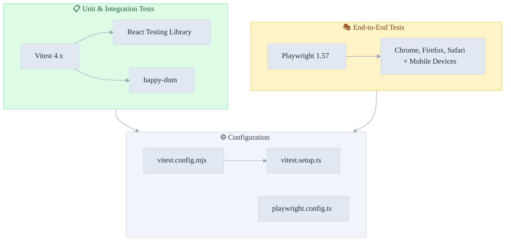

# Testing Setup Summary

This project now has complete testing infrastructure for both unit and end-to-end testing.

## Testing Stack Overview



## Quick Navigation

### 📋 Unit Testing (Vitest 4.x)

- **Setup Guide:** [TESTING.md](./TESTING.md)
- **Command:** `bun run test`
- **Coverage:** [TESTING.md#test-coverage](./TESTING.md#test-coverage)
- **Status:** ✅ 117 tests passing

### 🎭 E2E Testing (Playwright)

- **Setup Guide:** [PLAYWRIGHT.md](./PLAYWRIGHT.md)
- **Prerequisites:** [PLAYWRIGHT_SETUP.md](./PLAYWRIGHT_SETUP.md)
- **Command:** `bun run e2e`
- **Status:** ✅ 5 test suites ready (20+ tests)

---

## Available Commands

### Development

```bash
bun run dev              # Start dev server
bun run build           # Build for production
bun run type-check      # Type check TypeScript
```

### Testing

```bash
# Unit Tests (Vitest)
bun run test            # Run all Vitest tests
bun run test:watch     # Watch mode
bun run test:coverage  # Coverage report (v8)
bun run test:ui        # Interactive UI mode

# E2E Tests (Playwright)
bun run e2e            # Run Playwright tests
bun run e2e:ui         # Interactive UI mode
bun run e2e:debug      # Debug mode
bun run e2e:headed     # Browser visible
```

### Code Quality

```bash
bun run lint           # Check linting
bun run lint:fix       # Auto-fix lint issues
bun run format         # Check formatting
bun run format:fix     # Auto-fix formatting
```

---

## Testing Strategy

### Unit Tests (Vitest)

**When to use:** Logic, utilities, components, data validation

**Current coverage:**

- ✅ Authentication schema validation
- ✅ Data model structure
- ✅ API response handling
- ✅ Component logic
- ✅ Utility functions
- ✅ API route handlers

**Location:** `src/__tests__/` and `src/*/__tests__/`

### E2E Tests (Playwright)

**When to use:** User workflows, navigation, integration between pages

**Current coverage:**

- ✅ Homepage functionality
- ✅ Authentication pages (login/register)
- ✅ Navigation (courses, pricing, about)
- ✅ Legal pages (privacy, ToS, redirects)
- ✅ Accessibility (keyboard nav, alt text)

**Location:** `e2e/`

---

## Setup Prerequisites

### System

- Node.js 22+
- Bun 1.3.5+
- ~500MB disk space (for Playwright browsers)
- Port 3000 available (for dev server)

### Already Configured ✅

- Vitest configuration
- Playwright configuration
- Browser profiles (Desktop + Mobile)
- Test file examples
- All dependencies installed

---

## First Run

```bash
# Run unit tests
bun run test

# Run E2E tests (auto-downloads browsers)
bun run e2e

# View reports
bunx playwright show-report
```

---

## CI/CD Integration

### GitHub Actions Example

```yaml
- name: Run Tests
  run: bun run test

- name: Run E2E Tests
  run: bun run e2e

- uses: actions/upload-artifact@v4
  if: always()
  with:
    name: playwright-report
    path: playwright-report/
```

---

## Key Features

### Vitest

- ✅ TypeScript support
- ✅ Path aliases (@/\*) configured
- ✅ Coverage reports available (v8)
- ✅ Watch mode for development
- ✅ @testing-library/react ready
- ✅ Interactive UI mode
- ✅ Fast execution with happy-dom

### Playwright

- ✅ Multi-browser testing (Chromium, Firefox, WebKit)
- ✅ Mobile device testing (Pixel 5, iPhone 12)
- ✅ Screenshots on failure
- ✅ Trace recording for debugging
- ✅ HTML report generation
- ✅ Auto-starts dev server
- ✅ Interactive UI mode

---

## Next Steps

1. **Run tests locally**

   ```bash
   bun run test        # Unit tests
   bun run e2e         # E2E tests
   ```

2. **Add more tests**
   - Unit tests for new utilities
   - E2E tests for critical user paths
   - Integration tests for API routes

3. **Set up CI/CD**
   - Configure GitHub Actions
   - Run tests on pull requests
   - Generate coverage reports

4. **Monitor coverage**

   ```bash
   bun run test:coverage
   ```

5. **Debug failures**
   ```bash
   bun run e2e:ui              # Visual debugging
   bun run e2e:debug           # Step-by-step debugging
   ```

---

## Documentation

| Document                                                             | Purpose                         |
| -------------------------------------------------------------------- | ------------------------------- |
| [TESTING.md](./TESTING.md)                                           | Vitest unit testing guide       |
| [PLAYWRIGHT.md](./PLAYWRIGHT.md)                                     | Playwright E2E testing guide    |
| [PLAYWRIGHT_SETUP.md](./PLAYWRIGHT_SETUP.md)                         | Prerequisites & setup checklist |
| [TESTING.md#writing-new-tests](./TESTING.md#writing-new-tests)       | How to write unit tests         |
| [PLAYWRIGHT.md#writing-new-tests](./PLAYWRIGHT.md#writing-new-tests) | How to write E2E tests          |

---

## Troubleshooting

**Unit tests fail:**

- Check `vitest.config.mjs` path aliases
- Ensure TypeScript compiles: `bun run type-check`

**E2E tests fail:**

- Check port 3000 is available
- Run with debug: `bun run e2e:debug`
- View HTML report: `bunx playwright show-report`

**Browser issues:**

- Reinstall browsers: `bunx playwright install --with-deps`
- Clear cache: `bun clean`

---

## Browser & Device Coverage

### Browsers

- ✅ Chromium (Chrome/Edge equivalent)
- ✅ Firefox
- ✅ WebKit (Safari)

### Devices

- ✅ Desktop Chrome
- ✅ Desktop Firefox
- ✅ Desktop Safari
- ✅ Mobile Chrome (Pixel 5)
- ✅ Mobile Safari (iPhone 12)

---

**Last Updated:** January 4, 2026 **Testing Frameworks:** Vitest + Playwright **Status:** ✅ Ready for development

---

_DevMultiplier Academy - Building 10x-100x Developers in the Age of AI_
