# Database Access Patterns: REST API vs Prisma Comparison

Comprehensive comparison of direct Prisma access vs REST API abstraction layer for PostgreSQL database operations.

## Architecture Comparison

```mermaid
%%{init: {'theme': 'base', 'themeVariables': {
  'primaryColor': '#e2e8f0',
  'primaryTextColor': '#1e293b',
  'primaryBorderColor': '#cbd5e1',
  'lineColor': '#94a3b8',
  'secondaryColor': '#f1f5f9',
  'tertiaryColor': '#f8fafc',
  'background': '#ffffff',
  'textColor': '#334155',
  'fontFamily': 'system-ui, -apple-system, sans-serif'
}}}%%graph TB
    subgraph REST["🌐 REST API Layer"]
        direction LR
        Client2["Client<br/>Browser/Mobile/External"]
        API["REST API Endpoint<br/>Route Handler"]
        PrismaLib2["Prisma Client"]
        DB2[("PostgreSQL<br/>Database")]
        Client2 -->|HTTP| API
        API -->|Prisma| PrismaLib2
        PrismaLib2 -->|SQL| DB2
    end

    subgraph Prisma["🔌 Direct Prisma Access"]
        direction LR
        Client["Next.js Server<br/>Components/API"]
        PrismaLib["Prisma Client"]
        DB1[("PostgreSQL<br/>Database")]
        Client -->|Direct| PrismaLib
        PrismaLib -->|SQL| DB1
    end

    REST ~~~ Prisma

    style REST fill:#fef3c7,stroke:#fcd34d,color:#92400e
    style Prisma fill:#dbeafe,stroke:#93c5fd,color:#1e40af
```



## Quick Comparison Table

| Aspect                      | Prisma (Direct)         | REST API Layer              |
| --------------------------- | ----------------------- | --------------------------- |
| **Type Safety**             | ✅ Full TypeScript      | ⚠️ Manual validation needed |
| **Performance**             | ✅ Direct DB connection | ⚠️ HTTP overhead            |
| **Learning Curve**          | ✅ Intuitive ORM        | ✅ Standard REST patterns   |
| **Mobile/External Clients** | ❌ Can't access         | ✅ Universal access         |
| **Security Control**        | ✅ Easy to enforce      | ✅ Centralized auth         |
| **Scalability**             | ⚠️ Server coupling      | ✅ Decoupled services       |
| **Caching**                 | ⚠️ Per-request          | ✅ HTTP caching friendly    |
| **Query Complexity**        | ⚠️ Complex queries      | ✅ Server-side optimization |
| **Real-time Updates**       | ❌ Polling only         | ✅ WebSocket possible       |
| **API Versioning**          | ❌ N/A                  | ✅ Easy to version          |

---

## Detailed Comparison

### 1. **Type Safety & Validation**

#### Prisma (Direct)

```typescript
// Full TypeScript support, compile-time safety
async function getUserWithCourses(userId: string) {
  const user = await prisma.user.findUnique({
    where: { id: userId },
    include: { enrollments: true },
  });

  // TypeScript knows the exact shape
  console.log(user?.enrollments);
}

// Issues:
// - null checks required
// - Runtime validation needed for external input
```

#### REST API

```typescript
// app/api/v1/users/[id]/route.ts
export async function GET(req: NextRequest, { params }: { params: { id: string } }) {
  // Must validate input
  const { id } = params;

  if (!id || typeof id !== 'string') {
    return NextResponse.json({ error: 'Invalid ID' }, { status: 400 });
  }

  const user = await prisma.user.findUnique({
    where: { id },
    select: {
      id: true,
      name: true,
      email: true,
      // Explicitly define what to expose
    },
  });

  if (!user) {
    return NextResponse.json({ error: 'Not found' }, { status: 404 });
  }

  return NextResponse.json(user);
}

// Client-side TypeScript
const response = await fetch(`/api/v1/users/${id}`);
const user = (await response.json()) as User; // Still need type assertion
```

---

### 2. **Performance**

#### Prisma (Direct)

```typescript
// Pros
async function getCoursesWithProgress(userId: string) {
  // Single database round-trip
  // No HTTP serialization/deserialization
  // Direct memory access
  return prisma.enrollment.findMany({
    where: { userId },
    include: {
      course: {
        include: {
          modules: {
            include: { lessons: true },
          },
        },
      },
    },
  });
}

// Cons
// - Cannot use HTTP caching (ETags, If-Modified-Since)
// - Always fresh from database
// - Server-side rendering only
```

#### REST API

```typescript
// Pros
export async function GET(req: NextRequest) {
  // Can set HTTP cache headers
  const response = NextResponse.json(enrollments);
  response.headers.set('Cache-Control', 'public, max-age=3600');
  response.headers.set('ETag', generateETag(enrollments));
  return response;
}

// Can use CDN caching
// Can use browser caching
// Clients can handle stale data

// Cons
// - HTTP overhead (serialize/deserialize)
// - Additional network latency
// - Slower for real-time data
```

**Performance Benchmark Example:**

```
Direct Prisma Query: ~5ms (network: 0ms, DB: 5ms)
REST API Request: ~15ms (network: 10ms, DB: 5ms)
Cached REST API: ~1ms (cache hit)
```

---

### 3. **Security & Access Control**

#### Prisma (Direct)

```typescript
// Risk: Over-exposure of data
async function getUser(id: string) {
  return prisma.user.findUnique({ where: { id } });
  // Exposes: password, email, all fields
}

// Safe approach: Explicit field selection
async function getPublicUserProfile(id: string) {
  return prisma.user.findUnique({
    where: { id },
    select: {
      id: true,
      name: true,
      bio: true,
      avatar: true,
      // Excludes: email, password, etc.
    },
  });
}

// Issue: Must remember to use select everywhere
// Hard to enforce globally
```

#### REST API

```typescript
// Centralized security enforcement
export async function GET(req: NextRequest, { params }: { params: { id: string } }) {
  const session = await auth();

  // Authentication check (one place)
  if (!session?.user) {
    return NextResponse.json({ error: 'Unauthorized' }, { status: 401 });
  }

  // Authorization check (one place)
  if (session.user.id !== params.id && session.user.role !== 'admin') {
    return NextResponse.json({ error: 'Forbidden' }, { status: 403 });
  }

  // Validated data exposure
  const user = await prisma.user.findUnique({
    where: { id: params.id },
    select: {
      id: true,
      name: true,
      bio: true,
      // Never expose sensitive fields
    },
  });

  return NextResponse.json(user);
}

// Advantages:
// - All security logic centralized
// - Easy to audit
// - Consistent across endpoints
// - Can add rate limiting, validation, logging
```

---

### 4. **Scalability & Architecture**

#### Prisma (Direct)

```
Next.js App + Prisma
    ↓
PostgreSQL

Issues:
- App and DB tightly coupled
- Scaling requires replicating entire app
- Database connection pool per app instance
- Hard to separate frontend/backend teams
```

#### REST API

```
Next.js Frontend App
    ↓ (HTTP)
Node.js Backend API Server (with Prisma)
    ↓
PostgreSQL

Advantages:
- Decouple frontend and backend
- Scale API independently from frontend
- Multiple frontends can share API (web, mobile, desktop)
- Easy to add API gateway, load balancing
- Microservices ready
```

**Scalability Example:**

```typescript
// REST API allows this architecture
Frontend Server (3 instances)
    ↓
API Gateway / Load Balancer
    ↓
API Servers (10 instances, auto-scaling)
    ↓
Database Connection Pool
    ↓
PostgreSQL Replica Set

// Direct Prisma doesn't scale well:
Frontend Server (3 instances, each with Prisma)
    ↓ (too many connections)
PostgreSQL (overwhelmed)
```

---

### 5. **Caching Strategies**

#### Prisma (Direct)

```typescript
// Manual in-memory caching
const userCache = new Map<string, User>();
const CACHE_TTL = 5 * 60 * 1000; // 5 minutes

async function getCachedUser(id: string) {
  const cached = userCache.get(id);
  if (cached) return cached;

  const user = await prisma.user.findUnique({ where: { id } });
  userCache.set(id, user);

  setTimeout(() => userCache.delete(id), CACHE_TTL);
  return user;
}

// Issues:
// - Manual cache management
// - Cache invalidation complexity
// - Doesn't work across server instances
```

#### REST API

```typescript
// HTTP caching (automatic, distributed)
export async function GET(req: NextRequest, { params }: { params: { id: string } }) {
  const user = await getUser(params.id);

  const response = NextResponse.json(user);

  // Browser/CDN will cache this
  response.headers.set('Cache-Control', 'public, max-age=3600');
  response.headers.set('ETag', `"${hash(user)}"`);
  response.headers.set('Last-Modified', new Date().toUTCString());

  return response;
}

// Client can use conditional requests
async function getUserIfChanged(id: string, etag?: string) {
  const headers: HeadersInit = {};
  if (etag) headers['If-None-Match'] = etag;

  const response = await fetch(`/api/users/${id}`, { headers });

  if (response.status === 304) {
    return null; // Not modified
  }

  return response.json();
}

// Advantages:
// - Works across instances
// - Works with CDN
// - Browser caching
// - Reduces bandwidth
```

---

### 6. **Real-time Updates**

#### Prisma (Direct)

```typescript
// Limited to polling
async function pollUserUpdates(userId: string) {
  const interval = setInterval(async () => {
    const user = await prisma.user.findUnique({ where: { id: userId } });
    // Update UI
  }, 5000);

  return () => clearInterval(interval);
}

// Issues:
// - Inefficient
// - Latency (up to 5 seconds)
// - High database load
```

#### REST API

```typescript
// Can use WebSockets for real-time
import { WebSocketServer } from 'ws';

const wss = new WebSocketServer({ port: 8080 });

wss.on('connection', (ws) => {
  // Subscribe to user updates
  ws.on('message', async (message) => {
    const { type, userId } = JSON.parse(message);

    if (type === 'subscribe-user') {
      // Broadcast on user update
      prisma.user.onUpdate(userId, (user) => {
        ws.send(JSON.stringify({ type: 'user-updated', user }));
      });
    }
  });
});

// Advantages:
// - True real-time updates
// - Low latency (< 100ms)
// - Low overhead
// - Can push multiple events
```

---

### 7. **Mobile & External Client Access**

#### Prisma (Direct)

```typescript
// Cannot be used from mobile apps
// Cannot be used from third-party services
// Only works from Next.js server

// Security risk: would expose database connection string
```

#### REST API

```typescript
// Accessible from anywhere
// Mobile app example
const response = await fetch('https://api.yourdomain.com/v1/users/123', {
  headers: {
    Authorization: `Bearer ${token}`,
    Accept: 'application/json',
  },
});

// Third-party integration
// Public API for partners
// CLI tools
// Desktop apps
```

---

### 8. **API Versioning**

#### Prisma (Direct)

```typescript
// No versioning capability
// Breaking changes force frontend updates

// Bad: If you change database schema
// All existing frontends break
```

#### REST API

```typescript
// Easy versioning support
// v1 endpoint for legacy clients
// v2 endpoint for new clients

// app/api/v1/users/[id]/route.ts
export async function GET(req: NextRequest) {
  return NextResponse.json({ user: getLegacyUserFormat() });
}

// app/api/v2/users/[id]/route.ts
export async function GET(req: NextRequest) {
  return NextResponse.json({ data: { user: getNewUserFormat() } });
}

// Advantages:
// - Backward compatibility
// - Gradual migration
// - Multiple client support
```

---

### 9. **Query Complexity & Optimization**

#### Prisma

```typescript
// Simple queries: Easy
const user = await prisma.user.findUnique({ where: { id } });

// Complex queries: Challenging
const userStats = await prisma.user.findUnique({
  where: { id },
  include: {
    enrollments: {
      include: {
        course: {
          include: {
            modules: { include: { lessons: true } },
          },
        },
        progress: true,
      },
    },
    reviews: true,
  },
});

// Issues:
// - N+1 problem risk
// - Over-fetching data
// - Difficult raw SQL when needed
```

#### REST API

```typescript
// Can optimize at API layer
export async function GET(req: NextRequest) {
  const { include } = req.query;

  let query = prisma.user.findUnique({ where: { id } });

  if (include?.includes('enrollments')) {
    query = query.include({ enrollments: true });
  }
  if (include?.includes('progress')) {
    query = query.include({ progress: true });
  }

  const user = await query;
  return NextResponse.json(user);
}

// Raw SQL when needed
export async function GET(req: NextRequest) {
  const stats = await prisma.$queryRaw`
    SELECT u.id, COUNT(e.id) as enrollment_count
    FROM users u
    LEFT JOIN enrollments e ON u.id = e.user_id
    GROUP BY u.id
  `;

  return NextResponse.json(stats);
}

// Can use database-specific features
// Can apply server-side pagination
// Can implement GraphQL if needed
```

---

## Recommendation Matrix

### Use **Direct Prisma** when:

```
✅ Monolithic Next.js app (no external clients)
✅ Simple CRUD operations
✅ All logic in Next.js
✅ Small team, single codebase
✅ Performance-critical, low latency needed
✅ Internal tools only
✅ No need for mobile/external access
```

**Example:**

```typescript
// Dashboard app
export default async function DashboardPage() {
  const courses = await prisma.course.findMany();
  return <CourseList courses={courses} />;
}
```

---

### Use **REST API** when:

```
✅ Need external client access (mobile, desktop, third-party)
✅ Multiple frontend applications
✅ Want to scale frontend/backend independently
✅ Need API versioning
✅ Plan to add real-time features (WebSockets)
✅ Want centralized security/caching
✅ Team separation (frontend vs backend)
✅ Public API needed
✅ Want HTTP caching benefits
```

**Example:**

```typescript
// SaaS platform
// Web app uses /api/v1
// Mobile app uses /api/v1
// Partner integrations use /api/v1
// Admin dashboard uses /api/v2
```

---

## Hybrid Approach (Recommended for Most Cases)

Use **both strategically**:

```typescript
// Server Components: Direct Prisma (fastest)
export default async function Page() {
  const courses = await prisma.course.findMany();
  return <CourseList courses={courses} />;
}

// Client-side data fetching: REST API (flexible)
'use client';
export default function StudentDashboard() {
  const [enrollments, setEnrollments] = useState([]);

  useEffect(() => {
    fetch('/api/v1/user/enrollments')
      .then(r => r.json())
      .then(setEnrollments);
  }, []);

  return <EnrollmentList enrollments={enrollments} />;
}

// External access: REST API only
// Mobile app, third-party integrations, public API
```

---

## Best Practices for REST API Layer

### 1. Input Validation

```typescript
import { z } from 'zod';

const userQuerySchema = z.object({
  id: z.string().uuid(),
  include: z.enum(['enrollments', 'progress']).array().optional(),
});

export async function GET(req: NextRequest) {
  const parsed = userQuerySchema.safeParse(req.query);

  if (!parsed.success) {
    return NextResponse.json({ error: parsed.error.flatten() }, { status: 400 });
  }

  // Safe to use parsed.data
}
```

### 2. Error Handling

```typescript
export async function GET(req: NextRequest) {
  try {
    const user = await prisma.user.findUnique({ where: { id } });

    if (!user) {
      return NextResponse.json({ error: 'User not found' }, { status: 404 });
    }

    return NextResponse.json(user);
  } catch (error) {
    // Log error securely
    console.error('Database error:', error);

    return NextResponse.json({ error: 'Internal server error' }, { status: 500 });
  }
}
```

### 3. Consistent Response Format

```typescript
// Success response
{
  "success": true,
  "data": { user: {...} }
}

// Error response
{
  "success": false,
  "error": {
    "code": "NOT_FOUND",
    "message": "User not found"
  }
}
```

### 4. Rate Limiting & Throttling

```typescript
import { Ratelimit } from '@upstash/ratelimit';

const ratelimit = new Ratelimit({
  redis: Redis.fromEnv(),
  limiter: Ratelimit.slidingWindow(100, '1 h'),
});

export async function GET(req: NextRequest) {
  const ip = req.ip || 'unknown';
  const { success } = await ratelimit.limit(`api:${ip}`);

  if (!success) {
    return NextResponse.json({ error: 'Too many requests' }, { status: 429 });
  }

  // Continue processing
}
```

---

## Migration Path

```
Phase 1: Monolithic (Direct Prisma)
  └─> Simple Next.js + Database

Phase 2: Server Components (Still Direct Prisma)
  └─> Optimize for performance

Phase 3: Add REST API (Hybrid)
  └─> For client-side data fetching
  └─> For external access

Phase 4: Decouple Services (Full REST API)
  └─> Separate frontend/backend repositories
  └─> Independent scaling
```

---

## Conclusion

For **DevMultiplier Academy**, I recommend:

1. **Start with Direct Prisma** - faster to build
2. **Add REST API gradually** - as needs grow
3. **Use REST API for**:
   - Mobile app (future)
   - Student progress tracking (client-side)
   - Public API for partners
   - Real-time notifications (WebSockets)

This gives you the best of both worlds: **rapid development + future scalability**.

---

_DevMultiplier Academy - Building 10x-100x Developers in the Age of AI_
