# Testing Strategy for Next.js TypeScript Applications

A comprehensive guide to implementing a robust testing strategy for modern Next.js applications.

## The Testing Pyramid

A well-structured test suite follows the testing pyramid principle: many fast unit tests at the base, fewer integration tests in the middle, and selective end-to-end tests at the top.

```mermaid
graph TB
    subgraph pyramid [" "]
        direction TB
        E2E["🌐 E2E Tests<br/>Few, Slow, High Confidence"]
        INT["🔗 Integration Tests<br/>Moderate Amount, Medium Speed"]
        UNIT["⚡ Unit Tests<br/>Many, Fast, Focused"]
    end
    
    E2E --> INT
    INT --> UNIT
    
    style E2E fill:#ff6b6b,stroke:#c92a2a,color:#fff
    style INT fill:#ffd43b,stroke:#f59f00,color:#000
    style UNIT fill:#51cf66,stroke:#2f9e44,color:#fff
```

```mermaid
graph LR
    subgraph legend [" "]
        direction LR
        L1["🔺 Top: E2E - Real browsers, full stack"]
        L2["🔶 Middle: Integration - Components together"]
        L3["🟢 Base: Unit - Isolated functions/components"]
    end
```





## Test Flow Overview


## Testing Layers Explained

### Layer 1: Unit Tests

**Purpose:** Test individual functions, hooks, and components in isolation.

**Tools:** Vitest or Jest + React Testing Library

**Characteristics:**
- Execute in milliseconds
- No external dependencies (database, API, browser)
- Mock all external services
- High code coverage target (80%+)

**What to test:**
- Utility functions and helpers
- Custom React hooks
- Individual component rendering
- Business logic and calculations
- Form validation rules
- State management reducers

**Example scenarios:**
- Does the `formatCurrency()` function handle edge cases?
- Does the `useAuth` hook return correct states?
- Does the Button component render with correct styles?

### Layer 2: Integration Tests

**Purpose:** Test how multiple units work together.

**Tools:** Vitest or Jest + React Testing Library + MSW (Mock Service Worker)

**Characteristics:**
- Execute in seconds
- May mock external APIs but test real component interactions
- Test data flow between components
- Verify context providers work correctly

**What to test:**
- Form submission flows (validation → submit → feedback)
- Component hierarchies with shared state
- API integration with mocked responses
- Route transitions within the app
- Authentication flows with mocked providers

**Example scenarios:**
- Does the checkout form validate, submit, and show confirmation?
- Does the data table fetch, filter, and paginate correctly?
- Do protected routes redirect unauthenticated users?

### Layer 3: End-to-End Tests

**Purpose:** Test complete user journeys in a real browser.

**Tools:** Playwright

**Characteristics:**
- Execute in seconds to minutes
- Run against a real or staging environment
- Test the full stack (UI → API → Database)
- High confidence but slower feedback

**What to test:**
- Critical business flows (signup, purchase, checkout)
- Cross-browser compatibility
- Authentication and authorization
- Third-party integrations
- Performance-critical user paths

**Example scenarios:**
- Can a new user complete registration and access the dashboard?
- Can a customer complete a purchase from cart to confirmation?
- Does the admin panel correctly update database records?

## Recommended Tool Stack


### Primary Testing Tools

| Tool | Purpose | Install Command |
|------|---------|-----------------|
| Vitest | Unit & integration test runner | `bun add -d vitest @vitejs/plugin-react` |
| React Testing Library | Component testing utilities | `bun add -d @testing-library/react @testing-library/jest-dom` |
| Playwright | E2E browser testing | `bun add -d @playwright/test` |
| MSW | API mocking | `bun add -d msw` |

### Supporting Tools

| Tool | Purpose | Install Command |
|------|---------|-----------------|
| @testing-library/user-event | Realistic user interactions | `bun add -d @testing-library/user-event` |
| vitest-coverage-v8 | Code coverage reports | `bun add -d @vitest/coverage-v8` |
| @faker-js/faker | Generate test data | `bun add -d @faker-js/faker` |

## Project Structure


### Directory Layout

```
my-nextjs-app/
├── src/
│   ├── components/
│   │   ├── Button/
│   │   │   ├── Button.tsx
│   │   │   ├── Button.test.tsx      ← Unit test (co-located)
│   │   │   └── index.ts
│   │   └── ...
│   ├── hooks/
│   │   ├── useAuth.ts
│   │   └── useAuth.test.ts          ← Hook unit test
│   ├── lib/
│   │   ├── utils.ts
│   │   └── utils.test.ts            ← Utility unit test
│   └── app/
│       └── ...
├── tests/
│   ├── integration/                  ← Integration tests
│   │   ├── checkout-flow.test.tsx
│   │   └── auth-flow.test.tsx
│   └── e2e/                          ← Playwright E2E tests
│       ├── user-registration.spec.ts
│       ├── purchase-flow.spec.ts
│       └── admin-dashboard.spec.ts
├── vitest.config.ts
├── playwright.config.ts
└── package.json
```

## Configuration Files

### vitest.config.ts

```typescript
import { defineConfig } from 'vitest/config';
import react from '@vitejs/plugin-react';
import path from 'path';

export default defineConfig({
  plugins: [react()],
  test: {
    environment: 'jsdom',
    globals: true,
    setupFiles: ['./tests/setup.ts'],
    include: [
      'src/**/*.test.{ts,tsx}',
      'tests/integration/**/*.test.{ts,tsx}'
    ],
    exclude: ['tests/e2e/**'],
    coverage: {
      provider: 'v8',
      reporter: ['text', 'json', 'html'],
      exclude: [
        'node_modules/',
        'tests/',
        '**/*.d.ts',
        '**/*.config.{ts,js}',
      ],
    },
  },
  resolve: {
    alias: {
      '@': path.resolve(__dirname, './src'),
    },
  },
});
```

### playwright.config.ts

```typescript
import { defineConfig, devices } from '@playwright/test';

export default defineConfig({
  testDir: './tests/e2e',
  fullyParallel: true,
  forbidOnly: !!process.env.CI,
  retries: process.env.CI ? 2 : 0,
  workers: process.env.CI ? 1 : undefined,
  reporter: 'html',
  use: {
    baseURL: 'http://localhost:3000',
    trace: 'on-first-retry',
    screenshot: 'only-on-failure',
  },
  projects: [
    {
      name: 'chromium',
      use: { ...devices['Desktop Chrome'] },
    },
    {
      name: 'firefox',
      use: { ...devices['Desktop Firefox'] },
    },
    {
      name: 'webkit',
      use: { ...devices['Desktop Safari'] },
    },
    {
      name: 'mobile-chrome',
      use: { ...devices['Pixel 5'] },
    },
  ],
  webServer: {
    command: 'bun run dev',
    url: 'http://localhost:3000',
    reuseExistingServer: !process.env.CI,
  },
});
```

### tests/setup.ts

```typescript
import '@testing-library/jest-dom';
import { cleanup } from '@testing-library/react';
import { afterEach, vi } from 'vitest';

// Cleanup after each test
afterEach(() => {
  cleanup();
});

// Mock Next.js router
vi.mock('next/navigation', () => ({
  useRouter: () => ({
    push: vi.fn(),
    replace: vi.fn(),
    prefetch: vi.fn(),
    back: vi.fn(),
  }),
  usePathname: () => '/',
  useSearchParams: () => new URLSearchParams(),
}));

// Mock environment variables if needed
vi.stubEnv('NEXT_PUBLIC_API_URL', 'http://localhost:3000/api');
```

## Package.json Scripts

```json
{
  "scripts": {
    "test": "vitest",
    "test:ui": "vitest --ui",
    "test:run": "vitest run",
    "test:coverage": "vitest run --coverage",
    "test:e2e": "playwright test",
    "test:e2e:ui": "playwright test --ui",
    "test:e2e:headed": "playwright test --headed",
    "test:all": "vitest run && playwright test"
  }
}
```

## Example Tests

### Test Interaction Flow


### Unit Test: Utility Function

```typescript
// src/lib/format.ts
export function formatPrice(cents: number): string {
  return new Intl.NumberFormat('en-US', {
    style: 'currency',
    currency: 'USD',
  }).format(cents / 100);
}

// src/lib/format.test.ts
import { describe, it, expect } from 'vitest';
import { formatPrice } from './format';

describe('formatPrice', () => {
  it('formats cents to USD currency string', () => {
    expect(formatPrice(1000)).toBe('$10.00');
    expect(formatPrice(1999)).toBe('$19.99');
    expect(formatPrice(0)).toBe('$0.00');
  });

  it('handles large amounts', () => {
    expect(formatPrice(1000000)).toBe('$10,000.00');
  });

  it('handles negative amounts', () => {
    expect(formatPrice(-500)).toBe('-$5.00');
  });
});
```

### Unit Test: React Component

```typescript
// src/components/Button/Button.test.tsx
import { describe, it, expect, vi } from 'vitest';
import { render, screen } from '@testing-library/react';
import userEvent from '@testing-library/user-event';
import { Button } from './Button';

describe('Button', () => {
  it('renders with children', () => {
    render(<Button>Click me</Button>);
    expect(screen.getByRole('button', { name: /click me/i })).toBeInTheDocument();
  });

  it('calls onClick handler when clicked', async () => {
    const user = userEvent.setup();
    const handleClick = vi.fn();
    
    render(<Button onClick={handleClick}>Click me</Button>);
    await user.click(screen.getByRole('button'));
    
    expect(handleClick).toHaveBeenCalledTimes(1);
  });

  it('is disabled when disabled prop is true', () => {
    render(<Button disabled>Click me</Button>);
    expect(screen.getByRole('button')).toBeDisabled();
  });

  it('shows loading spinner when loading', () => {
    render(<Button loading>Submit</Button>);
    expect(screen.getByRole('button')).toBeDisabled();
    expect(screen.getByTestId('loading-spinner')).toBeInTheDocument();
  });
});
```

### Integration Test: Form Submission

```typescript
// tests/integration/contact-form.test.tsx
import { describe, it, expect, vi, beforeAll, afterAll, afterEach } from 'vitest';
import { render, screen, waitFor } from '@testing-library/react';
import userEvent from '@testing-library/user-event';
import { setupServer } from 'msw/node';
import { http, HttpResponse } from 'msw';
import { ContactForm } from '@/components/ContactForm';

const server = setupServer(
  http.post('/api/contact', async ({ request }) => {
    const body = await request.json();
    return HttpResponse.json({ success: true, id: '123' });
  })
);

beforeAll(() => server.listen());
afterEach(() => server.resetHandlers());
afterAll(() => server.close());

describe('ContactForm', () => {
  it('submits form data and shows success message', async () => {
    const user = userEvent.setup();
    render(<ContactForm />);

    // Fill out the form
    await user.type(screen.getByLabelText(/name/i), 'John Doe');
    await user.type(screen.getByLabelText(/email/i), 'john@example.com');
    await user.type(screen.getByLabelText(/message/i), 'Hello, this is a test message.');

    // Submit
    await user.click(screen.getByRole('button', { name: /send/i }));

    // Verify success state
    await waitFor(() => {
      expect(screen.getByText(/thank you/i)).toBeInTheDocument();
    });
  });

  it('shows validation errors for empty required fields', async () => {
    const user = userEvent.setup();
    render(<ContactForm />);

    // Submit without filling form
    await user.click(screen.getByRole('button', { name: /send/i }));

    // Verify validation errors
    expect(await screen.findByText(/name is required/i)).toBeInTheDocument();
    expect(screen.getByText(/email is required/i)).toBeInTheDocument();
  });

  it('handles server errors gracefully', async () => {
    server.use(
      http.post('/api/contact', () => {
        return HttpResponse.json(
          { error: 'Server error' },
          { status: 500 }
        );
      })
    );

    const user = userEvent.setup();
    render(<ContactForm />);

    await user.type(screen.getByLabelText(/name/i), 'John Doe');
    await user.type(screen.getByLabelText(/email/i), 'john@example.com');
    await user.type(screen.getByLabelText(/message/i), 'Test message');
    await user.click(screen.getByRole('button', { name: /send/i }));

    await waitFor(() => {
      expect(screen.getByText(/something went wrong/i)).toBeInTheDocument();
    });
  });
});
```

### E2E Test: User Registration Flow

```typescript
// tests/e2e/user-registration.spec.ts
import { test, expect } from '@playwright/test';
import { faker } from '@faker-js/faker';

test.describe('User Registration', () => {
  test('new user can complete registration and access dashboard', async ({ page }) => {
    const testUser = {
      name: faker.person.fullName(),
      email: faker.internet.email(),
      password: faker.internet.password({ length: 12 }),
    };

    // Navigate to registration page
    await page.goto('/register');
    await expect(page).toHaveTitle(/register/i);

    // Fill registration form
    await page.getByLabel(/full name/i).fill(testUser.name);
    await page.getByLabel(/email/i).fill(testUser.email);
    await page.getByLabel(/^password$/i).fill(testUser.password);
    await page.getByLabel(/confirm password/i).fill(testUser.password);

    // Accept terms and submit
    await page.getByLabel(/terms/i).check();
    await page.getByRole('button', { name: /create account/i }).click();

    // Verify redirect to dashboard
    await expect(page).toHaveURL('/dashboard');
    await expect(page.getByText(`Welcome, ${testUser.name}`)).toBeVisible();

    // Verify user can access protected content
    await page.getByRole('link', { name: /profile/i }).click();
    await expect(page.getByText(testUser.email)).toBeVisible();
  });

  test('shows validation errors for invalid input', async ({ page }) => {
    await page.goto('/register');

    // Submit empty form
    await page.getByRole('button', { name: /create account/i }).click();

    // Verify validation messages
    await expect(page.getByText(/name is required/i)).toBeVisible();
    await expect(page.getByText(/email is required/i)).toBeVisible();
    await expect(page.getByText(/password is required/i)).toBeVisible();
  });

  test('prevents registration with existing email', async ({ page }) => {
    await page.goto('/register');

    // Use a known existing email
    await page.getByLabel(/full name/i).fill('Test User');
    await page.getByLabel(/email/i).fill('existing@example.com');
    await page.getByLabel(/^password$/i).fill('SecurePass123!');
    await page.getByLabel(/confirm password/i).fill('SecurePass123!');
    await page.getByLabel(/terms/i).check();
    await page.getByRole('button', { name: /create account/i }).click();

    // Verify error message
    await expect(page.getByText(/email already registered/i)).toBeVisible();
  });
});
```

### E2E Test: Database Integration

```typescript
// tests/e2e/data-operations.spec.ts
import { test, expect } from '@playwright/test';

test.describe('Data Operations', () => {
  test.beforeEach(async ({ page }) => {
    // Login as admin
    await page.goto('/login');
    await page.getByLabel(/email/i).fill('admin@example.com');
    await page.getByLabel(/password/i).fill('AdminPass123!');
    await page.getByRole('button', { name: /sign in/i }).click();
    await expect(page).toHaveURL('/dashboard');
  });

  test('admin can create, edit, and delete a record', async ({ page }) => {
    // Navigate to data management
    await page.goto('/admin/products');

    // Create new product
    await page.getByRole('button', { name: /add product/i }).click();
    await page.getByLabel(/product name/i).fill('Test Product');
    await page.getByLabel(/price/i).fill('29.99');
    await page.getByLabel(/description/i).fill('A test product description');
    await page.getByRole('button', { name: /save/i }).click();

    // Verify product appears in list
    await expect(page.getByText('Test Product')).toBeVisible();
    await expect(page.getByText('$29.99')).toBeVisible();

    // Edit the product
    await page.getByRole('row', { name: /test product/i })
      .getByRole('button', { name: /edit/i }).click();
    await page.getByLabel(/price/i).clear();
    await page.getByLabel(/price/i).fill('39.99');
    await page.getByRole('button', { name: /save/i }).click();

    // Verify update
    await expect(page.getByText('$39.99')).toBeVisible();

    // Delete the product
    await page.getByRole('row', { name: /test product/i })
      .getByRole('button', { name: /delete/i }).click();
    await page.getByRole('button', { name: /confirm/i }).click();

    // Verify deletion
    await expect(page.getByText('Test Product')).not.toBeVisible();
  });

  test('data table filtering and pagination works correctly', async ({ page }) => {
    await page.goto('/admin/products');

    // Test search filter
    await page.getByPlaceholder(/search/i).fill('Widget');
    await expect(page.getByRole('table')).toContainText('Widget');

    // Test pagination
    await page.getByPlaceholder(/search/i).clear();
    await page.getByRole('button', { name: /next/i }).click();
    await expect(page.getByText(/page 2/i)).toBeVisible();
  });
});
```

## Best Practices

### General Guidelines

1. **Test behavior, not implementation** - Focus on what the code does, not how it does it.
2. **Use descriptive test names** - Tests should read like documentation.
3. **Follow the AAA pattern** - Arrange, Act, Assert in each test.
4. **Keep tests independent** - Each test should run in isolation.
5. **Avoid testing third-party code** - Trust that libraries work correctly.

### Unit Test Best Practices

- Test edge cases and error conditions
- Mock external dependencies
- Keep tests fast (< 100ms each)
- Aim for high coverage of business logic

### Integration Test Best Practices

- Use MSW for API mocking
- Test realistic user workflows
- Verify error handling and loading states
- Test accessibility requirements

### E2E Test Best Practices

- Focus on critical user paths
- Use stable selectors (roles, labels, test IDs)
- Handle flaky tests with retries
- Run against realistic test data
- Keep the test suite maintainable (fewer, more valuable tests)

## CI/CD Integration

```mermaid
flowchart LR
    subgraph trigger ["Trigger"]
        PUSH["Push to main/develop"]
        PR["Pull Request"]
    end
    
    subgraph jobs ["Parallel Jobs"]
        direction TB
        J1["🟢 unit-integration<br/>bun run test:coverage"]
        J2["🔴 e2e<br/>bun run test:e2e"]
    end
    
    subgraph artifacts ["Artifacts"]
        COV["📊 Coverage Report<br/>Codecov"]
        REPORT["📋 Playwright Report<br/>On Failure"]
    end
    
    subgraph result ["Result"]
        PASS["✅ All Passed"]
        FAIL["❌ Failed"]
    end
    
    PUSH --> jobs
    PR --> jobs
    J1 --> COV
    J2 --> REPORT
    J1 --> result
    J2 --> result
    
    style J1 fill:#51cf66,stroke:#2f9e44
    style J2 fill:#ff6b6b,stroke:#c92a2a
    style PASS fill:#51cf66,stroke:#2f9e44
    style FAIL fill:#ff6b6b,stroke:#c92a2a
```



### GitHub Actions Workflow

```yaml
name: Test Suite

on:
  push:
    branches: [main, develop]
  pull_request:
    branches: [main]

jobs:
  unit-integration:
    runs-on: ubuntu-latest
    steps:
      - uses: actions/checkout@v4
      - uses: oven-sh/setup-bun@v1
      - run: bun install
      - run: bun run test:coverage
      - uses: codecov/codecov-action@v3
        with:
          files: ./coverage/coverage-final.json

  e2e:
    runs-on: ubuntu-latest
    steps:
      - uses: actions/checkout@v4
      - uses: oven-sh/setup-bun@v1
      - run: bun install
      - run: bunx playwright install --with-deps
      - run: bun run test:e2e
      - uses: actions/upload-artifact@v3
        if: failure()
        with:
          name: playwright-report
          path: playwright-report/
```

## Coverage Targets

| Test Type | Coverage Target | Notes |
|-----------|-----------------|-------|
| Unit Tests | 80%+ | Focus on business logic and utilities |
| Integration Tests | Key user flows | All major features covered |
| E2E Tests | Critical paths | Registration, checkout, core workflows |

## Summary


A robust testing strategy combines multiple testing approaches:

1. **Unit tests** provide fast feedback on individual components
2. **Integration tests** verify components work together correctly
3. **E2E tests** ensure critical user journeys function properly

Start with unit tests for new code, add integration tests for complex features, and reserve E2E tests for critical business flows. This balanced approach maximizes confidence while keeping the test suite fast and maintainable.

---

*DevMultiplier Academy - Building 10x-100x Developers in the Age of AI*
