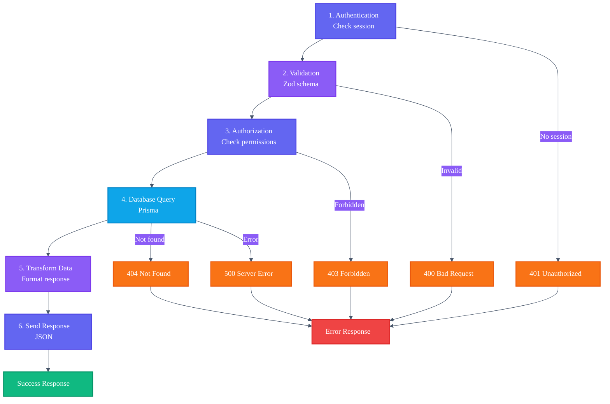

# API Implementation Guide

Complete guide for implementing REST API endpoints with Next.js App Router, Prisma, Zod validation, and Auth.js.

## Architecture Pattern

All API endpoints follow this consistent architecture:



---

## Step-by-Step Implementation

### 1. Authentication Check

**Pattern:** Check session before processing request

```typescript
import { auth } from '@/auth';

export async function GET(req: NextRequest) {
  try {
    const session = await auth();

    // For protected endpoints:
    if (!session?.user?.email) {
      return NextResponse.json({ error: 'Unauthorized' }, { status: 401 });
    }

    // For optional auth (show different data if authenticated):
    const userLocale = session?.user?.locale || 'en';

    // ... rest of handler
  }
}
```

**Key Points:**

- Always use try-catch for error handling
- Check `session?.user?.email` for authentication requirement
- Use `session?.user?.locale` to get user's preferred language
- Default to `'en'` for unauthenticated requests

---

### 2. Request Validation (Zod Schemas)

**Pattern:** Define schemas at file level, validate in handler

```typescript
import { z } from 'zod';

// Define schema
const createEnrollmentSchema = z.object({
  courseId: z.string().uuid('Invalid course ID'),
  startDate: z.date().optional(),
});

export async function POST(req: NextRequest) {
  try {
    const body = await req.json();

    // Validate request body
    const validatedData = createEnrollmentSchema.parse(body);

    // Use validated data
    // ...
  } catch (error) {
    if (error instanceof z.ZodError) {
      return NextResponse.json({ error: 'Invalid request', details: error.errors }, { status: 400 });
    }
    // ... handle other errors
  }
}
```

**Common Schemas:**

```typescript
// User profile update
const updateProfileSchema = z.object({
  name: z.string().optional(),
  bio: z.string().max(500).optional(),
  avatar: z.string().url().optional(),
});

// Enrollment creation
const enrollmentSchema = z.object({
  courseId: z.string().uuid('Invalid course ID'),
});

// Language preference
const languageSchema = z.object({
  locale: z.enum(['en', 'es', 'pt', 'hi', 'zh', 'de', 'hu']),
});

// Custom with validation message
const courseFilterSchema = z.object({
  status: z.enum(['draft', 'published', 'archived']).optional(),
  limit: z.number().min(1).max(100).default(20),
});
```

**Error Response for Zod:**

```json
{
  "error": "Invalid request",
  "details": [
    {
      "code": "invalid_type",
      "expected": "string",
      "received": "number",
      "path": ["courseId"],
      "message": "Expected string, received number"
    }
  ]
}
```

---

### 3. Prisma Query with Type Safety

**Pattern:** Use select to control fields returned

```typescript
import { prisma } from '@/lib/prisma';

// Basic query with field selection
const user = await prisma.user.findUnique({
  where: { id: userId },
  select: {
    id: true,
    email: true,
    name: true,
    locale: true,
    // Don't select sensitive fields like password
  },
});

// Conditional relations (show enrollment only if user is owner)
const course = await prisma.course.findUnique({
  where: { id: courseId },
  select: {
    id: true,
    title: true,
    // Only fetch enrollment if authenticated
    enrollments: isAuthenticated
      ? {
          where: { userId: currentUserId },
          select: { id: true, status: true, progress: true },
        }
      : false,
    // Count aggregation
    _count: {
      select: { enrollments: true },
    },
  },
});

// Nested relations with filtering
const courseWithContent = await prisma.course.findUnique({
  where: { id: courseId },
  select: {
    id: true,
    modules: {
      orderBy: { order: 'asc' },
      select: {
        id: true,
        order: true,
        lessons: {
          orderBy: { order: 'asc' },
          select: { id: true, videoUrl: true },
        },
      },
    },
  },
});

// Translation handling
const courseWithTranslations = await prisma.course.findUnique({
  where: { id: courseId },
  select: {
    id: true,
    // Filter translations by user's locale
    translations: {
      where: { locale: userLocale },
      select: {
        title: true,
        description: true,
        content: true,
      },
    },
  },
});
```

**Best Practices:**

- Always use `select` to control returned fields
- Don't select sensitive data (passwords, tokens)
- Use `where` with conditionals for permission checks
- Filter translations by locale in query
- Use `_count` for aggregations instead of fetching relations
- Order by relevant fields (modules by `order`, courses by `createdAt`)

---

### 4. Response Formatting with Translation Fallbacks

**Pattern:** Handle missing translations gracefully

```typescript
// Problem: translations array might be empty
const course = await prisma.course.findUnique({
  where: { id },
  select: {
    id: true,
    translations: {
      where: { locale: 'es' }, // User requested Spanish
      select: { title: true, description: true },
    },
  },
});

// Solution: Provide fallback values
const formattedCourse = {
  id: course.id,
  title: course.translations[0]?.title || 'Untitled Course',
  description: course.translations[0]?.description || '',
};

// For arrays of objects:
const formattedModules = course.modules.map((module) => ({
  id: module.id,
  title: module.translations[0]?.title || `Module ${module.order}`,
  lessons: module.lessons.map((lesson) => ({
    id: lesson.id,
    title: lesson.translations[0]?.title || `Lesson ${lesson.order}`,
  })),
}));
```

**Key Points:**

- Use optional chaining: `translations[0]?.title`
- Provide sensible defaults
- Don't return nested arrays with empty translations
- Use array index `[0]` since we filtered by locale in query

---

### 5. Error Handling

**Pattern:** Catch specific errors and return appropriate status codes

```typescript
export async function POST(req: NextRequest) {
  try {
    const session = await auth();

    if (!session?.user?.email) {
      return NextResponse.json({ error: 'Unauthorized' }, { status: 401 });
    }

    const body = await req.json();
    const validated = enrollmentSchema.parse(body);

    const course = await prisma.course.findUnique({
      where: { id: validated.courseId },
      select: { id: true, status: true },
    });

    if (!course) {
      return NextResponse.json({ error: 'Course not found' }, { status: 404 });
    }

    if (course.status !== 'published') {
      return NextResponse.json({ error: 'Course not available' }, { status: 403 });
    }

    const enrollment = await prisma.enrollment.create({
      data: { userId, courseId: validated.courseId },
    });

    return NextResponse.json(enrollment, { status: 201 });
  } catch (error) {
    // Zod validation error
    if (error instanceof z.ZodError) {
      return NextResponse.json({ error: 'Invalid request', details: error.errors }, { status: 400 });
    }

    // Prisma unique constraint error
    if (error instanceof PrismaClientKnownRequestError) {
      if (error.code === 'P2002') {
        return NextResponse.json({ error: 'Already enrolled' }, { status: 409 });
      }
    }

    // Generic server error
    console.error('Error in POST /enrollments:', error);
    return NextResponse.json({ error: 'Failed to create enrollment' }, { status: 500 });
  }
}
```

**HTTP Status Code Reference:**

- `200 OK` - Successful GET/PATCH
- `201 Created` - Successful POST
- `400 Bad Request` - Invalid input (validation error)
- `401 Unauthorized` - Missing/invalid authentication
- `403 Forbidden` - Authenticated but no permission
- `404 Not Found` - Resource doesn't exist
- `409 Conflict` - Duplicate or conflict error
- `500 Internal Server Error` - Server error

---

## Complete Endpoint Example

Here's a complete real-world example:

```typescript
// /api/courses/[id]/enroll/route.ts
import { auth } from '@/auth';
import { prisma } from '@/lib/prisma';
import { NextRequest, NextResponse } from 'next/server';
import { z } from 'zod';
import { PrismaClientKnownRequestError } from '@prisma/client/runtime/library';

const enrollSchema = z.object({
  courseId: z.string().uuid('Invalid course ID'),
});

export async function POST(req: NextRequest) {
  try {
    // [1] Authentication
    const session = await auth();
    if (!session?.user?.email) {
      return NextResponse.json({ error: 'Unauthorized' }, { status: 401 });
    }

    // [2] Validation
    const body = await req.json();
    const { courseId } = enrollSchema.parse(body);

    // [3] Prisma queries
    const user = await prisma.user.findUnique({
      where: { email: session.user.email },
      select: { id: true },
    });

    if (!user) {
      return NextResponse.json({ error: 'User not found' }, { status: 404 });
    }

    const course = await prisma.course.findUnique({
      where: { id: courseId },
      select: { id: true, status: true },
    });

    if (!course) {
      return NextResponse.json({ error: 'Course not found' }, { status: 404 });
    }

    if (course.status !== 'published') {
      return NextResponse.json({ error: 'Course not published' }, { status: 403 });
    }

    const enrollment = await prisma.enrollment.create({
      data: {
        userId: user.id,
        courseId,
      },
      select: {
        id: true,
        status: true,
        enrolledAt: true,
      },
    });

    // [4] Response formatting
    return NextResponse.json(
      {
        success: true,
        enrollment: {
          ...enrollment,
          courseId,
        },
      },
      { status: 201 }
    );
  } catch (error) {
    // [5] Error handling
    if (error instanceof z.ZodError) {
      return NextResponse.json({ error: 'Invalid request', details: error.errors }, { status: 400 });
    }

    if (error instanceof PrismaClientKnownRequestError) {
      if (error.code === 'P2002') {
        return NextResponse.json({ error: 'Already enrolled in this course' }, { status: 409 });
      }
    }

    console.error('Error enrolling user:', error);
    return NextResponse.json({ error: 'Failed to enroll' }, { status: 500 });
  }
}
```

---

## File Structure

```
📦 apps/web/apps/web/src/app/api/
├── 📁 user/
│   ├── 📁 profile/
│   │   └── 📄 route.ts      # GET, PATCH user profile
│   └── 📁 language/
│       └── 📄 route.ts      # PATCH language preference
├── 📁 courses/
│   ├── 📄 route.ts          # GET all courses
│   └── 📁 [id]/
│       └── 📄 route.ts      # GET course details
└── 📁 enrollments/
    ├── 📄 route.ts          # GET, POST enrollments
    └── 📁 [id]/
        └── 📄 route.ts      # GET enrollment details
```

**Legend:**

- 📦 Root API directory
- 🛣️ Route handlers (API endpoints)
- 👤 User-related endpoints
- 📚 Course management
- 📝 Enrollment management
- 🌐 Language/locale endpoints
- 🔢 Dynamic route segments

## Testing Your Endpoints

### Unit Test Example

```typescript
// __tests__/api/enrollments.test.ts
import { describe, it, expect, vi, Mock } from 'vitest';
import { POST } from '@/app/api/enrollments/route';
import { auth } from '@/auth';
import { prisma } from '@/lib/prisma';

vi.mock('@/auth');
vi.mock('@/lib/prisma');

describe('POST /api/enrollments', () => {
  it('should create enrollment for authenticated user', async () => {
    (auth as Mock).mockResolvedValue({
      user: { email: 'test@example.com', locale: 'en' },
    });

    const req = new NextRequest('http://localhost:3000/api/enrollments', {
      method: 'POST',
      body: JSON.stringify({ courseId: 'course-uuid' }),
    });

    const response = await POST(req);
    expect(response.status).toBe(201);
  });

  it('should return 401 if not authenticated', async () => {
    (auth as Mock).mockResolvedValue(null);

    const req = new NextRequest('http://localhost:3000/api/enrollments', {
      method: 'POST',
      body: JSON.stringify({ courseId: 'course-uuid' }),
    });

    const response = await POST(req);
    expect(response.status).toBe(401);
  });
});
```

### Integration Test with Real Database

```typescript
// Use a test database URL in .env.test
const response = await fetch('http://localhost:3000/api/enrollments', {
  method: 'POST',
  headers: { 'Content-Type': 'application/json' },
  body: JSON.stringify({ courseId: 'test-course-id' }),
});

expect(response.status).toBe(401); // No session cookie
```

---

## Performance Considerations

### Query Optimization

```typescript
// ❌ Bad: N+1 queries
const enrollments = await prisma.enrollment.findMany();
const enriched = await Promise.all(enrollments.map((e) => prisma.course.findUnique({ where: { id: e.courseId } })));

// ✅ Good: Single query with relations
const enrollments = await prisma.enrollment.findMany({
  include: { course: { select: { id: true, title: true } } },
});
```

### Pagination

```typescript
export async function GET(req: NextRequest) {
  const page = parseInt(req.nextUrl.searchParams.get('page') || '1');
  const limit = parseInt(req.nextUrl.searchParams.get('limit') || '20');

  const skip = (page - 1) * limit;

  const [courses, total] = await Promise.all([prisma.course.findMany({ skip, take: limit }), prisma.course.count()]);

  return NextResponse.json({
    data: courses,
    pagination: {
      total,
      page,
      limit,
      totalPages: Math.ceil(total / limit),
    },
  });
}
```

---

## Security Best Practices

1. **Always verify ownership** before returning user data
2. **Don't select sensitive fields** (passwords, tokens)
3. **Validate input** with Zod before Prisma queries
4. **Check permissions** (e.g., user can only see own enrollments)
5. **Rate limit** endpoints to prevent abuse
6. **Log errors** but don't expose internals to clients
7. **Use HTTPS** in production
8. **Validate locale** to prevent injection attacks

```typescript
// ✅ Good: Check ownership
const enrollment = await prisma.enrollment.findUnique({ where: { id } });
if (enrollment.userId !== currentUser.id) {
  return NextResponse.json({ error: 'Forbidden' }, { status: 403 });
}

// ✅ Good: Don't select password
const user = await prisma.user.findUnique({
  where: { id },
  select: { id: true, email: true, name: true }, // password NOT selected
});
```

---

## Progress Tracking Pattern

Progress tracking uses incremental updates with automatic completion detection.

### Pattern: Mark Lesson Complete

```typescript
// 1. Verify user is enrolled
const enrollment = await prisma.enrollment.findUnique({
  where: { userId_courseId: { userId, courseId } },
});
if (!enrollment) {
  return NextResponse.json({ error: 'Not enrolled' }, { status: 403 });
}

// 2. Get or create course progress
let progress = await prisma.courseProgress.findUnique({
  where: { userId_courseId: { userId, courseId } },
});

if (!progress) {
  progress = await prisma.courseProgress.create({
    data: {
      userId,
      courseId,
      lessonId,
      lessonsComplete: 1,
      modulesComplete: 0,
    },
  });
} else {
  progress = await prisma.courseProgress.update({
    where: { userId_courseId: { userId, courseId } },
    data: {
      lessonId,
      lessonsComplete: { increment: 1 },
      lastAccessedAt: new Date(),
    },
  });
}

// 3. Check if entire module is complete
const module = lesson.module;
const totalLessons = await prisma.lesson.count({
  where: { moduleId: module.id },
});

const completedLessons = await prisma.courseProgress.count({
  where: {
    userId,
    courseId,
    lesson: { module: { id: module.id } },
  },
});

// 4. Auto-increment module if all lessons complete
if (completedLessons === totalLessons) {
  await prisma.courseProgress.update({
    where: { userId_courseId: { userId, courseId } },
    data: { modulesComplete: { increment: 1 } },
  });
}

// 5. Calculate and update overall progress
const totalModules = await prisma.module.count({ where: { courseId } });
const overallProgress = Math.round((modulesComplete / totalModules) * 100);

await prisma.enrollment.update({
  where: { userId_courseId: { userId, courseId } },
  data: { progress: overallProgress },
});
```

### Key Points for Progress Tracking:

- **Incremental Updates:** Use `{ increment: 1 }` to avoid race conditions
- **Auto-completion:** Check if all lessons/modules complete to auto-increment parent
- **Progress Calculation:** Always recalculate percentage from totals, not cumulative counts
- **Timestamp Updates:** Track `lastAccessedAt` for analytics
- **Idempotency:** Counting completed items prevents double-counting
- **Enrollment Sync:** Update enrollment progress percentage alongside detailed progress

---

## Pagination Pattern

```typescript
export async function GET(req: NextRequest) {
  const page = parseInt(req.nextUrl.searchParams.get('page') || '1');
  const limit = parseInt(req.nextUrl.searchParams.get('limit') || '20');

  const skip = (page - 1) * limit;

  const [items, total] = await Promise.all([prisma.model.findMany({ skip, take: limit }), prisma.model.count()]);

  return NextResponse.json({
    data: items,
    pagination: {
      total,
      page,
      limit,
      totalPages: Math.ceil(total / limit),
    },
  });
}
```

---

_DevMultiplier Academy - Building 10x-100x Developers in the Age of AI_
