```mermaid
%%{init: {'theme': 'base', 'themeVariables': {
  'primaryColor': '#bfdbfe',
  'primaryTextColor': '#000000',
  'primaryBorderColor': '#3b82f6',
  'lineColor': '#000000',
  'secondaryColor': '#ddd6fe',
  'tertiaryColor': '#a5f3fc',
  'background': '#ffffff',
  'textColor': '#000000',
  'edgeLabelBackground': '#e2e8f0',
  'fontFamily': 'system-ui, -apple-system, sans-serif'
}}}%%
graph TD
    Start["User visits /login"] --> Form["Login Form"]
    Form --> Submit["Submit credentials"]
    Submit --> Validate["CredentialsProvider.authorize"]

    Validate --> FindUser["Find user in DB"]
    FindUser --> Hash["Compare password hash"]

    Hash --> Match{Password<br/>matches?}
    Match -->|No| Fail["❌ Auth failed"]
    Match -->|Yes| Success["✅ Create JWT"]

    Success --> Session["Store session in DB"]
    Session --> Redirect["Redirect to /dashboard"]
    Fail --> Error["Show error message"]
    Error --> Form

    style Start fill:#bfdbfe,stroke:#2563eb,color:#000000,stroke-width:2px
    style Form fill:#a5f3fc,stroke:#0891b2,color:#000000,stroke-width:2px
    style Submit fill:#a5f3fc,stroke:#0891b2,color:#000000,stroke-width:2px
    style Validate fill:#ddd6fe,stroke:#7c3aed,color:#000000,stroke-width:2px
    style FindUser fill:#ddd6fe,stroke:#7c3aed,color:#000000,stroke-width:2px
    style Hash fill:#ddd6fe,stroke:#7c3aed,color:#000000,stroke-width:2px
    style Match fill:#fde68a,stroke:#d97706,color:#000000,stroke-width:2px
    style Success fill:#bbf7d0,stroke:#16a34a,color:#000000,stroke-width:2px
    style Fail fill:#fecaca,stroke:#dc2626,color:#000000,stroke-width:2px
    style Session fill:#ddd6fe,stroke:#7c3aed,color:#000000,stroke-width:2px
    style Redirect fill:#bbf7d0,stroke:#16a34a,color:#000000,stroke-width:2px
    style Error fill:#fecaca,stroke:#dc2626,color:#000000,stroke-width:2px

    linkStyle default stroke:#000000,stroke-width:2px
```

# Authentication Implementation Guide

Complete guide for Auth.js setup, login/register pages, and protected routes.

## Overview

The Dev Academy platform uses **Auth.js v5** (NextAuth) with:

- **Credentials Provider**: Email/password authentication
- **Prisma Adapter**: Database integration with User model
- **JWT Sessions**: Stateless, 30-day expiration
- **Role-based Protection**: Route middleware for authenticated pages

---

## Architecture

Auth.js handles authentication with a middleware-first approach:

```mermaid
%%{init: {'theme': 'base', 'themeVariables': {
  'primaryColor': '#bfdbfe',
  'primaryTextColor': '#000000',
  'primaryBorderColor': '#3b82f6',
  'lineColor': '#000000',
  'secondaryColor': '#ddd6fe',
  'tertiaryColor': '#a5f3fc',
  'background': '#ffffff',
  'textColor': '#000000',
  'actorTextColor': '#000000',
  'actorBkg': '#bfdbfe',
  'actorBorder': '#2563eb',
  'signalColor': '#000000',
  'signalTextColor': '#000000',
  'labelBoxBkgColor': '#fde68a',
  'labelBoxBorderColor': '#d97706',
  'labelTextColor': '#000000',
  'noteBkgColor': '#e2e8f0',
  'noteTextColor': '#000000',
  'noteBorderColor': '#94a3b8',
  'fontFamily': 'system-ui, -apple-system, sans-serif'
}}}%%
sequenceDiagram
    participant User as User/Browser
    participant Middleware
    participant Auth as Auth.js
    participant DB as Prisma
    participant Route as Protected Route

    User->>Middleware: Request to /dashboard
    Middleware->>Auth: Check session?
    Auth->>DB: Load session from DB
    DB->>Auth: Session found?

    alt Session Valid
        Auth->>Middleware: ✅ Session OK
        Middleware->>Route: Allow access
        Route->>User: Render page
    else No Session
        Auth->>Middleware: ❌ No session
        Middleware->>User: Redirect to /login
    end
```



## Authentication Flow



---

## Configuration Files

### 1. `/src/auth.ts` - Auth.js Configuration

This is the main authentication configuration file:

```typescript
import NextAuth from 'next-auth';
import CredentialsProvider from 'next-auth/providers/credentials';
import { PrismaAdapter } from '@auth/prisma-adapter';
import { prisma } from './lib/prisma';
import bcrypt from 'bcryptjs';

export const { handlers, auth, signIn, signOut } = NextAuth({
  adapter: PrismaAdapter(prisma), // Use Prisma for database
  providers: [
    CredentialsProvider({
      // Email/password authentication
      name: 'Credentials',
      async authorize(credentials) {
        // Validate email & password
        // Hash comparison with bcrypt
        // Return user object if valid
      },
    }),
  ],
  callbacks: {
    jwt() {
      /* Add custom fields to JWT */
    },
    session() {
      /* Add custom fields to session */
    },
  },
});
```

**Key Concepts:**

| Component             | Purpose                               |
| --------------------- | ------------------------------------- |
| `PrismaAdapter`       | Syncs Auth.js with Prisma User model  |
| `CredentialsProvider` | Handles email/password authentication |
| `callbacks.jwt`       | Adds custom fields to JWT token       |
| `callbacks.session`   | Adds custom fields to client session  |
| `pages.signIn`        | Redirect to /login on auth errors     |

### 2. `/middleware.ts` - Route Protection

Middleware runs on every request to check authentication:

```typescript
import { auth } from './auth';

const protectedRoutes = ['/dashboard', '/courses', '/profile'];

export async function middleware(request: NextRequest) {
  const session = await auth();

  if (isProtectedRoute && !session) {
    // Redirect to login
    return NextResponse.redirect(new URL('/login', request.url));
  }

  return NextResponse.next();
}
```

**Protected Routes:**

- `/dashboard` - User dashboard
- `/courses` - Course listing (when enhanced)
- `/enrollments` - User enrollments
- `/profile` - Profile editing

---

## Authentication Flow

### Registration Flow

```mermaid
%%{init: {'theme': 'base', 'themeVariables': {
  'primaryColor': '#bfdbfe',
  'primaryTextColor': '#000000',
  'primaryBorderColor': '#3b82f6',
  'lineColor': '#000000',
  'secondaryColor': '#ddd6fe',
  'tertiaryColor': '#a5f3fc',
  'background': '#ffffff',
  'textColor': '#000000',
  'edgeLabelBackground': '#e2e8f0',
  'fontFamily': 'system-ui, -apple-system, sans-serif'
}}}%%
flowchart TD
    A["User enters form"] --> B["POST /api/auth/register"]
    B --> C["Validate input<br/>(Zod schema)"]
    C --> D{"Email<br/>exists?"}
    D -->|Yes| E["❌ Return 409 Conflict"]
    D -->|No| F["Hash password<br/>(bcrypt)"]
    F --> G["Create user in database"]
    G --> H["Auto sign-in<br/>with credentials"]
    H --> I["Redirect to /dashboard"]

    style A fill:#bfdbfe,stroke:#2563eb,color:#000000,stroke-width:2px
    style B fill:#fed7aa,stroke:#ea580c,color:#000000,stroke-width:2px
    style C fill:#ddd6fe,stroke:#7c3aed,color:#000000,stroke-width:2px
    style D fill:#fde68a,stroke:#d97706,color:#000000,stroke-width:2px
    style E fill:#fecaca,stroke:#dc2626,color:#000000,stroke-width:2px
    style F fill:#ddd6fe,stroke:#7c3aed,color:#000000,stroke-width:2px
    style G fill:#ddd6fe,stroke:#7c3aed,color:#000000,stroke-width:2px
    style H fill:#a5f3fc,stroke:#0891b2,color:#000000,stroke-width:2px
    style I fill:#bbf7d0,stroke:#16a34a,color:#000000,stroke-width:2px

    linkStyle default stroke:#000000,stroke-width:2px
```



**Example:**

```typescript
// Client-side (register/page.tsx)
const registerResponse = await fetch('/api/auth/register', {
  method: 'POST',
  headers: { 'Content-Type': 'application/json' },
  body: JSON.stringify({
    name: 'John Doe',
    email: 'john@example.com',
    password: 'securePassword123',
    locale: 'en',
  }),
});

// Server-side (/api/auth/register/route.ts)
const hashedPassword = await bcrypt.hash(password, 10);
const user = await prisma.user.create({
  data: {
    name,
    email,
    password: hashedPassword,
    locale,
    status: 'active',
  },
});
```

### Login Flow

```mermaid
%%{init: {'theme': 'base', 'themeVariables': {
  'primaryColor': '#bfdbfe',
  'primaryTextColor': '#000000',
  'primaryBorderColor': '#3b82f6',
  'lineColor': '#000000',
  'secondaryColor': '#ddd6fe',
  'tertiaryColor': '#a5f3fc',
  'background': '#ffffff',
  'textColor': '#000000',
  'edgeLabelBackground': '#e2e8f0',
  'fontFamily': 'system-ui, -apple-system, sans-serif'
}}}%%
flowchart TD
    A["User enters email/password"] --> B["POST /api/auth/signin"]
    B --> C["Auth.js calls<br/>CredentialsProvider.authorize()"]
    C --> D["Find user by email"]
    D --> E{"User<br/>found?"}
    E -->|No| F["❌ Auth failed"]
    E -->|Yes| G["Compare password<br/>with bcrypt"]
    G --> H{"Password<br/>matches?"}
    H -->|No| F
    H -->|Yes| I["Generate JWT + Session"]
    I --> J["Set session cookie"]
    J --> K["Redirect to /dashboard"]

    style A fill:#bfdbfe,stroke:#2563eb,color:#000000,stroke-width:2px
    style B fill:#fed7aa,stroke:#ea580c,color:#000000,stroke-width:2px
    style C fill:#a5f3fc,stroke:#0891b2,color:#000000,stroke-width:2px
    style D fill:#ddd6fe,stroke:#7c3aed,color:#000000,stroke-width:2px
    style E fill:#fde68a,stroke:#d97706,color:#000000,stroke-width:2px
    style F fill:#fecaca,stroke:#dc2626,color:#000000,stroke-width:2px
    style G fill:#ddd6fe,stroke:#7c3aed,color:#000000,stroke-width:2px
    style H fill:#fde68a,stroke:#d97706,color:#000000,stroke-width:2px
    style I fill:#a5f3fc,stroke:#0891b2,color:#000000,stroke-width:2px
    style J fill:#a5f3fc,stroke:#0891b2,color:#000000,stroke-width:2px
    style K fill:#bbf7d0,stroke:#16a34a,color:#000000,stroke-width:2px

    linkStyle default stroke:#000000,stroke-width:2px
```



**Client Usage:**

```typescript
import { signIn } from 'next-auth/react';

const result = await signIn('credentials', {
  email: 'user@example.com',
  password: 'password123',
  redirect: false, // Handle redirect manually
});

if (result?.ok) {
  router.push('/dashboard');
} else {
  setError('Invalid credentials');
}
```

### Logout Flow


**Usage:**

```typescript
import { signOut } from 'next-auth/react';

<button onClick={() => signOut({ redirectTo: '/login' })}>
  Sign Out
</button>
```

---

## Session Management

### Accessing Session in Components

**Client-side (use `useSession`):**

```typescript
'use client';

import { useSession } from 'next-auth/react';

export default function MyComponent() {
  const { data: session, status } = useSession();

  if (status === 'loading') return <p>Loading...</p>;
  if (status === 'unauthenticated') return <p>Not signed in</p>;

  return <p>Welcome, {session.user.name}!</p>;
}
```

**Server-side (use `auth()`):**

```typescript
import { auth } from '@/auth';
import { prisma } from '@/lib/prisma';

export async function GET(req: NextRequest) {
  const session = await auth();

  if (!session?.user?.email) {
    return NextResponse.json({ error: 'Unauthorized' }, { status: 401 });
  }

  const user = await prisma.user.findUnique({
    where: { email: session.user.email },
  });

  return NextResponse.json(user);
}
```

### Session Structure

```typescript
// Standard Auth.js session
{
  user: {
    id: "uuid",
    email: "user@example.com",
    name: "John Doe",
    image: "https://...", // avatar
    locale: "en",         // custom field
    timezone: "UTC",      // custom field
  },
  expires: "2026-02-04T12:00:00Z",
}
```

---

## Password Security

### Hashing with bcrypt

```typescript
import bcrypt from 'bcryptjs';

// During registration
const hashedPassword = await bcrypt.hash(password, 10);
// 10 = salt rounds (higher = slower but more secure)

// During login
const isValid = await bcrypt.compare(inputPassword, hashedPassword);
```

**Best Practices:**

- Never store plain passwords
- Always hash with bcrypt (or Argon2)
- Use at least 10 salt rounds
- Validate password length (min 8 characters)

---

## API Endpoints

### POST /api/auth/register

Register a new user.

**Request:**

```json
{
  "name": "John Doe",
  "email": "john@example.com",
  "password": "SecurePass123",
  "locale": "en"
}
```

**Response:** 201 Created

```json
{
  "success": true,
  "user": {
    "id": "uuid",
    "email": "john@example.com",
    "name": "John Doe",
    "locale": "en"
  }
}
```

**Errors:**

- `400` - Invalid input (Zod validation)
- `409` - Email already registered
- `500` - Server error

### POST /api/auth/signin (handled by Auth.js)

```typescript
const result = await signIn('credentials', {
  email: 'user@example.com',
  password: 'password123',
  redirect: false,
});

if (result?.error) {
  // Invalid credentials
}
if (result?.ok) {
  // Successfully signed in
}
```

### POST /api/auth/signout (handled by Auth.js)

```typescript
await signOut({ redirectTo: '/login' });
```

---

## Environment Variables

Add to `.env.local`:

```env
# NextAuth Configuration
NEXTAUTH_URL="http://localhost:3000"
NEXTAUTH_SECRET="your-secret-key"  # Generate: openssl rand -base64 32
```

**Generating NEXTAUTH_SECRET:**

```bash
openssl rand -base64 32
# Output: 7v+j5k...randomly_generated_secret...
```

---

## File Structure

```
📦 src/
├── 📄 auth.ts                     # Main Auth.js config
├── 📄 middleware.ts               # Route protection
├── 📁 app/
│   ├── 📁 login/
│   │   └── 📄 page.tsx            # Login page
│   ├── 📁 register/
│   │   └── 📄 page.tsx            # Registration page
│   ├── 📁 dashboard/
│   │   └── 📄 page.tsx            # Protected dashboard
│   └── 📁 api/
│       └── 📁 auth/
│           ├── 📁 [...nextauth]/
│           │   └── 📄 route.ts    # Auth.js handlers
│           ├── 📁 register/
│           │   └── 📄 route.ts    # Registration API
│           └── 📁 logout/
│               └── 📄 route.ts    # Logout endpoint
```

---

## Usage Examples

### Create Login UI

```typescript
'use client';

import { signIn } from 'next-auth/react';
import { useState } from 'react';

export default function LoginForm() {
  const [email, setEmail] = useState('');
  const [password, setPassword] = useState('');
  const [error, setError] = useState('');

  const handleSubmit = async (e: React.FormEvent) => {
    e.preventDefault();

    const result = await signIn('credentials', {
      email,
      password,
      redirect: false,
    });

    if (result?.error) {
      setError('Invalid email or password');
    } else if (result?.ok) {
      window.location.href = '/dashboard';
    }
  };

  return (
    <form onSubmit={handleSubmit}>
      <input
        type="email"
        value={email}
        onChange={(e) => setEmail(e.target.value)}
        placeholder="Email"
      />
      <input
        type="password"
        value={password}
        onChange={(e) => setPassword(e.target.value)}
        placeholder="Password"
      />
      <button type="submit">Sign In</button>
      {error && <p className="error">{error}</p>}
    </form>
  );
}
```

### Protect API Route

```typescript
import { auth } from '@/auth';
import { NextRequest, NextResponse } from 'next/server';

export async function GET(req: NextRequest) {
  const session = await auth();

  // Check authentication
  if (!session?.user?.email) {
    return NextResponse.json({ error: 'Unauthorized' }, { status: 401 });
  }

  // Proceed with authenticated logic
  return NextResponse.json({ message: 'Success' });
}
```

### Protect Frontend Route

```typescript
'use client';

import { useSession } from 'next-auth/react';
import { useRouter } from 'next/navigation';
import { useEffect } from 'react';

export default function ProtectedPage() {
  const { data: session, status } = useSession();
  const router = useRouter();

  useEffect(() => {
    if (status === 'unauthenticated') {
      router.push('/login');
    }
  }, [status, router]);

  if (status === 'loading') return <p>Loading...</p>;
  if (!session) return null;

  return <p>Welcome, {session.user?.name}!</p>;
}
```

---

## Testing Authentication

### Test Registration

```bash
curl -X POST http://localhost:3000/api/auth/register \
  -H "Content-Type: application/json" \
  -d '{
    "name": "Test User",
    "email": "test@example.com",
    "password": "TestPassword123",
    "locale": "en"
  }'
```

### Test Login

```typescript
// Use signIn from next-auth/react
const result = await signIn('credentials', {
  email: 'test@example.com',
  password: 'TestPassword123',
});
```

### Check Session

```typescript
const session = await auth();
console.log(session?.user);
```

---

## Security Considerations

### Password Validation

✅ Enforce minimum 8 characters ✅ Hash with bcrypt (10+ rounds) ✅ Validate on server, not just client ✅ No password hints or recovery hints

### Session Security

✅ Use JWT strategy (stateless) ✅ 30-day expiration for security ✅ HttpOnly cookies (can't be accessed by JS) ✅ Secure flag for HTTPS only

### Route Protection

✅ Middleware checks on every request ✅ Redirect unauthenticated users to /login ✅ Don't expose sensitive data in URLs ✅ Validate ownership before returning data

### Common Pitfalls

❌ Don't log passwords or plain credentials ❌ Don't store sessions in localStorage (use cookies) ❌ Don't skip server-side session validation ❌ Don't expose user IDs without permission checks

---

## Debugging

### Check Session in Development

```typescript
// Add to any page to see current session
const { data: session } = useSession();
console.log('Session:', session);
```

### Enable Auth.js Debug Logging

```env
AUTH_DEBUG=true
```

### Common Issues

**"NEXTAUTH_SECRET is not set"**

- Generate: `openssl rand -base64 32`
- Add to `.env.local`

**Session not persisting**

- Check cookies in browser DevTools
- Verify `NEXTAUTH_URL` matches your domain
- Check middleware is enabled

**Password verification fails**

- Ensure bcrypt is properly installed
- Check bcrypt comparison logic
- Verify password is hashed on registration

---

## Next Steps

1. ✅ Auth.js configured with Prisma
2. ✅ Login/register pages created
3. ✅ Route middleware for protection
4. **To do:** Add OAuth providers (Google, GitHub)
5. **To do:** Add password reset functionality
6. **To do:** Add email verification

---

_DevMultiplier Academy - Building 10x-100x Developers in the Age of AI_
