# Dark Mode Design Guide

Format all responses using professional technical documentation standards with visual diagrams and structured layouts.

---

## What is Dark Mode?

Dark mode is a color scheme that uses light-colored text, icons, and UI elements on a dark background. It reduces eye
strain in low-light environments, saves battery on OLED screens, and provides an alternative aesthetic that many users
prefer.

---

## Core Design Principles

### 1. Avoid Pure Black (#000000)

Pure black backgrounds create harsh contrast with white text, causing eye strain. Instead, use dark grays that are
easier on the eyes.

| Avoid     | Prefer    | Name          |
| --------- | --------- | ------------- |
| `#000000` | `#0f172a` | Dark slate    |
| `#000000` | `#1a1a2e` | Dark navy     |
| `#000000` | `#121212` | Material dark |

### 2. Reduce Contrast for Body Text

While headings can use near-white colors, body text should use slightly muted tones to reduce visual fatigue.

```css
/* Headings - high contrast */
h1,
h2,
h3 {
  color: #f9fafb;
}

/* Body text - reduced contrast */
p,
li {
  color: #d1d5db;
}

/* Muted text - low emphasis */
.muted {
  color: #9ca3af;
}
```

### 3. Desaturate Colors

Bright, saturated colors that work in light mode can feel harsh in dark mode. Reduce saturation and increase brightness.

| Light Mode | Dark Mode | Color |
| ---------- | --------- | ----- |
| `#2563eb`  | `#60a5fa` | Blue  |
| `#dc2626`  | `#f87171` | Red   |
| `#16a34a`  | `#4ade80` | Green |

### 4. Maintain Visual Hierarchy

Use elevation (lighter backgrounds) instead of shadows to create depth in dark mode.

```css
/* Light mode: shadows for depth */
.card {
  box-shadow: 0 4px 6px rgba(0, 0, 0, 0.1);
}

/* Dark mode: lighter backgrounds for depth */
.dark .card {
  background: #1e293b;
} /* elevated surface */
.dark .page {
  background: #0f172a;
} /* base surface */
```

### 5. Ensure WCAG Compliance

Maintain minimum contrast ratios:

| Requirement     | Ratio     | Use Case                |
| --------------- | --------- | ----------------------- |
| AA Normal Text  | **4.5:1** | Body text, labels       |
| AA Large Text   | **3:1**   | Headings, UI components |
| AAA Normal Text | **7:1**   | Enhanced accessibility  |

---

## Example 1: Dashboard Application

A professional dashboard design with clear visual hierarchy.

### Color Palette

```css
:root {
  /* Dark Mode Dashboard */
  --bg-primary: #0f172a; /* Main background */
  --bg-secondary: #1e293b; /* Cards, elevated surfaces */
  --bg-tertiary: #334155; /* Hover states, borders */

  --text-primary: #f1f5f9; /* Headings */
  --text-secondary: #cbd5e1; /* Body text */
  --text-muted: #64748b; /* Labels, captions */

  --accent: #3b82f6; /* Primary actions */
  --accent-hover: #60a5fa; /* Hover state */
  --success: #22c55e;
  --warning: #f59e0b;
  --error: #ef4444;
}
```

### Component Structure


### Color Key (GitHub-style)

| Element        | Light     | Dark      | Soft Dark |
| -------------- | --------- | --------- | --------- |
| Background     | `#ffffff` | `#0d1117` | `#1c2128` |
| Secondary BG   | `#f6f8fa` | `#161b22` | `#22272e` |
| Border         | `#d1d9e0` | `#30363d` | `#444c56` |
| Primary Text   | `#1f2328` | `#e6edf3` | `#adbac7` |
| Secondary Text | `#656d76` | `#848d97` | `#768390` |
| Link           | `#0969da` | `#4493f8` | `#539bf5` |
| Accent         | `#1f6feb` | `#1f6feb` | `#316dca` |
| Success        | `#1a7f37` | `#3fb950` | `#57ab5a` |

### Implementation

```css
/* Dashboard Dark Mode */
.dashboard {
  background: #0f172a;
  min-height: 100vh;
}

.dashboard-header {
  background: #1e293b;
  border-bottom: 1px solid #334155;
}

.metric-card {
  background: #1e293b;
  border-radius: 0.75rem;
  padding: 1.5rem;
}

.metric-card:hover {
  background: #263548;
}

.metric-value {
  color: #f1f5f9;
  font-size: 2rem;
  font-weight: 700;
}

.metric-label {
  color: #64748b;
  font-size: 0.875rem;
  text-transform: uppercase;
}
```

---

## Example 2: Content/Blog Platform

An educational or blog platform optimized for reading.

### Color Palette

```css
:root {
  /* Dark Mode Reading */
  --bg-page: #111827; /* Page background */
  --bg-content: #1f2937; /* Article container */
  --bg-code: #0d1117; /* Code blocks */

  --text-heading: #f9fafb;
  --text-body: #e5e7eb;
  --text-muted: #9ca3af;

  --link: #60a5fa;
  --link-hover: #93c5fd;

  --border: #374151;
  --highlight: #fef08a; /* Text selection */
}
```

### Visual Structure

```mermaid
%%{init: {'theme': 'base', 'themeVariables': {
  'primaryColor': '#f6f8fa',
  'primaryTextColor': '#1f2328',
  'primaryBorderColor': '#d1d9e0',
  'lineColor': '#656d76',
  'secondaryColor': '#ffffff',
  'background': '#ffffff',
  'textColor': '#1f2328',
  'fontFamily': '-apple-system, BlinkMacSystemFont, Segoe UI, Helvetica, Arial, sans-serif'
}}}%%
flowchart TB
    subgraph Page ["Page Background #f6f8fa"]
        subgraph Article ["Article Container #ffffff"]
            Title["# Article Title"]
            Meta["Published Jan 13, 2026"]
            HR["────────────────────"]
            Heading["## Section Heading"]
            Body["Body text with good contrast"]
            Link["Links use #0969da"]

            subgraph CodeBlock ["Code Block #161b22"]
                Code["const example = 'code';"]
            end
        end
    end

    Title --> Meta --> HR --> Heading --> Body --> Link --> CodeBlock

    style Page fill:#f6f8fa,stroke:#d1d9e0,color:#1f2328
    style Article fill:#ffffff,stroke:#d1d9e0,color:#1f2328
    style CodeBlock fill:#161b22,stroke:#30363d,color:#e6edf3
    style Link fill:#ddf4ff,stroke:#54aeff,color:#0969da
```



### Color Key (GitHub-style)

| Element           | Light     | Dark      | Purpose              |
| ----------------- | --------- | --------- | -------------------- |
| Page Background   | `#f6f8fa` | `#0d1117` | Base layer           |
| Article Container | `#ffffff` | `#161b22` | Elevated content     |
| Code Block        | `#161b22` | `#0d1117` | Syntax highlighting  |
| Heading Text      | `#1f2328` | `#e6edf3` | High contrast        |
| Body Text         | `#1f2328` | `#e6edf3` | Comfortable reading  |
| Muted Text        | `#656d76` | `#848d97` | Secondary info       |
| Links             | `#0969da` | `#4493f8` | Interactive elements |
| Border            | `#d1d9e0` | `#30363d` | Subtle separators    |

### Typography Scale

```css
/* Optimized for dark mode reading */
.article {
  background: #1f2937;
  padding: 3rem;
  border-radius: 0.5rem;
}

.article h1 {
  color: #f9fafb;
  font-size: 2.5rem;
  line-height: 1.2;
  margin-bottom: 1.5rem;
}

.article h2 {
  color: #f9fafb;
  font-size: 1.75rem;
  border-bottom: 1px solid #374151;
  padding-bottom: 0.5rem;
  margin-top: 3rem;
}

.article p {
  color: #e5e7eb;
  line-height: 1.8;
  font-size: 1.125rem;
}

.article a {
  color: #60a5fa;
  text-decoration: underline;
  text-underline-offset: 2px;
}

.article code {
  background: #374151;
  color: #fbbf24;
  padding: 0.125rem 0.375rem;
  border-radius: 0.25rem;
  font-size: 0.9em;
}

.article pre {
  background: #0d1117;
  border: 1px solid #374151;
  border-radius: 0.5rem;
  padding: 1rem;
  overflow-x: auto;
}

.article blockquote {
  border-left: 4px solid #3b82f6;
  background: #1e293b;
  padding: 1rem 1.5rem;
  color: #d1d5db;
  font-style: italic;
}
```

---

## Example 3: E-Commerce Platform

A shopping interface balancing aesthetics with conversion optimization.

### Color Palette

```css
:root {
  /* Dark Mode E-Commerce */
  --bg-base: #0a0a0a; /* True dark for product focus */
  --bg-card: #171717; /* Product cards */
  --bg-elevated: #262626; /* Modals, dropdowns */

  --text-primary: #fafafa;
  --text-secondary: #a3a3a3;
  --text-price: #22c55e; /* Green for prices */

  --accent-primary: #f97316; /* Orange CTA buttons */
  --accent-secondary: #0ea5e9; /* Blue secondary actions */

  --border: #262626;
  --border-hover: #404040;
}
```

### Layout Structure


### Color Key (GitHub-style)

| Element         | Light     | Dark      | Purpose           |
| --------------- | --------- | --------- | ----------------- |
| Page Background | `#ffffff` | `#0d1117` | Base layer        |
| Secondary BG    | `#f6f8fa` | `#161b22` | Navbar, cards     |
| Border          | `#d1d9e0` | `#30363d` | Subtle separators |
| Primary Text    | `#1f2328` | `#e6edf3` | Product names     |
| Secondary Text  | `#656d76` | `#848d97` | Descriptions      |
| Success/Price   | `#1a7f37` | `#3fb950` | Pricing, CTAs     |
| Success BG      | `#dafbe1` | `#238636` | Price highlights  |

### Product Card Design

```css
.product-grid {
  background: #0a0a0a;
  padding: 2rem;
}

.product-card {
  background: #171717;
  border: 1px solid #262626;
  border-radius: 1rem;
  overflow: hidden;
  transition: all 0.2s ease;
}

.product-card:hover {
  border-color: #404040;
  transform: translateY(-4px);
}

.product-image {
  background: #262626; /* Placeholder bg */
  aspect-ratio: 1;
}

.product-info {
  padding: 1rem;
}

.product-name {
  color: #fafafa;
  font-weight: 600;
  margin-bottom: 0.5rem;
}

.product-description {
  color: #a3a3a3;
  font-size: 0.875rem;
  line-height: 1.5;
}

.product-price {
  color: #22c55e;
  font-size: 1.5rem;
  font-weight: 700;
}

.product-price-original {
  color: #525252;
  text-decoration: line-through;
  font-size: 1rem;
}

.btn-add-to-cart {
  background: #f97316;
  color: white;
  padding: 0.75rem 1.5rem;
  border-radius: 0.5rem;
  font-weight: 600;
  width: 100%;
}

.btn-add-to-cart:hover {
  background: #ea580c;
}
```

---

## Implementation Best Practices

### 1. CSS Custom Properties (Recommended)

```css
:root {
  --bg: #ffffff;
  --text: #1f2937;
  --accent: #2563eb;
}

.dark {
  --bg: #0f172a;
  --text: #f1f5f9;
  --accent: #60a5fa;
}

body {
  background: var(--bg);
  color: var(--text);
}
```

### 2. Tailwind CSS Dark Mode

```html
<!-- Using class strategy -->
<div class="bg-white dark:bg-gray-900">
  <h1 class="text-gray-900 dark:text-white">Title</h1>
  <p class="text-gray-600 dark:text-gray-300">Content</p>
</div>
```

### 3. Theme Toggle Implementation

```typescript
// src/lib/theme.ts - Theme toggle utility
function toggleTheme() {
  const root = document.documentElement;
  const isDark = root.classList.contains('dark');

  if (isDark) {
    root.classList.remove('dark');
    localStorage.setItem('theme', 'light');
  } else {
    root.classList.add('dark');
    localStorage.setItem('theme', 'dark');
  }
}

// Respect system preference
function initTheme() {
  const saved = localStorage.getItem('theme');
  const prefersDark = window.matchMedia('(prefers-color-scheme: dark)').matches;

  if (saved === 'dark' || (!saved && prefersDark)) {
    document.documentElement.classList.add('dark');
  }
}
```

---

## Theme Toggle Flow


---

## Testing Checklist

- [ ] All text meets WCAG contrast requirements
- [ ] Interactive elements have visible focus states
- [ ] Images and icons are visible on dark backgrounds
- [ ] Form inputs have clear borders/backgrounds
- [ ] Error and success states are distinguishable
- [ ] Shadows are replaced with elevation or borders
- [ ] Theme preference persists across sessions
- [ ] System preference is respected by default

---

## Status Node Colors Reference

Use these colors consistently across all dark mode diagrams:

| State   | Fill      | Stroke    | Text      | Usage             |
| ------- | --------- | --------- | --------- | ----------------- |
| Success | `#dcfce7` | `#86efac` | `#166534` | Completed, Pass   |
| Error   | `#fee2e2` | `#fca5a5` | `#991b1b` | Failed, Error     |
| Warning | `#fef3c7` | `#fcd34d` | `#92400e` | Caution, Pending  |
| Info    | `#dbeafe` | `#93c5fd` | `#1e40af` | Informational     |
| Neutral | `#f1f5f9` | `#cbd5e1` | `#334155` | Default, Inactive |

---

## Resources

> 💡 **Tip**: Bookmark these resources for quick reference during implementation.

- [WCAG Contrast Checker](https://webaim.org/resources/contrastchecker/)
- [Material Design Dark Theme](https://material.io/design/color/dark-theme.html)
- [Tailwind CSS Dark Mode](https://tailwindcss.com/docs/dark-mode)
- [Apple Human Interface Guidelines - Dark Mode](https://developer.apple.com/design/human-interface-guidelines/dark-mode)

---

_DevMultiplier Academy - Building 10x-100x Developers in the Age of AI_
