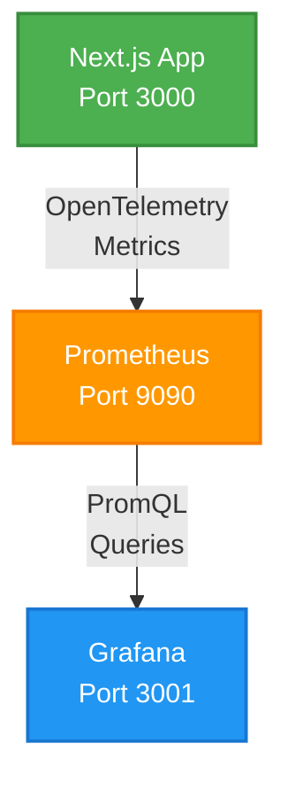

# Grafana Dashboard Setup Guide

This guide explains how to set up and use Grafana dashboards for monitoring the DevAcademy application.

## Overview

The DevAcademy project includes a complete monitoring stack:

- **Prometheus**: Metrics collection and storage
- **Grafana**: Visualization and dashboards
- **OpenTelemetry**: Application instrumentation

## Architecture



## Quick Start

### 1. Start the Monitoring Stack

```bash
cd .devcontainer
docker-compose up -d prometheus grafana
```

### 2. Access Grafana

Open your browser and navigate to: **http://localhost:3001**

**Default credentials:**

- Username: `admin`
- Password: `admin`

You'll be prompted to change the password on first login.

### 3. View Dashboards

The following dashboards are automatically provisioned:

1. **Application Overview** (`/d/devacademy-overview`)
   - HTTP request rate and latency
   - Error rates
   - Login activity
   - Database query rate
   - Page view distribution

2. **Security Monitoring** (`/d/devacademy-security`)
   - Failed login attempts
   - Suspicious login detection
   - New location logins
   - Login success rate
   - Geographic distribution
   - Security email alerts

3. **Performance Metrics** (`/d/devacademy-performance`)
   - HTTP response time percentiles (p50, p95, p99)
   - Database query latency
   - External API call duration
   - Request/response sizes
   - Throughput by route

## Configuration

### Environment Variables

You can customize the monitoring stack using these environment variables in [.devcontainer/.env](.devcontainer/.env):

```bash
# Prometheus
PROMETHEUS_PORT=9090

# Grafana
GRAFANA_PORT=3001
GRAFANA_ADMIN_USER=admin
GRAFANA_ADMIN_PASSWORD=admin
```

### Prometheus Configuration

Prometheus scrape configuration is located at
[.devcontainer/prometheus/prometheus.yml](.devcontainer/prometheus/prometheus.yml).

**Default scrape targets:**

- Prometheus itself: `localhost:9090`
- Next.js app: `dev-x-academy-web:3000/api/metrics`

### Dashboard Provisioning

Dashboards are automatically loaded from [.devcontainer/grafana/dashboards/](.devcontainer/grafana/dashboards/).

**Available dashboards:**

- `application-overview.json`
- `security-monitoring.json`
- `performance-metrics.json`

## Available Metrics

### HTTP Metrics

| Metric Name                                             | Type      | Description                 |
| ------------------------------------------------------- | --------- | --------------------------- |
| `devacademy_http_client_request_duration_seconds_count` | Counter   | Total HTTP requests         |
| `devacademy_http_client_request_duration_seconds`       | Histogram | Request duration in ms      |
| `devacademy_api_errors_total`                           | Counter   | Total HTTP errors           |
| `devacademy_http_client_request_size`                   | Histogram | Request body size in bytes  |
| `devacademy_http_client_response_size`                  | Histogram | Response body size in bytes |

**Labels:** `http_method`, `http_route`, `http_status_code`, `error_type`

### Authentication Metrics

| Metric Name                                | Type    | Description               |
| ------------------------------------------ | ------- | ------------------------- |
| `devacademy_user_login_attempts_total`     | Counter | Total login attempts      |
| `devacademy_user_login_success_total`      | Counter | Successful logins         |
| `devacademy_user_login_failures_total`     | Counter | Failed logins             |
| `devacademy_user_login_suspicious_total`   | Counter | Suspicious login attempts |
| `devacademy_user_login_new_location_total` | Counter | Logins from new locations |

**Labels:** `user_id`, `failure_reason`, `geo_country`, `geo_city`

### Database Metrics

| Metric Name                                             | Type          | Description            |
| ------------------------------------------------------- | ------------- | ---------------------- |
| `devacademy_db_client_operation_duration_seconds_count` | Counter       | Total database queries |
| `devacademy_db_client_operation_duration_seconds`       | Histogram     | Query duration in ms   |
| `devacademy_db_errors_total`                            | Counter       | Database errors        |
| `db_connection_pool_size`                               | UpDownCounter | Connection pool size   |

**Labels:** `db_operation`, `db_table`, `error_type`

### API Metrics

| Metric Name                                 | Type      | Description             |
| ------------------------------------------- | --------- | ----------------------- |
| `devacademy_api_calls_total`                | Counter   | External API calls      |
| `devacademy_api_call_duration_milliseconds` | Histogram | API call duration in ms |
| `api_errors_total`                          | Counter   | API call errors         |

**Labels:** `api_service`, `api_endpoint`, `api_status_code`, `error_type`

### Business Metrics

| Metric Name                       | Type    | Description         |
| --------------------------------- | ------- | ------------------- |
| `devacademy_page_views_total`     | Counter | Page views          |
| `course_views_total`              | Counter | Course views        |
| `lesson_views_total`              | Counter | Lesson views        |
| `devacademy_email_sent_total`     | Counter | Emails sent         |
| `devacademy_email_failures_total` | Counter | Email send failures |

**Labels:** `page_path`, `email_type`, `course_id`, `lesson_id`

## Useful Queries

### HTTP Performance

```promql
# Request rate
rate(devacademy_http_client_request_duration_seconds_count[5m])

# Average latency
rate(devacademy_http_client_request_duration_seconds_sum[5m]) / rate(devacademy_http_client_request_duration_seconds_count[5m])

# Error rate
rate(devacademy_api_errors_total[5m]) / rate(devacademy_http_client_request_duration_seconds_count[5m])

# 95th percentile latency
histogram_quantile(0.95, rate(devacademy_http_client_request_duration_seconds_bucket[5m]))
```

### Security Monitoring

```promql
# Failed login rate
rate(devacademy_user_login_failures_total[5m])

# Login success rate
sum(rate(devacademy_user_login_success_total[5m])) / sum(rate(devacademy_user_login_attempts_total[5m]))

# Suspicious logins by country
sum by (geo_country) (rate(devacademy_user_login_suspicious_total[5m]))

# Failed logins by reason
sum by (failure_reason) (rate(devacademy_user_login_failures_total[5m]))
```

### Database Performance

```promql
# Query rate by operation
sum by (db_operation) (rate(devacademy_db_client_operation_duration_seconds_count[5m]))

# Average query duration
rate(db_query_duration_sum[5m]) / rate(db_query_duration_count[5m])

# Slow queries (p99)
histogram_quantile(0.99, rate(db_query_duration_bucket[5m]))

# Database error rate
rate(devacademy_db_errors_total[5m])
```

### Business Insights

```promql
# Most popular pages
topk(10, sum by (page_path) (devacademy_page_views_total))

# Page view rate
rate(devacademy_page_views_total[5m])

# Course enrollment trend
rate(devacademy_course_enrollments_total[1h])
```

## Creating Custom Dashboards

### 1. Create a New Dashboard

1. Click the **+** icon in the Grafana sidebar
2. Select **Dashboard**
3. Click **Add visualization**
4. Select **Prometheus** as the data source

### 2. Add a Panel

1. Enter a PromQL query in the query editor
2. Configure visualization type (Graph, Gauge, Table, etc.)
3. Set panel title and description
4. Click **Apply**

### 3. Save the Dashboard

1. Click the **Save** icon (disk icon)
2. Enter a name and description
3. Select the **DevAcademy** folder
4. Click **Save**

### 4. Export for Provisioning (Optional)

To make your dashboard permanent:

1. Click **Share** → **Export**
2. Enable **Export for sharing externally**
3. Click **Save to file**
4. Move the JSON file to `.devcontainer/grafana/dashboards/`
5. Restart Grafana: `docker-compose restart grafana`

## Alerting

### Setting Up Alerts

1. Navigate to **Alerting** → **Alert rules**
2. Click **New alert rule**
3. Configure:
   - **Query**: Select Prometheus and enter a PromQL query
   - **Condition**: Set threshold (e.g., `> 100`)
   - **Evaluation**: Set check interval
   - **Notification**: Configure contact points

### Example Alert: High Error Rate

```yaml
Query: rate(devacademy_api_errors_total[5m]) / rate(devacademy_http_client_request_duration_seconds_count[5m])
Condition: IS ABOVE 0.05
For: 5m
Summary: HTTP error rate is above 5%
```

### Example Alert: Suspicious Logins

```yaml
Query: increase(devacademy_user_login_suspicious_total[5m])
Condition: IS ABOVE 5
For: 1m
Summary: Multiple suspicious login attempts detected
```

## Troubleshooting

### Dashboards Not Loading

**Check Grafana logs:**

```bash
docker logs grafana
```

**Verify dashboard files exist:**

```bash
ls -la .devcontainer/grafana/dashboards/
```

**Restart Grafana:**

```bash
docker-compose restart grafana
```

### No Data in Dashboards

**1. Check Prometheus is scraping metrics:**

Visit: http://localhost:9090/targets

All targets should show status **UP**.

**2. Verify metrics are being exported:**

Visit: http://localhost:3000/api/metrics

You should see metrics in Prometheus format.

**3. Check Prometheus logs:**

```bash
docker logs prometheus
```

**4. Test a query in Prometheus:**

Visit: http://localhost:9090/graph

Try: `devacademy_http_client_request_duration_seconds_count`

### Connection Issues

**Check all containers are running:**

```bash
docker-compose ps
```

**Check network connectivity:**

```bash
docker exec -it grafana ping prometheus
docker exec -it prometheus ping dev-x-academy-web
```

**Restart the entire stack:**

```bash
docker-compose down
docker-compose up -d
```

## Integration with Grafana Cloud

If you're already using Grafana Cloud (as configured in your OpenTelemetry setup), you can:

### Option 1: Use Grafana Cloud Exclusively

Your metrics are already being exported to Grafana Cloud via OpenTelemetry. You can:

1. Log in to your Grafana Cloud instance
2. Import the dashboard JSON files from `.devcontainer/grafana/dashboards/`
3. Update data source to use your Grafana Cloud Prometheus instance

### Option 2: Hybrid Approach

- Use **local Grafana** for development and debugging
- Use **Grafana Cloud** for production monitoring

The local setup gives you:

- Faster queries (no network latency)
- Development without affecting production dashboards
- Ability to test dashboard changes before deploying

## Best Practices

### Dashboard Design

1. **Group related metrics** - Organize panels logically
2. **Use appropriate visualizations** - Time series for trends, gauges for current values, tables for lists
3. **Add descriptions** - Help future users understand what they're looking at
4. **Set sensible time ranges** - Default to 15 minutes for operational dashboards
5. **Use variables** - Make dashboards reusable with templating

### Performance

1. **Limit time ranges** - Shorter ranges = faster queries
2. **Use recording rules** - Pre-calculate expensive queries
3. **Avoid too many panels** - Each panel is a separate query
4. **Use appropriate intervals** - Longer intervals for historical data

### Maintenance

1. **Regular reviews** - Remove unused dashboards
2. **Version control** - Keep dashboard JSON in git
3. **Documentation** - Document custom metrics and queries
4. **Alerts** - Set up alerts for critical metrics

## Next Steps

1. **Customize dashboards** - Add metrics specific to your use cases
2. **Set up alerts** - Configure notifications for critical events
3. **Add recording rules** - Optimize frequently-used queries
4. **Integrate with CI/CD** - Monitor deployment impact
5. **Create SLO dashboards** - Track service level objectives

## Resources

- [Prometheus Documentation](https://prometheus.io/docs/)
- [Grafana Documentation](https://grafana.com/docs/)
- [PromQL Cheat Sheet](https://promlabs.com/promql-cheat-sheet/)
- [OpenTelemetry Metrics](https://opentelemetry.io/docs/specs/otel/metrics/)

## Related Documentation

- [metrics_testing_guide.md](./metrics_testing_guide.md)
- [metrics_implementation.md](./metrics_implementation.md)
- [opentelemetry_setup.md](./opentelemetry_setup.md)
- [opentelemetry_architecture.md](./opentelemetry_architecture.md)

---

_DevMultiplier Academy - Building 10x-100x Developers in the Age of AI_
