# Integrating Legal Pages (Terms of Service & Privacy Policy) into DevMultiplier Academy

## Quick Answer

You'll create legal pages at these routes:

- `/[locale]/terms-of-service/page.tsx`
- `/[locale]/privacy-policy/page.tsx`

Then link to them from:

1. Footer (on every page)
2. Signup/Registration forms
3. Checkout/Payment pages
4. Account settings

## Legal Pages Flow

```mermaid
%%{init: {'theme': 'base', 'themeVariables': {
  'primaryColor': '#bfdbfe',
  'primaryTextColor': '#000000',
  'primaryBorderColor': '#3b82f6',
  'lineColor': '#000000',
  'secondaryColor': '#ddd6fe',
  'tertiaryColor': '#a5f3fc',
  'background': '#ffffff',
  'textColor': '#000000',
  'edgeLabelBackground': '#e2e8f0',
  'fontFamily': 'system-ui, -apple-system, sans-serif'
}}}%%
graph TD
    User["User"] -->|Visit site| Home["Home Page"]
    Home -->|Click footer link| Legal["Legal Page<br/>Terms or Privacy"]
    Legal -->|Read content| Content["Content loaded<br/>from translation JSON"]

    Signup["Registration Page"] -->|Accept terms| Accept["Show legal text"]
    Accept -->|User confirms| TOS["✅ Stored in DB"]

    Admin["Admin/Developer"] -->|Update legal text| JSON["Edit translation<br/>JSON file"]
    JSON -->|Deploy| Prod["Live on website"]

    style User fill:#bfdbfe,stroke:#2563eb,color:#000000,stroke-width:2px
    style Home fill:#a5f3fc,stroke:#0891b2,color:#000000,stroke-width:2px
    style Legal fill:#bfdbfe,stroke:#2563eb,color:#000000,stroke-width:2px
    style Content fill:#fde68a,stroke:#d97706,color:#000000,stroke-width:2px
    style Signup fill:#bfdbfe,stroke:#2563eb,color:#000000,stroke-width:2px
    style Accept fill:#ddd6fe,stroke:#7c3aed,color:#000000,stroke-width:2px
    style TOS fill:#bbf7d0,stroke:#16a34a,color:#000000,stroke-width:2px
    style Admin fill:#bfdbfe,stroke:#2563eb,color:#000000,stroke-width:2px
    style JSON fill:#ddd6fe,stroke:#7c3aed,color:#000000,stroke-width:2px
    style Prod fill:#bbf7d0,stroke:#16a34a,color:#000000,stroke-width:2px

    linkStyle default stroke:#000000,stroke-width:2px
```



---

## File Structure

```
📦 app/
└── 📁 [locale]/
    ├── 📄 layout.tsx
    ├── 📄 page.tsx              # Home
    ├── 📁 terms-of-service/
    │   └── 📄 page.tsx          # Terms page
    ├── 📁 privacy-policy/
    │   └── 📄 page.tsx          # Privacy page
    ├── 📁 courses/
    │   └── ...
    └── ...other pages
```

---

## Step 1: Create the Terms of Service Page

### Option A: Simple HTML Conversion (Quick Start)

**`app/[locale]/terms-of-service/page.tsx`**

```typescript
import { getTranslations } from 'next-intl/server';

export async function generateMetadata({
  params: { locale }
}: {
  params: { locale: string }
}) {
  const t = await getTranslations({ locale, namespace: 'legal' });

  return {
    title: t('terms.title'),
    description: t('terms.description')
  };
}

export default async function TermsOfServicePage({
  params: { locale }
}: {
  params: { locale: string };
}) {
  const t = await getTranslations({ locale, namespace: 'legal' });

  return (
    <div className="min-h-screen bg-gradient-to-br from-purple-600 to-indigo-700 py-12 px-4">
      <div className="max-w-4xl mx-auto bg-white rounded-2xl shadow-2xl overflow-hidden">
        {/* Header */}
        <div className="bg-gradient-to-r from-purple-600 to-indigo-700 text-white py-12 px-8 text-center">
          <h1 className="text-4xl font-bold mb-2">{t('terms.title')}</h1>
          <p className="text-lg opacity-95">DevMultiplier Academy</p>
          <p className="text-sm opacity-85 mt-1">{t('terms.subtitle')}</p>
        </div>

        {/* Content */}
        <div className="py-12 px-8 prose prose-lg max-w-none">
          <div className="bg-gray-100 rounded-lg p-4 mb-8">
            <strong>{t('terms.lastUpdated')}:</strong> December 30, 2025
          </div>

          {/* Section 1: Acceptance of Terms */}
          <section className="mb-8">
            <h2 className="text-2xl font-bold text-purple-700 mb-4 pb-2 border-b-2 border-gray-200">
              1. {t('terms.acceptance.title')}
            </h2>
            <p className="text-gray-700 mb-4">
              {t('terms.acceptance.intro')}
            </p>
            <div className="bg-purple-50 border-l-4 border-purple-600 p-6 rounded my-6">
              <strong>{t('terms.acceptance.important')}:</strong>{' '}
              {t('terms.acceptance.agreement')}
            </div>
          </section>

          {/* Section 2: Eligibility */}
          <section className="mb-8">
            <h2 className="text-2xl font-bold text-purple-700 mb-4 pb-2 border-b-2 border-gray-200">
              2. {t('terms.eligibility.title')}
            </h2>
            <p className="text-gray-700 mb-4">
              {t('terms.eligibility.intro')}
            </p>
            <ul className="list-disc ml-6 space-y-2 text-gray-700">
              <li>{t('terms.eligibility.age')}</li>
              <li>{t('terms.eligibility.capacity')}</li>
              <li>{t('terms.eligibility.compliance')}</li>
              <li>{t('terms.eligibility.accuracy')}</li>
              <li>{t('terms.eligibility.maintenance')}</li>
            </ul>
          </section>

          {/* Add more sections as needed... */}

          {/* Contact Section */}
          <section className="mt-12">
            <h2 className="text-2xl font-bold text-purple-700 mb-4 pb-2 border-b-2 border-gray-200">
              {t('terms.contact.title')}
            </h2>
            <div className="bg-gray-100 rounded-lg p-6">
              <h3 className="text-xl font-bold text-purple-700 mb-4">
                DevMultiplier Academy
              </h3>
              <p className="text-sm text-gray-600 mb-4">
                {t('terms.contact.legalEntity')}
              </p>
              <div className="space-y-2">
                <p>
                  <strong>{t('terms.contact.website')}:</strong>{' '}
                  <a href="https://www.DevMultiplier.com" className="text-purple-600 hover:underline">
                    www.DevMultiplier.com
                  </a>
                </p>
                <p>
                  <strong>{t('terms.contact.email')}:</strong>{' '}
                  <a href="mailto:legal@devmultiplier.com" className="text-purple-600 hover:underline">
                    legal@devmultiplier.com
                  </a>
                </p>
              </div>
            </div>
          </section>
        </div>

        {/* Footer */}
        <div className="bg-gray-800 text-white py-8 px-8 text-center">
          <p>&copy; 2025 DevMultiplier Academy, a division of 3D HD Soft, LLC. All rights reserved.</p>
        </div>
      </div>
    </div>
  );
}
```

### Option B: MDX-Based (Recommended for Easy Editing)

This approach lets you write content in Markdown with React components.

**Install MDX:**

```bash
bun add @next/mdx @mdx-js/loader @mdx-js/react @types/mdx
```

**`mdx-components.tsx` (in root directory)**

```typescript
import type { MDXComponents } from 'mdx/types';

export function useMDXComponents(components: MDXComponents): MDXComponents {
  return {
    h1: ({ children }) => (
      <h1 className="text-4xl font-bold text-purple-700 mb-6">{children}</h1>
    ),
    h2: ({ children }) => (
      <h2 className="text-2xl font-bold text-purple-700 mb-4 mt-8 pb-2 border-b-2 border-gray-200">
        {children}
      </h2>
    ),
    h3: ({ children }) => (
      <h3 className="text-xl font-bold text-gray-700 mb-3 mt-6">{children}</h3>
    ),
    p: ({ children }) => (
      <p className="text-gray-700 mb-4 leading-relaxed">{children}</p>
    ),
    ul: ({ children }) => (
      <ul className="list-disc ml-6 space-y-2 text-gray-700 mb-4">{children}</ul>
    ),
    li: ({ children }) => (
      <li className="leading-relaxed">{children}</li>
    ),
    a: ({ href, children }) => (
      <a href={href} className="text-purple-600 hover:underline font-medium">
        {children}
      </a>
    ),
    ...components,
  };
}
```

**`content/legal/en/terms-of-service.mdx`**

```markdown
---
title: Terms of Service
lastUpdated: 2025-12-30
---

## 1. Acceptance of Terms

Welcome to DevMultiplier Academy, a division of 3D HD Soft, LLC...

> **Important:** By accessing or using our Services, you agree to be bound by these Terms.

## 2. Eligibility

You must be at least 18 years of age to use our Services...

- You are at least 18 years old
- You have the legal capacity to enter into these Terms
- You will comply with these Terms and all applicable laws

...
```

**`app/[locale]/terms-of-service/page.tsx` (MDX version)**

```typescript
import { getTranslations } from 'next-intl/server';
import fs from 'fs/promises';
import path from 'path';
import { compileMDX } from 'next-mdx-remote/rsc';

export async function generateMetadata({
  params: { locale }
}: {
  params: { locale: string }
}) {
  const t = await getTranslations({ locale, namespace: 'legal' });

  return {
    title: t('terms.metaTitle'),
    description: t('terms.metaDescription')
  };
}

export default async function TermsOfServicePage({
  params: { locale }
}: {
  params: { locale: string };
}) {
  // Read MDX file based on locale
  const filePath = path.join(
    process.cwd(),
    'content',
    'legal',
    locale,
    'terms-of-service.mdx'
  );

  const source = await fs.readFile(filePath, 'utf-8');

  const { content, frontmatter } = await compileMDX({
    source,
    options: { parseFrontmatter: true }
  });

  return (
    <div className="min-h-screen bg-gradient-to-br from-purple-600 to-indigo-700 py-12 px-4">
      <div className="max-w-4xl mx-auto bg-white rounded-2xl shadow-2xl overflow-hidden">
        <div className="bg-gradient-to-r from-purple-600 to-indigo-700 text-white py-12 px-8 text-center">
          <h1 className="text-4xl font-bold mb-2">{frontmatter.title}</h1>
          <p className="text-lg opacity-95">DevMultiplier Academy</p>
          <p className="text-sm opacity-85 mt-1">A division of 3D HD Soft, LLC</p>
        </div>

        <div className="py-12 px-8">
          <div className="bg-gray-100 rounded-lg p-4 mb-8">
            <strong>Last Updated:</strong> {frontmatter.lastUpdated}
          </div>

          <div className="prose prose-lg max-w-none">
            {content}
          </div>
        </div>

        <div className="bg-gray-800 text-white py-8 px-8 text-center">
          <p>&copy; 2025 DevMultiplier Academy. All rights reserved.</p>
        </div>
      </div>
    </div>
  );
}
```

### Option C: Database/CMS-Based (Best for Scale)

**Using Sanity.io:**

```typescript
// sanity/schemas/legalPage.ts
export default {
  name: 'legalPage',
  type: 'document',
  title: 'Legal Page',
  fields: [
    {
      name: 'slug',
      type: 'slug',
      title: 'Slug',
      options: {
        source: 'title.en',
        maxLength: 96,
      },
    },
    {
      name: 'title',
      type: 'object',
      title: 'Title',
      fields: [
        { name: 'en', type: 'string', title: 'English' },
        { name: 'es', type: 'string', title: 'Spanish' },
        { name: 'pt', type: 'string', title: 'Portuguese' },
        { name: 'hu', type: 'string', title: 'Hungarian' },
      ],
    },
    {
      name: 'content',
      type: 'object',
      title: 'Content',
      fields: [
        {
          name: 'en',
          type: 'array',
          title: 'English',
          of: [{ type: 'block' }],
        },
        {
          name: 'es',
          type: 'array',
          title: 'Spanish',
          of: [{ type: 'block' }],
        },
        // ... other languages
      ],
    },
  ],
};
```

```typescript
// app/[locale]/terms-of-service/page.tsx
import { client } from '@/sanity/lib/client';
import { PortableText } from '@portabletext/react';

async function getLegalPage(slug: string, locale: string) {
  return client.fetch(
    `*[_type == "legalPage" && slug.current == $slug][0]{
      "title": title.${locale},
      "content": content.${locale}
    }`,
    { slug }
  );
}

export default async function TermsOfServicePage({
  params: { locale }
}: {
  params: { locale: string };
}) {
  const page = await getLegalPage('terms-of-service', locale);

  return (
    <div className="min-h-screen bg-gradient-to-br from-purple-600 to-indigo-700 py-12 px-4">
      <div className="max-w-4xl mx-auto bg-white rounded-2xl shadow-2xl overflow-hidden">
        <div className="bg-gradient-to-r from-purple-600 to-indigo-700 text-white py-12 px-8 text-center">
          <h1 className="text-4xl font-bold mb-2">{page.title}</h1>
          <p className="text-lg opacity-95">DevMultiplier Academy</p>
        </div>

        <div className="py-12 px-8 prose prose-lg max-w-none">
          <PortableText value={page.content} />
        </div>
      </div>
    </div>
  );
}
```

---

## Step 2: Create the Privacy Policy Page

Same approach as Terms of Service:

**`app/[locale]/privacy-policy/page.tsx`**

```typescript
import { getTranslations } from 'next-intl/server';

export async function generateMetadata({
  params: { locale }
}: {
  params: { locale: string }
}) {
  const t = await getTranslations({ locale, namespace: 'legal' });

  return {
    title: t('privacy.title'),
    description: t('privacy.description')
  };
}

export default async function PrivacyPolicyPage({
  params: { locale }
}: {
  params: { locale: string };
}) {
  const t = await getTranslations({ locale, namespace: 'legal' });

  return (
    <div className="min-h-screen bg-gradient-to-br from-purple-600 to-indigo-700 py-12 px-4">
      <div className="max-w-4xl mx-auto bg-white rounded-2xl shadow-2xl overflow-hidden">
        {/* Header */}
        <div className="bg-gradient-to-r from-purple-600 to-indigo-700 text-white py-12 px-8 text-center">
          <h1 className="text-4xl font-bold mb-2">{t('privacy.title')}</h1>
          <p className="text-lg opacity-95">DevMultiplier Academy</p>
          <p className="text-sm opacity-85 mt-1">{t('privacy.subtitle')}</p>
        </div>

        {/* Content - Similar structure to Terms of Service */}
        <div className="py-12 px-8 prose prose-lg max-w-none">
          {/* Your privacy policy content here */}
        </div>

        {/* Footer */}
        <div className="bg-gray-800 text-white py-8 px-8 text-center">
          <p>&copy; 2025 DevMultiplier Academy, a division of 3D HD Soft, LLC.</p>
        </div>
      </div>
    </div>
  );
}
```

---

## Step 3: Add Translation Keys

**`messages/en.json`**

```json
{
  "legal": {
    "terms": {
      "title": "Terms of Service",
      "metaTitle": "Terms of Service | DevMultiplier Academy",
      "metaDescription": "Terms of Service for DevMultiplier Academy courses and services",
      "subtitle": "A division of 3D HD Soft, LLC",
      "lastUpdated": "Last Updated",
      "acceptance": {
        "title": "Acceptance of Terms",
        "intro": "Welcome to DevMultiplier Academy...",
        "important": "Important",
        "agreement": "By accessing or using our Services, you agree to be bound by these Terms."
      },
      "eligibility": {
        "title": "Eligibility",
        "intro": "You must be at least 18 years of age to use our Services.",
        "age": "You are at least 18 years old",
        "capacity": "You have the legal capacity to enter into these Terms",
        "compliance": "You will comply with these Terms and all applicable laws",
        "accuracy": "All registration information you submit is accurate and truthful",
        "maintenance": "You will maintain the accuracy of such information"
      },
      "contact": {
        "title": "Contact Information",
        "legalEntity": "A division of 3D HD Soft, LLC",
        "website": "Website",
        "email": "Email"
      }
    },
    "privacy": {
      "title": "Privacy Policy",
      "metaTitle": "Privacy Policy | DevMultiplier Academy",
      "metaDescription": "Privacy Policy for DevMultiplier Academy",
      "subtitle": "A division of 3D HD Soft, LLC"
    }
  },
  "footer": {
    "legal": "Legal",
    "termsOfService": "Terms of Service",
    "privacyPolicy": "Privacy Policy"
  }
}
```

**`messages/es.json`**

```json
{
  "legal": {
    "terms": {
      "title": "Términos de Servicio",
      "metaTitle": "Términos de Servicio | DevMultiplier Academy",
      "metaDescription": "Términos de Servicio para cursos y servicios de DevMultiplier Academy",
      "subtitle": "Una división de 3D HD Soft, LLC",
      "lastUpdated": "Última Actualización",
      "acceptance": {
        "title": "Aceptación de Términos",
        "intro": "Bienvenido a DevMultiplier Academy...",
        "important": "Importante",
        "agreement": "Al acceder o usar nuestros Servicios, aceptas estar sujeto a estos Términos."
      }
      // ... more translations
    }
  }
}
```

**`messages/hu.json`**

```json
{
  "legal": {
    "terms": {
      "title": "Szolgáltatási Feltételek",
      "metaTitle": "Szolgáltatási Feltételek | DevMultiplier Academy",
      "metaDescription": "Szolgáltatási feltételek a DevMultiplier Academy tanfolyamokhoz és szolgáltatásokhoz",
      "subtitle": "A 3D HD Soft, LLC részlege",
      "lastUpdated": "Utolsó Frissítés",
      "acceptance": {
        "title": "Feltételek Elfogadása",
        "intro": "Üdvözöljük a DevMultiplier Academy-n...",
        "important": "Fontos",
        "agreement": "A Szolgáltatásaink eléréséhez vagy használatához elfogadod ezeket a Feltételeket."
      }
      // ... more translations
    }
  }
}
```

---

## Step 4: Link from Footer

**`components/Footer.tsx`**

```typescript
'use client';

import { useTranslations } from 'next-intl';
import { Link } from '@/i18n/routing';

export default function Footer() {
  const t = useTranslations('footer');
  const year = new Date().getFullYear();

  return (
    <footer className="bg-gray-900 text-white py-12">
      <div className="container mx-auto px-4">
        <div className="grid grid-cols-1 md:grid-cols-4 gap-8">
          {/* Company */}
          <div>
            <h3 className="text-lg font-bold mb-4">{t('company')}</h3>
            <ul className="space-y-2">
              <li><Link href="/about" className="hover:text-purple-400">{t('about')}</Link></li>
              <li><Link href="/courses" className="hover:text-purple-400">{t('courses')}</Link></li>
              <li><Link href="/contact" className="hover:text-purple-400">{t('contact')}</Link></li>
            </ul>
          </div>

          {/* Legal */}
          <div>
            <h3 className="text-lg font-bold mb-4">{t('legal')}</h3>
            <ul className="space-y-2">
              <li>
                <Link href="/terms-of-service" className="hover:text-purple-400">
                  {t('termsOfService')}
                </Link>
              </li>
              <li>
                <Link href="/privacy-policy" className="hover:text-purple-400">
                  {t('privacyPolicy')}
                </Link>
              </li>
            </ul>
          </div>

          {/* Support */}
          <div>
            <h3 className="text-lg font-bold mb-4">{t('support')}</h3>
            <ul className="space-y-2">
              <li><a href="mailto:support@devmultiplier.com" className="hover:text-purple-400">support@devmultiplier.com</a></li>
            </ul>
          </div>

          {/* Social */}
          <div>
            <h3 className="text-lg font-bold mb-4">{t('followUs')}</h3>
            {/* Social links */}
          </div>
        </div>

        <div className="border-t border-gray-800 mt-8 pt-8 text-center text-sm">
          <p>&copy; {year} DevMultiplier Academy, a division of 3D HD Soft, LLC. {t('allRightsReserved')}</p>
        </div>
      </div>
    </footer>
  );
}
```

**`app/[locale]/layout.tsx`**

```typescript
import Footer from '@/components/Footer';

export default function LocaleLayout({
  children,
  params: { locale }
}: {
  children: React.ReactNode;
  params: { locale: string };
}) {
  return (
    <html lang={locale}>
      <body>
        {children}
        <Footer />
      </body>
    </html>
  );
}
```

---

## Step 5: Link from Signup/Registration Forms

**`components/SignupForm.tsx`**

```typescript
'use client';

import { useTranslations } from 'next-intl';
import { Link } from '@/i18n/routing';

export default function SignupForm() {
  const t = useTranslations('auth');

  return (
    <form>
      {/* Form fields */}

      <div className="mt-4">
        <label className="flex items-start">
          <input type="checkbox" className="mt-1 mr-2" required />
          <span className="text-sm text-gray-600">
            {t('signup.agreement.prefix')}{' '}
            <Link href="/terms-of-service" className="text-purple-600 hover:underline">
              {t('signup.agreement.terms')}
            </Link>
            {' '}{t('signup.agreement.and')}{' '}
            <Link href="/privacy-policy" className="text-purple-600 hover:underline">
              {t('signup.agreement.privacy')}
            </Link>
          </span>
        </label>
      </div>

      <button type="submit" className="w-full bg-purple-600 text-white py-2 rounded-lg">
        {t('signup.submit')}
      </button>
    </form>
  );
}
```

**Translation:**

```json
{
  "auth": {
    "signup": {
      "agreement": {
        "prefix": "I agree to the",
        "terms": "Terms of Service",
        "and": "and",
        "privacy": "Privacy Policy"
      }
    }
  }
}
```

---

## Step 6: Link from Checkout/Payment Pages

**`app/[locale]/checkout/page.tsx`**

```typescript
import { useTranslations } from 'next-intl';
import { Link } from '@/i18n/routing';

export default function CheckoutPage() {
  const t = useTranslations('checkout');

  return (
    <div>
      {/* Checkout form */}

      <div className="mt-6 p-4 bg-gray-50 rounded-lg border border-gray-200">
        <p className="text-sm text-gray-600">
          {t('legal.prefix')}{' '}
          <Link href="/terms-of-service" className="text-purple-600 hover:underline font-medium">
            {t('legal.terms')}
          </Link>
          {' '}{t('legal.and')}{' '}
          <Link href="/privacy-policy" className="text-purple-600 hover:underline font-medium">
            {t('legal.privacy')}
          </Link>
          .
        </p>
      </div>

      <button className="w-full mt-4 bg-purple-600 text-white py-3 rounded-lg">
        {t('completePurchase')}
      </button>
    </div>
  );
}
```

---

## Summary: Where to Link Legal Pages

### **Required Locations:**

1. ✅ **Footer** - Every page (most common)
2. ✅ **Signup/Registration Form** - Checkbox with links
3. ✅ **Checkout/Payment Page** - Disclaimer with links
4. ✅ **Account Settings** - Legal section

### **Optional but Recommended:**

5. **Cookie Consent Banner** - Link to privacy policy
6. **Email Footer** - All transactional emails
7. **Mobile App** - Settings menu
8. **API Documentation** - For developers using your API

### **File Locations:**

```
📦 app/[locale]/
├── 📁 terms-of-service/
│   └── 📄 page.tsx                 # Terms of Service
├── 📁 privacy-policy/
│   └── 📄 page.tsx                 # Privacy Policy
└── 📄 layout.tsx                   # Includes Footer component

📦 components/
├── 📄 Footer.tsx                   # Links to legal pages
├── 📄 SignupForm.tsx               # Checkbox agreement
└── 📄 CookieConsent.tsx            # Privacy policy link
```

### **Translation Files:**

```
📦 messages/
├── 📄 en.json    # English legal translations
├── 📄 es.json    # Spanish legal translations
├── 📄 pt.json    # Portuguese legal translations
└── 📄 hu.json    # Hungarian legal translations
```

---

## Quick Start Checklist

- [ ] Create `/app/[locale]/terms-of-service/page.tsx`
- [ ] Create `/app/[locale]/privacy-policy/page.tsx`
- [ ] Add legal translations to `messages/[locale].json`
- [ ] Add legal links to Footer component
- [ ] Add checkbox to signup form
- [ ] Add disclaimer to checkout page
- [ ] Test all locale variations (`/en/terms-of-service`, `/es/terms-of-service`, etc.)
- [ ] Verify SEO metadata for each locale
- [ ] Test mobile responsiveness

This gives you a complete, multilingual legal page implementation that's SEO-friendly and properly integrated throughout your site! 🚀

---

_DevMultiplier Academy - Building 10x-100x Developers in the Age of AI_
