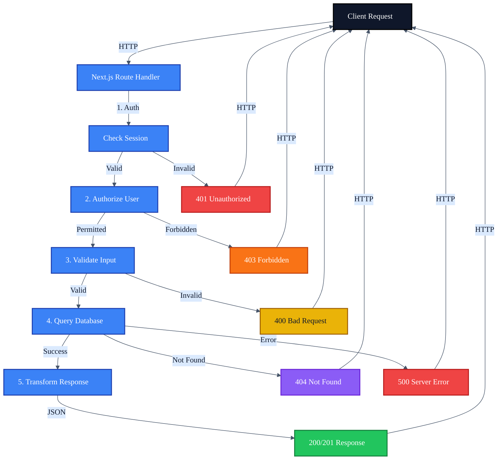

# Mermaid Theme Guide

Standard theme configuration for Mermaid diagrams in Dev Academy documentation.

## Standard Theme Configuration

Use this theme configuration at the start of all Mermaid diagrams for consistent styling:

```mermaid
%%{init: {'theme': 'base', 'themeVariables': {
  'primaryColor': '#3b82f6',
  'primaryTextColor': '#0f172a',
  'primaryBorderColor': '#1e40af',
  'lineColor': '#475569',
  'secondaryColor': '#dbeafe',
  'tertiaryColor': '#eff6ff',
  'background': '#ffffff',
  'textColor': '#0f172a',
  'fontFamily': 'system-ui, -apple-system, sans-serif'
}}}%%
```

### Copy-Paste Template (Single Line)

```
%%{init: {'theme': 'base', 'themeVariables': { 'primaryColor': '#3b82f6', 'primaryTextColor': '#0f172a', 'primaryBorderColor': '#1e40af', 'lineColor': '#475569', 'secondaryColor': '#dbeafe', 'tertiaryColor': '#eff6ff', 'background': '#ffffff', 'textColor': '#0f172a', 'fontFamily': 'system-ui, -apple-system, sans-serif'}}}%%
```

## Theme Variables Reference

| Variable             | Value                                  | Description                                |
| -------------------- | -------------------------------------- | ------------------------------------------ |
| `primaryColor`       | `#3b82f6`                              | Main node background (Tailwind blue-500)   |
| `primaryTextColor`   | `#0f172a`                              | Text on primary nodes (Tailwind slate-900) |
| `primaryBorderColor` | `#1e40af`                              | Primary node borders (Tailwind blue-800)   |
| `lineColor`          | `#475569`                              | Connector lines (Tailwind slate-600)       |
| `secondaryColor`     | `#dbeafe`                              | Secondary elements (Tailwind blue-100)     |
| `tertiaryColor`      | `#eff6ff`                              | Background fills (Tailwind blue-50)        |
| `background`         | `#ffffff`                              | Diagram background (white)                 |
| `textColor`          | `#0f172a`                              | General text color (Tailwind slate-900)    |
| `fontFamily`         | `system-ui, -apple-system, sans-serif` | System font stack                          |

## Status Node Styles

For flowcharts with success/error states, use these pastel colors with dark text for better readability:

```mermaid
    %% Success states (green pastel)
    style SuccessNode fill:#dcfce7,stroke:#86efac,color:#166534

    %% Error states (red pastel)
    style ErrorNode fill:#fee2e2,stroke:#fca5a5,color:#991b1b

    %% Warning states (amber pastel)
    style WarningNode fill:#fef3c7,stroke:#fcd34d,color:#92400e

    %% Info states (blue pastel)
    style InfoNode fill:#dbeafe,stroke:#93c5fd,color:#1e40af

    %% Neutral states (gray pastel)
    style NeutralNode fill:#f1f5f9,stroke:#cbd5e1,color:#334155
```

### Status Colors Quick Reference

| State   | Fill      | Stroke    | Text      |
| ------- | --------- | --------- | --------- |
| Success | `#dcfce7` | `#86efac` | `#166534` |
| Error   | `#fee2e2` | `#fca5a5` | `#991b1b` |
| Warning | `#fef3c7` | `#fcd34d` | `#92400e` |
| Info    | `#dbeafe` | `#93c5fd` | `#1e40af` |
| Neutral | `#f1f5f9` | `#cbd5e1` | `#334155` |

## Alternative Theme Presets

### Indigo Theme (Original)

```
%%{init: {'theme': 'base', 'themeVariables': { 'primaryColor': '#4f46e5', 'primaryTextColor': '#1e293b', 'primaryBorderColor': '#3730a3', 'lineColor': '#94a3b8', 'secondaryColor': '#e0e7ff', 'tertiaryColor': '#f5f3ff', 'textColor': '#334155'}}}%%
```

### Emerald Theme (Fresh/Growth)

```
%%{init: {'theme': 'base', 'themeVariables': { 'primaryColor': '#10b981', 'primaryTextColor': '#1e293b', 'primaryBorderColor': '#047857', 'lineColor': '#94a3b8', 'secondaryColor': '#d1fae5', 'tertiaryColor': '#ecfdf5', 'textColor': '#334155'}}}%%
```

### Neutral Theme (Minimal)

```
%%{init: {'theme': 'base', 'themeVariables': { 'primaryColor': '#475569', 'primaryTextColor': '#1e293b', 'primaryBorderColor': '#1e293b', 'lineColor': '#94a3b8', 'secondaryColor': '#f1f5f9', 'tertiaryColor': '#f8fafc', 'textColor': '#334155'}}}%%
```

### Dark Theme (For Dark Mode Contexts)

```
%%{init: {'theme': 'dark', 'themeVariables': { 'primaryColor': '#e2e8f0', 'primaryTextColor': '#1e293b', 'primaryBorderColor': '#60a5fa', 'lineColor': '#94a3b8', 'secondaryColor': '#334155', 'tertiaryColor': '#1e293b', 'textColor': '#f1f5f9', 'background': '#0f172a'}}}%%
```

## Complete Example



## Subgraph Styling

For diagrams with subgraphs, use these fill colors:

```mermaid
    subgraph GroupA["Group A"]
        %% nodes
    end

    subgraph GroupB["Group B"]
        %% nodes
    end

    style GroupA fill:#dbeafe,stroke:#93c5fd,color:#1e40af
    style GroupB fill:#fef3c7,stroke:#fcd34d,color:#92400e
```

### Subgraph Color Palette

| Purpose         | Fill      | Stroke    | Text      |
| --------------- | --------- | --------- | --------- |
| Primary Group   | `#dbeafe` | `#93c5fd` | `#1e40af` |
| Secondary Group | `#fef3c7` | `#fcd34d` | `#92400e` |
| Success Group   | `#dcfce7` | `#86efac` | `#166534` |
| Neutral Group   | `#f1f5f9` | `#cbd5e1` | `#334155` |

## Design Principles

1. **Consistency** - Use the standard theme across all documentation
2. **Accessibility** - Ensure sufficient contrast ratios (WCAG AA)
3. **Tailwind Alignment** - Colors match the application's Tailwind palette
4. **Semantic Colors** - Green for success, red for errors, amber for warnings

---

_DevMultiplier Academy - Building 10x-100x Developers in the Age of AI_
