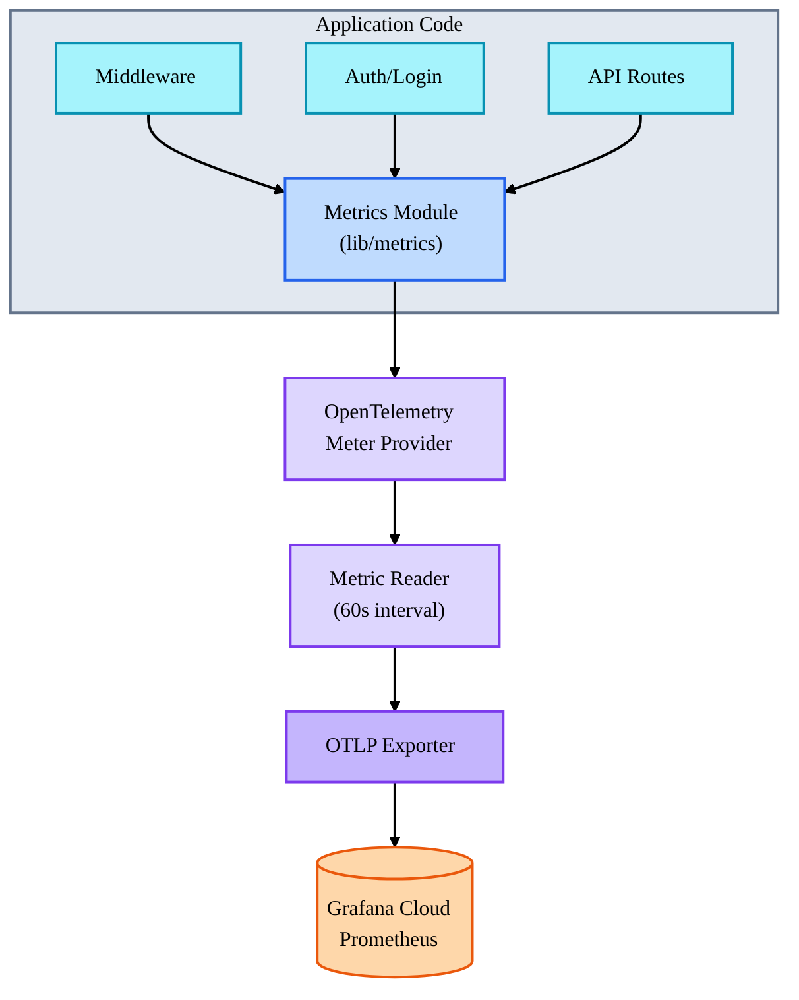

# OpenTelemetry Metrics Implementation

This document describes the comprehensive metrics collection system implemented in the Dev Academy web application using
OpenTelemetry.

## Overview

The application now collects three main categories of metrics:

1. **Application Performance Metrics** - System and infrastructure metrics
2. **Business Metrics - User Activity** - User behavior and authentication metrics
3. **Business Metrics - Feature Usage** - Feature engagement and content metrics

All metrics are exported to **Grafana Cloud Prometheus** via OTLP/HTTP protocol.

## Architecture

### Components



### Files

- **[instrumentation.node.ts](../instrumentation.node.ts)** - OpenTelemetry SDK initialization with metrics reader
- **[src/lib/metrics.ts](../src/lib/metrics.ts)** - Metrics utility module with all metric definitions
- **[middleware.ts](../middleware.ts)** - HTTP request and page view metrics collection
- **[src/lib/login-logger.ts](../src/lib/login-logger.ts)** - Authentication metrics collection
- **[src/lib/email-service.ts](../src/lib/email-service.ts)** - Email metrics collection
- **[src/lib/ip-utils.ts](../src/lib/ip-utils.ts)** - API call metrics collection

## Metrics Catalog

### Application Performance Metrics

#### HTTP Metrics

| Metric Name                 | Type      | Unit    | Description                 | Labels                                                        |
| --------------------------- | --------- | ------- | --------------------------- | ------------------------------------------------------------- |
| `http.server.requests`      | Counter   | `1`     | Total HTTP requests         | `http.method`, `http.route`, `http.status_code`               |
| `http.server.duration`      | Histogram | `ms`    | HTTP request duration       | `http.method`, `http.route`, `http.status_code`               |
| `http.server.request.size`  | Histogram | `bytes` | HTTP request body size      | `http.method`, `http.route`, `http.status_code`               |
| `http.server.response.size` | Histogram | `bytes` | HTTP response body size     | `http.method`, `http.route`, `http.status_code`               |
| `http.server.errors`        | Counter   | `1`     | Total HTTP errors (4xx/5xx) | `http.method`, `http.route`, `http.status_code`, `error.type` |

**Usage Example:**

```typescript
import { recordHttpRequest } from '@/lib/metrics';

recordHttpRequest({
  method: 'GET',
  route: '/api/users',
  statusCode: 200,
  duration: 45,
  requestSize: 256,
  responseSize: 1024,
});
```

#### Database Metrics

| Metric Name               | Type          | Unit | Description                  | Labels                                   |
| ------------------------- | ------------- | ---- | ---------------------------- | ---------------------------------------- |
| `db.queries`              | Counter       | `1`  | Total database queries       | `db.operation`, `db.table`               |
| `db.query.duration`       | Histogram     | `ms` | Database query duration      | `db.operation`, `db.table`               |
| `db.errors`               | Counter       | `1`  | Total database errors        | `db.operation`, `db.table`, `error.type` |
| `db.connection_pool.size` | UpDownCounter | `1`  | Current connection pool size | -                                        |

**Usage Example:**

```typescript
import { recordDbQuery } from '@/lib/metrics';

const startTime = Date.now();
try {
  const result = await prisma.user.findMany();
  recordDbQuery({
    operation: 'findMany',
    table: 'user',
    duration: Date.now() - startTime,
    success: true,
  });
} catch (error) {
  recordDbQuery({
    operation: 'findMany',
    table: 'user',
    duration: Date.now() - startTime,
    success: false,
    error: 'QueryError',
  });
}
```

#### API Metrics (External Services)

| Metric Name         | Type      | Unit | Description                | Labels                                           |
| ------------------- | --------- | ---- | -------------------------- | ------------------------------------------------ |
| `api.calls`         | Counter   | `1`  | Total external API calls   | `api.service`, `api.endpoint`, `api.status_code` |
| `api.call.duration` | Histogram | `ms` | External API call duration | `api.service`, `api.endpoint`, `api.status_code` |
| `api.errors`        | Counter   | `1`  | Total external API errors  | `api.service`, `api.endpoint`, `error.type`      |

**Usage Example:**

```typescript
import { recordApiCall } from '@/lib/metrics';

recordApiCall({
  service: 'ip-api.com',
  endpoint: '/json',
  duration: 120,
  statusCode: 200,
  success: true,
});
```

### Business Metrics - User Activity

#### Authentication Metrics

| Metric Name               | Type    | Unit | Description               | Labels                                               |
| ------------------------- | ------- | ---- | ------------------------- | ---------------------------------------------------- |
| `user.login.attempts`     | Counter | `1`  | Total login attempts      | `user.success`, `user.id`, `geo.country`, `geo.city` |
| `user.login.success`      | Counter | `1`  | Successful logins         | `user.id`, `geo.country`, `geo.city`                 |
| `user.login.failures`     | Counter | `1`  | Failed login attempts     | `failure.reason`                                     |
| `user.logout`             | Counter | `1`  | User logouts              | `user.id`                                            |
| `user.login.new_location` | Counter | `1`  | Logins from new locations | `user.id`, `geo.country`, `geo.city`                 |
| `user.login.suspicious`   | Counter | `1`  | Suspicious login attempts | `user.email`, `failed.attempts`, `geo.country`       |

**Usage Example:**

```typescript
import { recordLoginAttempt } from '@/lib/metrics';

recordLoginAttempt({
  success: true,
  userId: 'user-123',
  email: 'user@example.com',
  country: 'United States',
  city: 'San Francisco',
});
```

#### User Registration Metrics

| Metric Name         | Type    | Unit | Description              | Labels |
| ------------------- | ------- | ---- | ------------------------ | ------ |
| `user.registration` | Counter | `1`  | Total user registrations | -      |
| `user.activation`   | Counter | `1`  | Account activations      | -      |

#### Active User Metrics

| Metric Name            | Type          | Unit | Description               | Labels |
| ---------------------- | ------------- | ---- | ------------------------- | ------ |
| `user.active`          | UpDownCounter | `1`  | Currently active users    | -      |
| `user.sessions.active` | UpDownCounter | `1`  | Currently active sessions | -      |

**Usage Example:**

```typescript
import { updateActiveUsers, updateActiveSessions } from '@/lib/metrics';

// User logged in
updateActiveUsers(1);
updateActiveSessions(1);

// User logged out
updateActiveUsers(-1);
updateActiveSessions(-1);
```

### Business Metrics - Feature Usage

#### Page View Metrics

| Metric Name         | Type    | Unit | Description       | Labels                 |
| ------------------- | ------- | ---- | ----------------- | ---------------------- |
| `page.views`        | Counter | `1`  | Total page views  | `page.path`, `user.id` |
| `page.views.unique` | Counter | `1`  | Unique page views | `page.path`, `user.id` |

**Usage Example:**

```typescript
import { recordPageView } from '@/lib/metrics';

recordPageView({
  path: '/courses/react-basics',
  userId: 'user-123',
  isUnique: true,
});
```

#### Course/Content Metrics

| Metric Name          | Type    | Unit | Description        | Labels                              |
| -------------------- | ------- | ---- | ------------------ | ----------------------------------- |
| `course.views`       | Counter | `1`  | Total course views | `course.id`                         |
| `course.enrollments` | Counter | `1`  | Course enrollments | `course.id`, `user.id`              |
| `course.completions` | Counter | `1`  | Course completions | `course.id`, `user.id`              |
| `lesson.views`       | Counter | `1`  | Lesson views       | `lesson.id`, `course.id`            |
| `lesson.completions` | Counter | `1`  | Lesson completions | `lesson.id`, `course.id`, `user.id` |

#### Search Metrics

| Metric Name            | Type      | Unit | Description              | Labels        |
| ---------------------- | --------- | ---- | ------------------------ | ------------- |
| `search.queries`       | Counter   | `1`  | Total search queries     | `search.term` |
| `search.duration`      | Histogram | `ms` | Search query duration    | -             |
| `search.results.count` | Histogram | `1`  | Number of search results | -             |

#### Email & Notification Metrics

| Metric Name           | Type      | Unit | Description              | Labels                        |
| --------------------- | --------- | ---- | ------------------------ | ----------------------------- |
| `email.sent`          | Counter   | `1`  | Emails sent successfully | `email.type`, `email.success` |
| `email.failures`      | Counter   | `1`  | Email send failures      | `email.type`, `error.type`    |
| `email.send.duration` | Histogram | `ms` | Email send duration      | `email.type`                  |
| `notification.sent`   | Counter   | `1`  | Notifications sent       | `notification.type`           |

**Usage Example:**

```typescript
import { recordEmailSent } from '@/lib/metrics';

recordEmailSent({
  type: 'new_location_alert',
  recipient: 'user@example.com',
  success: true,
  duration: 250,
});
```

## Configuration

### Environment Variables

Add these to your `.env` file:

```bash
# OpenTelemetry endpoint (Grafana Cloud)
OTEL_EXPORTER_OTLP_ENDPOINT=https://otlp-gateway-prod-us-east-3.grafana.net/otlp

# Authentication (Base64 encoded instanceID:token)
OTEL_EXPORTER_OTLP_HEADERS=Authorization=Basic <YOUR_BASE64_CREDENTIALS>
```

### Export Interval

Metrics are exported every **60 seconds** by default. This can be adjusted in
[instrumentation.node.ts](../instrumentation.node.ts):

```typescript
const metricReader = new PeriodicExportingMetricReader({
  exporter: metricExporter,
  exportIntervalMillis: 60000, // Adjust this value
});
```

## Viewing Metrics in Grafana

### PromQL Query Examples

**HTTP request rate by route:**

```promql
rate(devacademy_http_client_request_duration_seconds_count[5m])
```

**Average HTTP request duration:**

```promql
rate(devacademy_http_client_request_duration_seconds_sum[5m]) / rate(devacademy_http_client_request_duration_seconds_count[5m])
```

**Login success rate:**

```promql
rate(devacademy_user_login_success_total[5m]) / rate(devacademy_user_login_attempts_total[5m])
```

**Failed login attempts by country:**

```promql
sum by (geo_country) (rate(devacademy_user_login_failures_total[5m]))
```

**API error rate:**

```promql
rate(api_errors_total[5m]) / rate(devacademy_api_calls_total[5m])
```

**Database query latency (95th percentile):**

```promql
histogram_quantile(0.95, rate(db_query_duration_bucket[5m]))
```

### Example Dashboard Panels

1. **HTTP Traffic Overview**
   - Request rate (requests/sec)
   - Error rate (%)
   - Average latency (ms)
   - P95 latency (ms)

2. **Authentication Security**
   - Login attempts vs successes
   - Failed login attempts by country (map)
   - Suspicious login alerts
   - New location logins

3. **Database Performance**
   - Query rate
   - Query latency distribution
   - Error rate
   - Connection pool usage

4. **External API Health**
   - API call rate
   - API latency
   - API error rate by service

5. **User Engagement**
   - Active users
   - Page views by path
   - Course enrollments
   - Content completions

6. **Email Service**
   - Emails sent
   - Email failure rate
   - Email send duration

## Custom Metrics

You can create custom metrics using the helper functions:

```typescript
import { createCounter, createHistogram, createUpDownCounter } from '@/lib/metrics';

// Create a custom counter
const myCounter = createCounter('my.custom.metric', {
  description: 'My custom metric',
  unit: '1',
});

myCounter.add(1, { 'custom.label': 'value' });

// Create a custom histogram
const myHistogram = createHistogram('my.custom.duration', {
  description: 'Duration of custom operation',
  unit: 'ms',
});

myHistogram.record(150, { operation: 'batch_process' });

// Create a custom gauge (up-down counter)
const myGauge = createUpDownCounter('my.queue.size', {
  description: 'Items in queue',
  unit: '1',
});

myGauge.add(5); // Add 5 items
myGauge.add(-2); // Remove 2 items
```

## Metric Types Explained

### Counter

- **Monotonic** - Only increases (never decreases)
- Use for: Total requests, errors, events
- Example: `http.server.requests`

### Histogram

- Records **distribution** of values
- Provides: count, sum, min, max, percentiles
- Use for: Latencies, sizes, durations
- Example: `http.server.duration`

### UpDownCounter

- Can **increase and decrease**
- Use for: Active connections, queue size, current users
- Example: `user.active`

## Best Practices

### 1. Label Cardinality

- Keep label cardinality low (< 100 unique values per label)
- ❌ Don't use: user IDs, email addresses, IP addresses as labels
- ✅ Use: user roles, countries, HTTP methods

### 2. Naming Conventions

- Use descriptive names: `http.server.duration` not `http_time`
- Follow semantic conventions: [OpenTelemetry Semantic Conventions](https://opentelemetry.io/docs/specs/semconv/)
- Use consistent units: `ms`, `bytes`, `1` (for counts)

### 3. Performance

- Metrics are recorded asynchronously (non-blocking)
- Export interval balances data freshness vs overhead
- Use aggregation in queries for high-volume metrics

### 4. Security

- Don't include PII in metric labels
- Sanitize user input before using in labels
- Use email type, not email address
- Use country/city, not full addresses

## Troubleshooting

### Metrics not appearing in Grafana

1. Check OpenTelemetry configuration:

```typescript
diag.setLogger(new DiagConsoleLogger(), DiagLogLevel.DEBUG);
```

2. Verify environment variables are set correctly

3. Check export logs (temporarily enable debug logging)

4. Verify Grafana Cloud credentials

### High cardinality warnings

If you see cardinality warnings in Grafana:

- Review metric labels
- Remove dynamic values from labels
- Aggregate in application code before recording

### Missing data points

- Check export interval (60s default)
- Verify metric is being recorded
- Check for filtering in Grafana queries

## Integration Testing

Test metrics collection locally:

```bash
# Run the application
bun run dev

# Make some requests
curl http://localhost:3000/
curl http://localhost:3000/api/user/login-history

# Check console for metric export logs (if debug enabled)
```

## References

- [OpenTelemetry Metrics API](https://opentelemetry.io/docs/specs/otel/metrics/api/)
- [OpenTelemetry Semantic Conventions](https://opentelemetry.io/docs/specs/semconv/)
- [Grafana Cloud Prometheus](https://grafana.com/docs/grafana-cloud/metrics/)
- [PromQL Documentation](https://prometheus.io/docs/prometheus/latest/querying/basics/)

---

_DevMultiplier Academy - Building 10x-100x Developers in the Age of AI_
