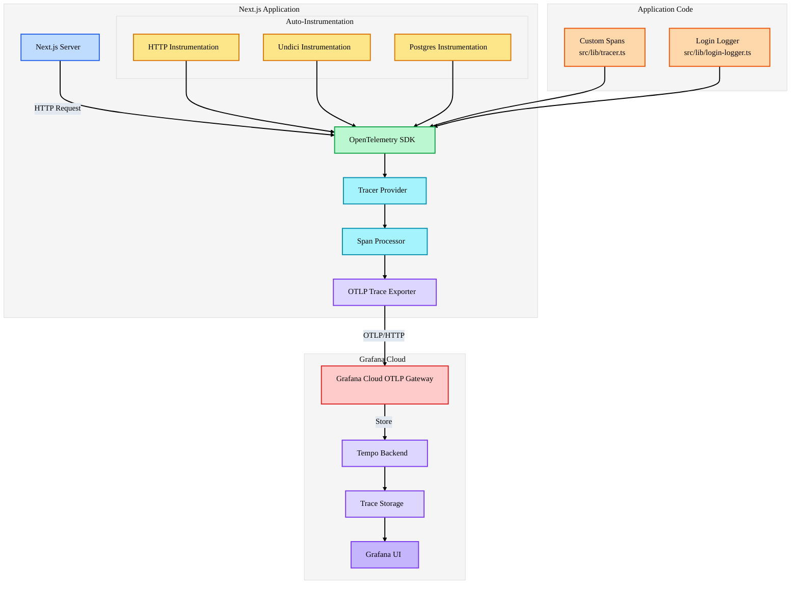
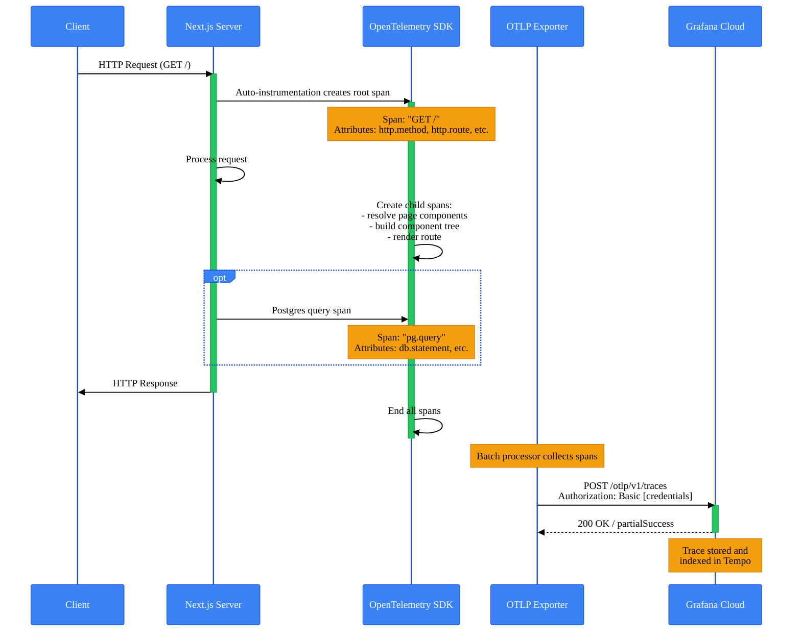
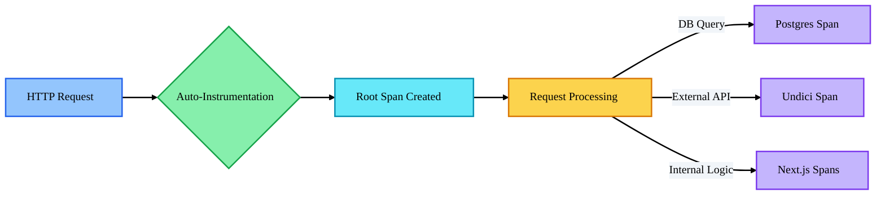
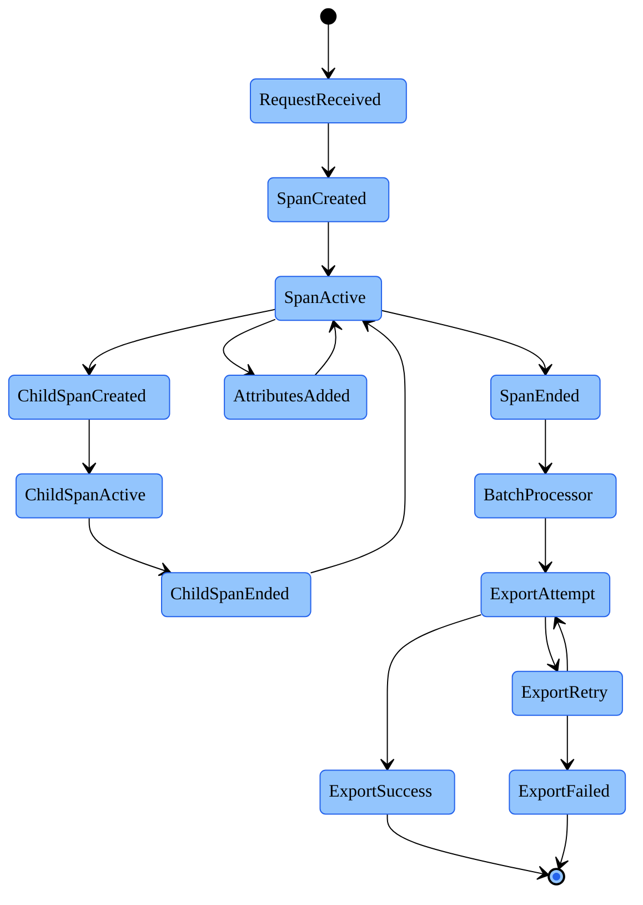
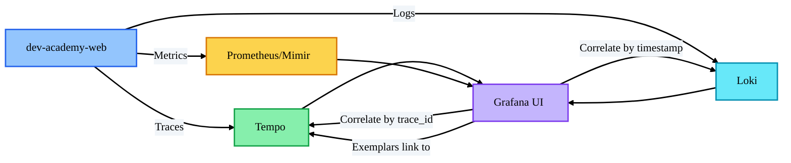
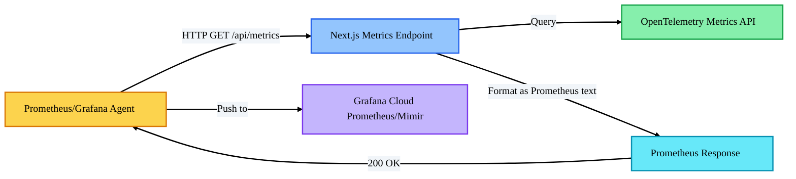

# OpenTelemetry Architecture Documentation

Complete technical documentation of the OpenTelemetry observability stack for dev-academy-web.

## Table of Contents

- [Overview](#overview)
- [Architecture Diagram](#architecture-diagram)
- [Technology Stack](#technology-stack)
- [Component Details](#component-details)
- [Data Flow](#data-flow)
- [Configuration Details](#configuration-details)
- [Instrumentation Strategy](#instrumentation-strategy)
- [Trace Lifecycle](#trace-lifecycle)
- [Performance Considerations](#performance-considerations)
- [Troubleshooting](#troubleshooting)

## Overview

The dev-academy-web application uses OpenTelemetry for distributed tracing, sending telemetry data to Grafana Cloud Tempo for storage and analysis. This setup provides end-to-end visibility into application performance, request flows, and error tracking.

### Key Capabilities

- **Distributed Tracing**: Track requests across the entire Next.js application
- **Automatic Instrumentation**: Zero-code instrumentation for HTTP, Undici, and Postgres
- **Custom Spans**: Manual instrumentation support for business logic
- **Cloud Integration**: Direct export to Grafana Cloud Tempo
- **Production Ready**: Optimized batch processing and retry logic

## Architecture Diagram



## Technology Stack

### Core Dependencies

```json
{
  "@opentelemetry/api": "^1.9.0",
  "@opentelemetry/sdk-node": "^0.56.0",
  "@opentelemetry/auto-instrumentations-node": "^0.53.0",
  "@opentelemetry/exporter-trace-otlp-http": "^0.56.0",
  "@opentelemetry/resources": "^1.29.0",
  "@opentelemetry/semantic-conventions": "^1.29.0"
}
```

### Version Information

- **OpenTelemetry SDK**: v2.x
- **OpenTelemetry API**: v1.9.0
- **Next.js**: 16.1.1 (with native instrumentation support)
- **Node.js**: 22.21.0

### Backend Services

- **Grafana Cloud Tempo**: Distributed tracing backend
- **OTLP Gateway**: `otlp-gateway-prod-us-east-3.grafana.net`
- **Region**: US East 3

## Component Details

### 1. Instrumentation Entry Point

**File**: [`instrumentation.node.ts`](../instrumentation.node.ts)

This file initializes the OpenTelemetry SDK and runs in the Node.js server process. It's automatically loaded by Next.js 16+ at startup.

```typescript
// Key responsibilities:
// 1. Parse environment variables
// 2. Configure OTLP exporter with Grafana Cloud credentials
// 3. Initialize SDK with auto-instrumentations
// 4. Set up resource attributes
// 5. Handle graceful shutdown
```

### 2. Client-Side Instrumentation Hook

**File**: [`instrumentation.ts`](../instrumentation.ts)

This file runs in both Node.js and Edge runtime environments. Currently used for server-side only.

```typescript
export async function register() {
  if (process.env.NEXT_RUNTIME === 'nodejs') {
    await import('./instrumentation.node');
  }
}
```

### 3. Tracer Utility

**File**: [`src/lib/tracer.ts`](../src/lib/tracer.ts)

Provides helper functions for creating custom spans in application code.

**Key Functions**:

- `withSpan<T>()`: Execute function within traced span
- `startSpan()`: Manually create and manage spans
- `addSpanAttributes()`: Add custom attributes to active span

### 4. OTLP Trace Exporter

The exporter sends trace data to Grafana Cloud using the OTLP/HTTP protocol.

**Configuration**:

- **Protocol**: HTTP
- **Endpoint**: `https://otlp-gateway-prod-us-east-3.grafana.net/otlp/v1/traces`
- **Authentication**: Basic Auth with instanceID:token
- **Retry Policy**: Enabled with exponential backoff

## Data Flow



## Configuration Details

### Environment Variables

**File**: [`.env.local`](../.env.local)

```bash
# OTLP Endpoint (without /v1/traces suffix)
OTEL_EXPORTER_OTLP_ENDPOINT=https://otlp-gateway-prod-us-east-3.grafana.net/otlp

# Authentication headers (JSON format for .env.local)
OTEL_EXPORTER_OTLP_HEADERS={"Authorization":"Basic REMOVED_SECRET"}
```

**File**: [`.env`](../.env)

```bash
# Same endpoint
OTEL_EXPORTER_OTLP_ENDPOINT=https://otlp-gateway-prod-us-east-3.grafana.net/otlp

# Authentication headers (key=value format for .env)
OTEL_EXPORTER_OTLP_HEADERS=Authorization=Basic REMOVED_SECRET
```

### Header Format Details

The `OTEL_EXPORTER_OTLP_HEADERS` value is a Base64-encoded string in the format:

```
Base64("<instanceID>:<grafana_cloud_token>")
```

**Example**:

```bash
# Example removed for security. Do not include real tokens in documentation.
```

### Resource Attributes

These attributes identify your service in the tracing backend:

```typescript
const resource = resourceFromAttributes({
  [ATTR_SERVICE_NAME]: 'dev-academy-web',
  [ATTR_SERVICE_VERSION]: '1.0.0',
  [SEMRESATTRS_DEPLOYMENT_ENVIRONMENT]: 'development',
});
```

**Additional auto-detected attributes**:

- `process.pid`: Process ID
- `process.runtime.name`: "nodejs"
- `process.runtime.version`: "22.21.0"
- `host.name`: "dev-x-academy-web"
- `host.arch`: "amd64"

### Auto-Instrumentation Configuration

**Enabled Instrumentations**:

- `@opentelemetry/instrumentation-http`: HTTP server/client
- `@opentelemetry/instrumentation-undici`: Modern fetch/HTTP client
- `@opentelemetry/instrumentation-pg`: PostgreSQL queries
- `@opentelemetry/instrumentation-express`: Express.js (if used)
- `@opentelemetry/instrumentation-grpc`: gRPC calls
- And 30+ more libraries...

**Disabled Instrumentations**:

- `@opentelemetry/instrumentation-fs`: File system (too noisy)
- `@opentelemetry/instrumentation-dns`: DNS lookups (too noisy)
- `@opentelemetry/instrumentation-fastify`: Not used

## Instrumentation Strategy

### Automatic Instrumentation



**Next.js Built-in Spans**:

- `BaseServer.handleRequest`: Root HTTP request span
- `NextNodeServer.findPageComponents`: Component resolution
- `NextNodeServer.createComponentTree`: React tree building
- `AppRender.getBodyResult`: Server-side rendering
- `NextNodeServer.startResponse`: Response initiation
- `NextNodeServer.clientComponentLoading`: Client components

### Custom Instrumentation

**Example: Login Monitoring**

File: [`src/lib/login-logger.ts`](../src/lib/login-logger.ts)

```typescript
export async function logLoginAttempt(/* ... */) {
  return withSpan('login.attempt', async (span) => {
    span.setAttributes({
      'user.email': email,
      'login.success': success,
      'login.ip': ipAddress,
    });

    // Business logic here

    return result;
  });
}
```

**Example: API Route Instrumentation**

```typescript
// src/app/api/user/login-history/route.ts
import { withSpan } from '@/lib/tracer';

export async function GET(request: Request) {
  return withSpan('api.user.login-history', async (span) => {
    const session = await auth();
    span.setAttribute('user.id', session?.user?.id);

    const history = await db.loginLog.findMany(/* ... */);

    return Response.json(history);
  });
}
```

## Trace Lifecycle



### Span Lifecycle Stages

1. **Creation**: Span created with unique `spanId` and `traceId`
2. **Active**: Span is the current active span in context
3. **Attribute Addition**: Metadata added (HTTP method, route, etc.)
4. **Child Span Creation**: Nested operations create child spans
5. **Completion**: Span ended with duration calculated
6. **Export**: Span sent to backend via batch processor

## Performance Considerations

### Batch Processing

The SDK uses `BatchSpanProcessor` for efficient export:

```typescript
{
  maxQueueSize: 2048,        // Max spans in queue
  maxExportBatchSize: 512,   // Max spans per batch
  scheduledDelayMillis: 5000 // Export every 5 seconds
}
```

### Sampling Strategy

Currently using **AlwaysOnSampler** (100% sampling):

- All traces are captured and exported
- Suitable for development and low-to-medium traffic
- Consider `ParentBasedSampler` or `TraceIdRatioBasedSampler` for production

### Memory Overhead

**Estimated overhead per trace**:

- Root span: ~2-4 KB
- Child spans: ~1-2 KB each
- Typical Next.js request: 8-10 spans = ~15-20 KB

**For 1000 req/min**:

- ~15-20 MB/min trace data generated
- Batch processor manages memory efficiently

### Network Impact

- **Batch size**: 512 spans per export
- **Export frequency**: Every 5 seconds or when batch fills
- **Compression**: GZIP compression enabled by default
- **Typical batch size**: ~200-500 KB compressed

## Troubleshooting

### Common Issues and Solutions

#### 1. 401 Unauthorized Error

```
OTLPExporterError: Unauthorized
authentication error: invalid authentication credentials
```

**Cause**: Incorrect Base64 encoding of credentials

**Solution**:

```bash
# Correct format: instanceID:token
# echo -n "<instanceID>:<grafana_cloud_token>" | base64
```

Update both `.env` and `.env.local` with correct value.

#### 2. Header Parsing Error

```
TypeError: Header name must be a valid HTTP token ["{"Authorization":"Basic ..."]
```

**Cause**: Environment variable being used directly as header name instead of being parsed

**Solution**: The `instrumentation.node.ts` file includes special parsing logic that deletes the env var after parsing to prevent this issue.

#### 3. No Traces Appearing in Grafana

**Diagnostic Steps**:

1. Check environment variables are loaded:

```typescript
console.log('Endpoint:', process.env.OTEL_EXPORTER_OTLP_ENDPOINT);
```

2. Enable debug logging in `instrumentation.node.ts`:

```typescript
diag.setLogger(new DiagConsoleLogger(), DiagLogLevel.DEBUG);
```

3. Check network connectivity:

```bash
curl -X POST https://otlp-gateway-prod-us-east-3.grafana.net/otlp/v1/traces \
  -H "Authorization: Basic MTQ4Njg0Nzp..." \
  -H "Content-Type: application/json" \
  -d '{}'
```

Expected response: `{"partialSuccess":{}}`

#### 4. Traces Not Correlated

**Cause**: Context propagation broken between async operations

**Solution**: Use `withSpan()` helper or ensure proper context passing:

```typescript
import { context } from '@opentelemetry/api';

// Preserve context across async boundaries
await context.with(context.active(), async () => {
  // Your async operation
});
```

#### 5. High Memory Usage

**Cause**: Too many spans queued for export

**Solutions**:

- Reduce `maxQueueSize` in BatchSpanProcessor
- Implement sampling strategy
- Increase export frequency

### Debug Mode

To enable full debug output:

```typescript
// instrumentation.node.ts
import { diag, DiagConsoleLogger, DiagLogLevel } from '@opentelemetry/api';

diag.setLogger(new DiagConsoleLogger(), DiagLogLevel.ALL);
```

This logs:

- Span creation/ending
- Export attempts
- Batch processing
- Instrumentation loading
- Resource detection

### Testing Trace Export

Generate test traffic and check console for export confirmation:

```bash
# Generate 3 requests
for i in {1..3}; do curl http://localhost:3000/; done

# Check logs for:
# "OTLPExportDelegate items to be sent [ ... ]"
```

## Security Considerations

### Credential Management

**DO NOT**:

- Commit `.env.local` to version control
- Log credentials in application code
- Share Base64-encoded tokens publicly

**DO**:

- Use `.env.local` for local development (gitignored)
- Use environment variables in production
- Rotate Grafana Cloud tokens periodically
- Use separate tokens for dev/staging/production

### Sensitive Data in Traces

**Automatically captured**:

- HTTP headers (may contain auth tokens)
- Query parameters (may contain PII)
- Database queries (may contain sensitive data)

**Mitigation strategies**:

1. **Attribute filtering**:

```typescript
// Don't capture authorization headers
span.setAttribute('http.headers', filterSensitiveHeaders(headers));
```

2. **SQL query sanitization**:

```typescript
// Postgres instrumentation can be configured to mask values
{
  pg: {
    enhancedDatabaseReporting: true,
    sanitizeQuery: true
  }
}
```

3. **Custom sanitization**:

```typescript
export function sanitizeSpanAttributes(span: Span) {
  // Remove PII before export
}
```

## Integration Points

### Grafana Cloud Services



## Metrics Endpoint

### Overview

The application exposes Prometheus-compatible metrics via a `/api/metrics` endpoint. This allows monitoring tools to scrape application metrics in the standard Prometheus text format.

### Implementation

**File**: [`src/app/api/metrics/route.ts`](../src/app/api/metrics/route.ts)

The metrics endpoint:

- Exposes basic application metrics (uptime, service info)
- Returns data in Prometheus text format (version 0.0.4)
- Can be extended to include OpenTelemetry metrics
- Supports scraping by Prometheus, Grafana Agent, or similar tools

### Current Metrics

| Metric Name          | Type    | Description                   | Labels                   |
| -------------------- | ------- | ----------------------------- | ------------------------ |
| `app_info`           | gauge   | Application metadata          | `service`, `environment` |
| `app_uptime_seconds` | counter | Application uptime in seconds | None                     |

### Architecture Integration



### Metrics vs Traces

| Feature           | Traces (Tempo)          | Metrics (Prometheus)        |
| ----------------- | ----------------------- | --------------------------- |
| **Data Type**     | Spans with events       | Time-series counters/gauges |
| **Cardinality**   | High (per-request)      | Low (aggregated)            |
| **Storage**       | Tempo backend           | Prometheus/Mimir            |
| **Use Case**      | Request debugging       | Performance monitoring      |
| **Export Method** | OTLP push               | HTTP scrape                 |
| **Cost**          | Higher for high traffic | Lower                       |

### Extending the Metrics Endpoint

To add full OpenTelemetry metrics support:

1. **Install dependencies**:

```bash
bun add @opentelemetry/exporter-prometheus @opentelemetry/sdk-metrics
```

2. **Configure metrics in `instrumentation.node.ts`**:

```typescript
import { PrometheusExporter } from '@opentelemetry/exporter-prometheus';
import { MeterProvider } from '@opentelemetry/sdk-metrics';

const prometheusExporter = new PrometheusExporter({
  // Disabled: we'll use the metrics endpoint instead
  // port: 9464,
});

const meterProvider = new MeterProvider({
  readers: [prometheusExporter],
});
```

3. **Update the metrics endpoint**:

```typescript
import { PrometheusSerializer } from '@opentelemetry/exporter-prometheus';

export async function GET() {
  const serializer = new PrometheusSerializer();
  const metricsData = await meterProvider.forceFlush();
  const response = serializer.serialize(metricsData);

  return new NextResponse(response, {
    headers: { 'Content-Type': 'text/plain; version=0.0.4' },
  });
}
```

### Future Enhancements

1. **Metrics Integration**: ✅ Basic metrics endpoint implemented
   - Next: Add OpenTelemetry Metrics SDK for full metric collection
2. **Logs Integration**: Export structured logs with trace correlation
3. **Custom Dashboards**: Create Grafana dashboards for key metrics
4. **Alerting**: Set up alerts for SLO violations
5. **Sampling**: Implement intelligent sampling for production

## References

- [OpenTelemetry Node.js Documentation](https://opentelemetry.io/docs/languages/js/)
- [Grafana Tempo Documentation](https://grafana.com/docs/tempo/latest/)
- [Next.js Instrumentation](https://nextjs.org/docs/app/building-your-application/optimizing/instrumentation)
- [TraceQL Language Reference](https://grafana.com/docs/tempo/latest/traceql/)
- [OTLP Specification](https://opentelemetry.io/docs/specs/otlp/)

## Appendix: Span Attributes Reference

### HTTP Spans

| Attribute                   | Example       | Description               |
| --------------------------- | ------------- | ------------------------- |
| `http.method`               | `"GET"`       | HTTP request method       |
| `http.route`                | `"/"`         | Matched route pattern     |
| `http.target`               | `"/api/user"` | Request URL path          |
| `http.status_code`          | `200`         | HTTP response status      |
| `http.request.method`       | `"POST"`      | Request method (OTLP v2)  |
| `http.response.status_code` | `500`         | Response status (OTLP v2) |

### Next.js Spans

| Attribute                       | Example                      | Description                 |
| ------------------------------- | ---------------------------- | --------------------------- |
| `next.span_name`                | `"GET /"`                    | Descriptive span name       |
| `next.span_type`                | `"BaseServer.handleRequest"` | Next.js operation type      |
| `next.route`                    | `"/"`                        | Next.js route               |
| `next.rsc`                      | `false`                      | Is React Server Component   |
| `next.clientComponentLoadCount` | `13`                         | Number of client components |

### Database Spans

| Attribute      | Example                               | Description     |
| -------------- | ------------------------------------- | --------------- |
| `db.system`    | `"postgresql"`                        | Database system |
| `db.statement` | `"SELECT * FROM users WHERE id = $1"` | SQL query       |
| `db.name`      | `"academy"`                           | Database name   |
| `db.user`      | `"admin"`                             | Database user   |

### Network Spans

| Attribute              | Example                           | Description            |
| ---------------------- | --------------------------------- | ---------------------- |
| `server.address`       | `"api.example.com"`               | Target server hostname |
| `server.port`          | `443`                             | Target server port     |
| `network.peer.address` | `"192.168.1.1"`                   | IP address             |
| `url.full`             | `"https://api.example.com/users"` | Full URL               |

---

**Last Updated**: 2026-01-05 **Version**: 1.0.0 **Maintainer**: Dev Multiplier Team

---

_DevMultiplier Academy - Building 10x-100x Developers in the Age of AI_
