# Unit Testing Guide

## Overview

This project uses **Vitest 4.x** as the testing framework with TypeScript support. Tests are organized by feature and include unit tests for utilities, API handlers, authentication, and component logic.

## Running Tests

```bash
# Run all tests
bun run test

# Run tests in watch mode
bun run test:watch

# Generate coverage report
bun run test:coverage

# Run tests with UI (interactive)
bun run test:ui
```

## Test Execution Flow

```mermaid
%%{init: {'theme': 'base', 'themeVariables': {
  'primaryColor': '#f8fafc',
  'primaryTextColor': '#000000',
  'primaryBorderColor': '#2563eb',
  'lineColor': '#000000',
  'secondaryColor': '#fafafa',
  'tertiaryColor': '#f5f5f5',
  'background': '#ffffff',
  'textColor': '#000000',
  'edgeLabelBackground': '#f1f5f9',
  'fontFamily': 'system-ui, -apple-system, sans-serif'
}}}%%
flowchart TD
    A[Run: bun run test] --> B[Vitest loads config]
    B --> C[Setup: vitest.setup.ts]
    C --> D[Discover tests in src/**/*.test.ts]
    D --> E[Run tests in parallel]
    E --> F{All pass?}
    F -->|Yes| G[✅ Tests passed]
    F -->|No| H[❌ Show failures]
    H --> I[Exit code 1]
    G --> J[Exit code 0]

    style A fill:#86efac,stroke:#16a34a,color:#000000,stroke-width:2px
    style B fill:#93c5fd,stroke:#2563eb,color:#000000,stroke-width:2px
    style C fill:#93c5fd,stroke:#2563eb,color:#000000,stroke-width:2px
    style D fill:#93c5fd,stroke:#2563eb,color:#000000,stroke-width:2px
    style E fill:#93c5fd,stroke:#2563eb,color:#000000,stroke-width:2px
    style F fill:#fcd34d,stroke:#d97706,color:#000000,stroke-width:2px
    style G fill:#86efac,stroke:#16a34a,color:#000000,stroke-width:2px
    style H fill:#fca5a5,stroke:#dc2626,color:#000000,stroke-width:2px
    style I fill:#c4b5fd,stroke:#7c3aed,color:#000000,stroke-width:2px
    style J fill:#c4b5fd,stroke:#7c3aed,color:#000000,stroke-width:2px

    linkStyle default stroke:#000000,stroke-width:2px
```



## Test Structure

Tests are organized in `__tests__` directories alongside the code they test:

```
📦 src/
├── 📁 __tests__/
│   ├── 🧪 auth.test.ts
│   └── 🧪 models.test.ts
├── 📁 lib/
│   └── 📁 __tests__/
│       ├── 🧪 api.test.ts
│       └── 🧪 utils.test.ts
├── 📁 app/
│   └── 📁 api/
│       └── 📁 __tests__/
│           ├── 🧪 courses.test.ts
│           ├── 🧪 enrollments.test.ts
│           ├── 🧪 progress.test.ts
│           ├── 🧪 register.test.ts
│           ├── 🧪 user-language.test.ts
│           └── 🧪 user-profile.test.ts
└── 📁 components/
    └── 📁 ui/
        └── 📁 __tests__/
            └── 🧪 button.test.tsx
```

## Test Coverage

Current test coverage includes:

### Authentication (`apps/web/src/__tests__/auth.test.ts`)

- Email validation
- Password validation (8+ character requirement)
- Schema parsing and error handling

### Data Models (`apps/web/src/__tests__/models.test.ts`)

- Course model structure
- User model with locale/timezone
- Enrollment progress tracking
- Course progress calculations

### API Utilities (`apps/web/src/lib/__tests__/api.test.ts`)

- HTTP response handling (200, 400, 401, 500)
- Course data transformation
- Enrollment data transformation

### API Routes (`apps/web/apps/web/src/app/api/__tests__/`)

- Course CRUD operations
- Enrollment management
- Progress tracking
- User registration
- Language preferences
- Profile management

### Components (`apps/web/src/components/ui/__tests__/button.test.tsx`)

- Button variant types
- Size options
- Disabled state support

## Configuration

- **vitest.config.mjs** - Main Vitest configuration
- **vitest.setup.ts** - Test environment setup with mocks for Next.js APIs

## Writing New Tests

### Basic Test Structure

```typescript
import { describe, it, expect } from 'vitest';

describe('Feature Name', () => {
  it('should do something', () => {
    const result = someFunction();
    expect(result).toBe(expectedValue);
  });
});
```

### Testing Async Functions

```typescript
it('should handle async operations', async () => {
  const result = await asyncFunction();
  expect(result).toBeDefined();
});
```

### Mocking Dependencies

```typescript
import { vi } from 'vitest';

vi.mock('@/lib/prisma', () => ({
  prisma: {
    user: {
      findUnique: vi.fn(),
    },
  },
}));
```

## Best Practices

1. **One assertion per test** - Keep tests focused and simple
2. **Descriptive test names** - Use "should..." format
3. **Test behavior, not implementation** - Focus on outputs, not internal details
4. **Isolate tests** - Use mocks and setUp/tearDown when needed
5. **Keep tests maintainable** - Use helper functions for common setup

## Continuous Integration

Tests are automatically run during:

- Local development (can be enforced via git hooks)
- CI/CD pipelines (to be configured)

Add test execution to your CI pipeline:

```yaml
- name: Run Tests
  run: bun run test
```

## Troubleshooting

### TypeScript Errors in Tests

Ensure `vitest.config.mjs` includes proper TypeScript configuration and all required type definitions are installed.

### Module Resolution Issues

Check that the path aliases in `vitest.config.mjs` match your path aliases in `tsconfig.json`.

### Missing Test Dependencies

Install missing test utilities:

```bash
bun add -d @testing-library/react @testing-library/jest-dom
```

## Future Enhancements

- [ ] Set up coverage thresholds
- [ ] Add snapshot tests for UI components
- [ ] Configure pre-commit git hooks to run tests

---

_DevMultiplier Academy - Building 10x-100x Developers in the Age of AI_
